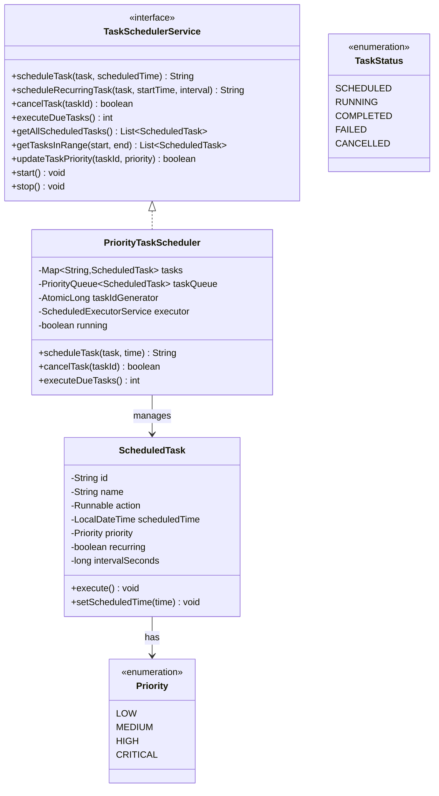

# Task Scheduler - Complete Implementation

A comprehensive task scheduling system supporting priority-based execution, one-time and recurring tasks, and thread-safe operations.

## Quick Links
- [View Complete Source Code](/problems/taskscheduler/CODE)
- [Project Structure](/problems/taskscheduler/CODE#-directory-structure)

---

## Problem Statement

Design and implement a robust task scheduling system that can:
- Schedule tasks for future execution with specific timestamps
- Support priority-based task execution (CRITICAL > HIGH > MEDIUM > LOW)
- Handle both one-time and recurring tasks
- Provide thread-safe concurrent task scheduling and execution
- Allow task cancellation and priority updates
- Execute tasks efficiently using a thread pool
- Support querying tasks in specific time ranges

**Real-world applications**: Cron job systems, background job processors (Sidekiq, Celery), Kubernetes CronJobs, AWS CloudWatch Events.

---

## Requirements

### Functional Requirements

1. **Task Scheduling**
   - Schedule one-time tasks with specific execution time
   - Schedule recurring tasks with interval (every N seconds/minutes/hours)
   - Auto-generate unique task IDs

2. **Priority Management**
   - Support 4 priority levels: CRITICAL, HIGH, MEDIUM, LOW
   - Execute higher priority tasks first when scheduled for same time
   - Allow runtime priority updates without re-scheduling

3. **Task Execution**
   - Automatically execute due tasks at scheduled time
   - Use thread pool for concurrent execution
   - Handle task failures gracefully without stopping scheduler

4. **Task Lifecycle**
   - Cancel scheduled tasks before execution
   - Remove one-time tasks after completion
   - Automatically reschedule recurring tasks

5. **Query Operations**
   - List all currently scheduled tasks
   - Query tasks scheduled within time range
   - Check task status and next execution time

### Non-Functional Requirements

1. **Performance**
   - O(log n) task insertion and removal
   - O(1) task lookup by ID
   - Sub-millisecond scheduling latency
   - Support 10,000+ concurrent scheduled tasks

2. **Scalability**
   - Configurable thread pool size
   - Efficient memory usage for task storage
   - Handle high task scheduling throughput (1000+ tasks/sec)

3. **Reliability**
   - Thread-safe operations (no race conditions)
   - Graceful shutdown with task cleanup
   - No task loss during cancellation

4. **Maintainability**
   - Clean separation: API, Implementation, Models
   - Extensible priority system
   - Easy to add new scheduling strategies

---

## Class Diagram

<details>
<summary>View Mermaid Source</summary>



</details>


---
## Key Design Decisions

### 1. PriorityQueue for Task Scheduling
**Decision**: Use `PriorityQueue<ScheduledTask>` with custom comparator.

**Rationale**:
- O(log n) insertion and removal
- Natural fit for time + priority-based scheduling
- Comparator allows multi-criteria sorting (time, then priority)

**Tradeoffs**:
- ✅ Fast retrieval of next due task
- ✅ Memory efficient (heap-based)
- ❌ O(n) for random removal (acceptable for cancel)
- ❌ Not thread-safe (requires synchronization)

### 2. Dual Storage: Map + PriorityQueue
**Decision**: Maintain both `ConcurrentHashMap<String, Task>` and `PriorityQueue<Task>`.

**Rationale**:
- Map provides O(1) lookup by ID
- PriorityQueue provides efficient "next due task" retrieval
- Allows fast query operations

**Tradeoffs**:
- ✅ O(1) task lookup by ID
- ✅ O(log n) next-due-task retrieval
- ❌ Must keep both synchronized
- ❌ 2x memory references

### 3. ScheduledExecutorService for Execution
**Decision**: Use `ScheduledExecutorService` with fixed thread pool.

**Rationale**:
- Manages thread lifecycle automatically
- Built-in support for recurring tasks
- Thread pooling prevents exhaustion
- Graceful shutdown support

**Tradeoffs**:
- ✅ Production-ready thread management
- ✅ Prevents system overload
- ❌ Fixed pool size (not auto-scaling)

---

## Implementation Guide

### 1. Schedule Task Algorithm

```
Algorithm: ScheduleTask(task, scheduledTime)
Input: task object, scheduled execution time
Output: taskId string

1. taskId = "TASK-" + taskIdGenerator.incrementAndGet()

2. task.setId(taskId)
   task.setScheduledTime(scheduledTime)

3. tasks.put(taskId, task)  // O(1) hash map

4. synchronized (taskQueue):
      taskQueue.offer(task)  // O(log n) heap insert

5. return taskId
```

**Time Complexity**: O(log n)  
**Space Complexity**: O(1)

---

### 2. Execute Due Tasks Algorithm

```
Algorithm: ExecuteDueTasks()
Input: none
Output: count of executed tasks

1. now = LocalDateTime.now()
   dueTasks = []

2. synchronized (taskQueue):
      while taskQueue is not empty:
         nextTask = taskQueue.peek()
         
         if nextTask.scheduledTime > now:
            break  // No more due tasks
         
         dueTasks.add(taskQueue.poll())

3. for each task in dueTasks:
      executor.submit(() -> {
         try:
            task.execute()
            
            if task.isRecurring():
               nextTime = now + task.intervalSeconds
               task.setScheduledTime(nextTime)
               taskQueue.offer(task)
            else:
               tasks.remove(task.id)
         catch Exception:
            log("Task failed")
      })

4. return dueTasks.size()
```

**Time Complexity**: O(k log n) where k = due tasks  
**Space Complexity**: O(k)

---

### 3. Cancel Task Algorithm

```
Algorithm: CancelTask(taskId)
Input: task ID string
Output: boolean success

1. task = tasks.remove(taskId)  // O(1)

2. if task == null:
      return false

3. synchronized (taskQueue):
      taskQueue.remove(task)  // O(n)

4. return true
```

**Time Complexity**: O(n)  
**Space Complexity**: O(1)

---

### 4. Update Priority Algorithm

```
Algorithm: UpdateTaskPriority(taskId, newPriority)
Input: task ID, new priority
Output: boolean success

1. task = tasks.get(taskId)

2. if task == null:
      return false

3. synchronized (taskQueue):
      taskQueue.remove(task)  // O(n)
      task.setPriority(newPriority)
      taskQueue.offer(task)  // O(log n)

4. return true
```

**Time Complexity**: O(n)  
**Space Complexity**: O(1)

---

### 5. Query Time Range Algorithm

```
Algorithm: GetTasksInRange(startTime, endTime)
Input: start and end times
Output: List of tasks

1. result = []

2. for each task in tasks.values():
      if task.scheduledTime >= start and 
         task.scheduledTime <= end:
         result.add(task)

3. sort result by scheduledTime

4. return result
```

**Time Complexity**: O(n)  
**Space Complexity**: O(k) where k = matching tasks

---

## Source Code

All source code available in [CODE.md](/problems/taskscheduler/CODE):

**Core** (2 files):
- [ScheduledTask.java](/problems/taskscheduler/CODE#scheduledtaskjava)
- [TaskScheduler.java](/problems/taskscheduler/CODE#taskschedulerjava)

**Service** (2 files):
- [api/TaskSchedulerService.java](/problems/taskscheduler/CODE#apitaskschedulerservicejava)
- [impl/PriorityTaskScheduler.java](/problems/taskscheduler/CODE#implprioritytaskschedulerjava)

**Models** (5 files):
- [model/Priority.java](/problems/taskscheduler/CODE#modelpriorityjava)
- [model/Task.java](/problems/taskscheduler/CODE#modeltaskjava)
- [model/TaskStatus.java](/problems/taskscheduler/CODE#modeltaskstatusjava)
- [model/TaskResult.java](/problems/taskscheduler/CODE#modeltaskresultjava)
- [model/Schedule.java](/problems/taskscheduler/CODE#modelschedulejava)

**Exceptions** (2 files):
- [exceptions/SchedulingException.java](/problems/taskscheduler/CODE#exceptionsschedulingexceptionjava)
- [exceptions/TaskNotFoundException.java](/problems/taskscheduler/CODE#exceptionstasknotfoundexceptionjava)

**Total**: 11 files, ~650 lines of code

---
## Interview Discussion Points

### 1. Scalability to 1M Tasks

**Q**: How to handle 1 million scheduled tasks?

**Approaches**:
- **Partitioned Queues**: Shard by time range (next hour, next day, etc.)
- **DB Persistence**: Store in PostgreSQL, load only next N due tasks
- **Distributed**: Use Kafka/RabbitMQ with scheduled messages
- **Time Wheel**: O(1) insertion vs O(log n) for PriorityQueue

**Trade-offs**:
- Partitioning: Complex sharding logic
- DB: I/O overhead, eventual consistency
- Distributed: Network latency, coordination
- Time Wheel: More memory, fixed granularity

### 2. Task Failure Handling

**Q**: What if a task fails? Retry strategy?

**Enhancement**:
```java
class ScheduledTask {
    private int maxRetries = 3;
    private int currentRetry = 0;
    
    public void executeWithRetry() {
        try {
            execute();
            currentRetry = 0;
        } catch (Exception e) {
            if (currentRetry < maxRetries) {
                currentRetry++;
                scheduledTime = now() + retryDelay;
                taskQueue.offer(this);
            } else {
                sendToDeadLetterQueue();
            }
        }
    }
}
```

**Advanced**: Exponential backoff, circuit breaker pattern.

### 3. Preventing Duplicate Execution

**Q**: How to ensure no duplicate execution?

**Solution**:
```java
class ScheduledTask {
    private AtomicBoolean executing = new AtomicBoolean(false);
    
    public void execute() {
        if (!executing.compareAndSet(false, true)) {
            return; // Already running
        }
        try {
            action.run();
        } finally {
            executing.set(false);
        }
    }
}
```

### 4. Persistent Scheduling

**Q**: Tasks lost on restart. How to persist?

**Approach**:
```java
// On schedule:
db.insert("INSERT INTO tasks VALUES (?, ?, ?)");

// On startup:
tasks = db.query("SELECT * FROM tasks WHERE time > NOW()");
for (task : tasks) scheduler.schedule(task);

// On complete:
db.delete("DELETE FROM tasks WHERE id = ?");
```

**Challenges**: DB becomes bottleneck, need indexing.

### 5. Time Wheel vs Priority Queue

**Time Wheel** (Kafka, Netty):
- Buckets: [0-1s], [1-2s], ..., overflow
- O(1) insert/remove
- Better for high throughput (100k+ tasks/sec)
- More memory, fixed granularity

**Priority Queue** (our choice):
- O(log n) insert/remove
- Dynamic scheduling
- Better for general-purpose

**Use Time Wheel when**: Real-time systems, high frequency.
**Use Priority Queue when**: Human-scale intervals.

### 6. Thread Pool Sizing

**Formula**:
```
Threads = CPUs × Utilization × (1 + Wait/Compute)
```

**Example**: 8 cores, 50% util, 80% I/O (wait/compute=4):
```
Threads = 8 × 0.5 × (1 + 4) = 20
```

**Our default**: 4 threads (conservative).
**Recommendation**: Make configurable.

---

## Extensions

1. **Task Dependencies**: DAG-based execution
2. **Task Groups**: Batch cancel/priority update
3. **Rate Limiting**: Max N tasks per minute
4. **Monitoring**: Metrics (latency, failure rate)
5. **Distributed**: Raft/Paxos for multi-instance

---

**See Also**: Quartz Scheduler, Celery, Kubernetes CronJobs
