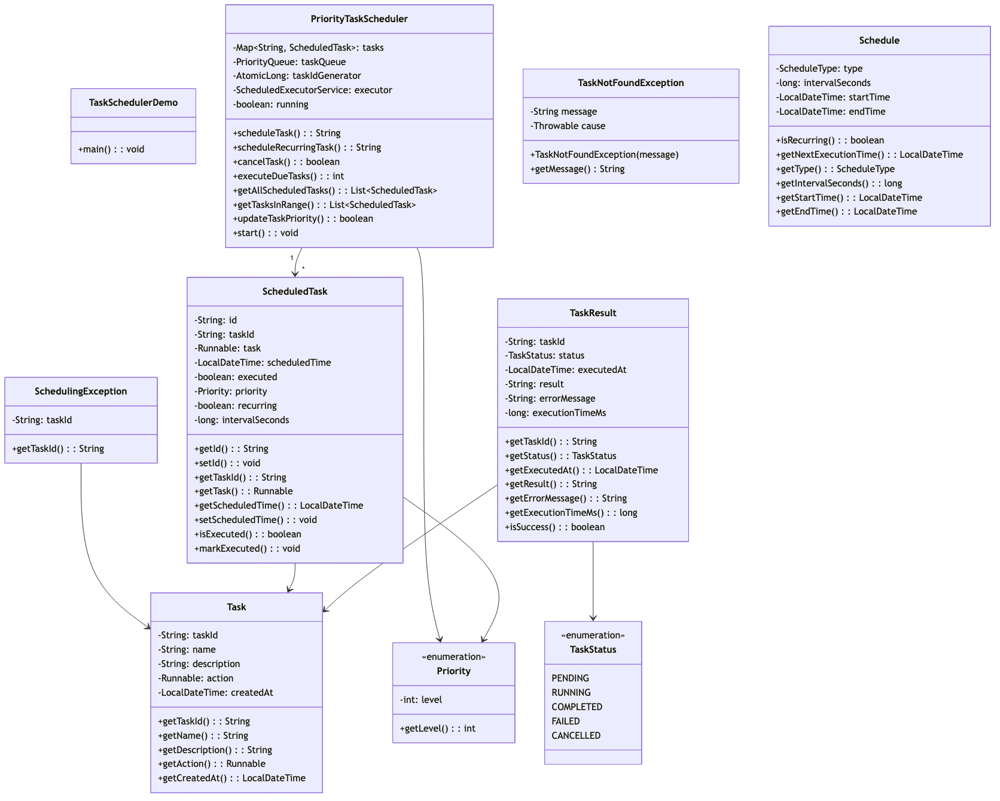

# Task Scheduler - Complete Implementation

A comprehensive task scheduling system supporting priority-based execution, one-time and recurring tasks, and thread-safe operations.

## Quick Links
- [View Complete Source Code](/problems/taskscheduler/CODE)
- [Project Structure](/problems/taskscheduler/CODE#-directory-structure)

---

## Problem Statement

Design and implement a robust task scheduling system that can:
- Schedule tasks for future execution with specific timestamps
- Support priority-based task execution (CRITICAL > HIGH > MEDIUM > LOW)
- Handle both one-time and recurring tasks
- Provide thread-safe concurrent task scheduling and execution
- Allow task cancellation and priority updates
- Execute tasks efficiently using a thread pool
- Support querying tasks in specific time ranges

**Real-world applications**: Cron job systems, background job processors (Sidekiq, Celery), Kubernetes CronJobs, AWS CloudWatch Events.

---

## Requirements

### Functional Requirements

1. **Task Scheduling**
   - Schedule one-time tasks with specific execution time
   - Schedule recurring tasks with interval (every N seconds/minutes/hours)
   - Auto-generate unique task IDs

2. **Priority Management**
   - Support 4 priority levels: CRITICAL, HIGH, MEDIUM, LOW
   - Execute higher priority tasks first when scheduled for same time
   - Allow runtime priority updates without re-scheduling

3. **Task Execution**
   - Automatically execute due tasks at scheduled time
   - Use thread pool for concurrent execution
   - Handle task failures gracefully without stopping scheduler

4. **Task Lifecycle**
   - Cancel scheduled tasks before execution
   - Remove one-time tasks after completion
   - Automatically reschedule recurring tasks

5. **Query Operations**
   - List all currently scheduled tasks
   - Query tasks scheduled within time range
   - Check task status and next execution time

### Non-Functional Requirements

1. **Performance**
   - O(log n) task insertion and removal
   - O(1) task lookup by ID
   - Sub-millisecond scheduling latency
   - Support 10,000+ concurrent scheduled tasks

2. **Scalability**
   - Configurable thread pool size
   - Efficient memory usage for task storage
   - Handle high task scheduling throughput (1000+ tasks/sec)

3. **Reliability**
   - Thread-safe operations (no race conditions)
   - Graceful shutdown with task cleanup
   - No task loss during cancellation

4. **Maintainability**
   - Clean separation: API, Implementation, Models
   - Extensible priority system
   - Easy to add new scheduling strategies

---

## Class Diagram

<details>
<summary>View Mermaid Source</summary>


```mermaid
classDiagram

    class TaskSchedulerDemo {
        +main(): void
    }

    class ScheduledTask {
        -String: id
        -String: taskId
        -Runnable: task
        -LocalDateTime: scheduledTime
        -boolean: executed
        -Priority: priority
        -boolean: recurring
        -long: intervalSeconds
        +getId(): String
        +setId(): void
        +getTaskId(): String
        +getTask(): Runnable
        +getScheduledTime(): LocalDateTime
        +setScheduledTime(): void
        +isExecuted(): boolean
        +markExecuted(): void
    }

    class PriorityTaskScheduler {
        -Map~String, ScheduledTask~: tasks
        -PriorityQueue<ScheduledTask>: taskQueue
        -AtomicLong: taskIdGenerator
        -ScheduledExecutorService: executor
        -boolean: running
        +scheduleTask(): String
        +scheduleRecurringTask(): String
        +cancelTask(): boolean
        +executeDueTasks(): int
        +getAllScheduledTasks(): List~ScheduledTask~
        +getTasksInRange(): List~ScheduledTask~
        +updateTaskPriority(): boolean
        +start(): void
    }

    class SchedulingException {
        -String: taskId
        +getTaskId(): String
    }

    class TaskNotFoundException {
    }

    class Schedule {
        -ScheduleType: type
        -long: intervalSeconds
        -LocalDateTime: startTime
        -LocalDateTime: endTime
        +isRecurring(): boolean
        +getNextExecutionTime(): LocalDateTime
        +getType(): ScheduleType
        +getIntervalSeconds(): long
        +getStartTime(): LocalDateTime
        +getEndTime(): LocalDateTime
    }

    class TaskStatus {
        <<enumeration>>
    }

    class TaskResult {
        -String: taskId
        -TaskStatus: status
        -LocalDateTime: executedAt
        -String: result
        -String: errorMessage
        -long: executionTimeMs
        +getTaskId(): String
        +getStatus(): TaskStatus
        +getExecutedAt(): LocalDateTime
        +getResult(): String
        +getErrorMessage(): String
        +getExecutionTimeMs(): long
        +isSuccess(): boolean
    }

    class Task {
        -String: taskId
        -String: name
        -String: description
        -Runnable: action
        -LocalDateTime: createdAt
        +getTaskId(): String
        +getName(): String
        +getDescription(): String
        +getAction(): Runnable
        +getCreatedAt(): LocalDateTime
    }

    class Priority {
        <<enumeration>>
        -int: level
        +getLevel(): int
    }

    class for {
        <<interface>>

    ScheduledTask --> Task
    ScheduledTask --> Priority
    PriorityTaskScheduler "1" --> "*" ScheduledTask
    SchedulingException --> Task
    TaskResult --> Task
    TaskResult --> TaskStatus
```

</details>



---

## Key Design Decisions

### 1. PriorityQueue for Task Scheduling
**Decision**: Use `PriorityQueue<ScheduledTask>` with custom comparator for task ordering.

**Rationale**:
- Efficient O(log n) insertion and O(log n) removal of min element
- Natural fit for time-based + priority-based scheduling
- Built-in Java collection with proven performance
- Comparator allows multi-criteria sorting (time, then priority)

**Tradeoffs**:
- ✅ Fast retrieval of next due task
- ✅ Memory efficient (heap-based)
- ❌ O(n) for random access/removal (acceptable for cancel operations)
- ❌ Not thread-safe by default (requires synchronization)

**Implementation**:
```java
this.taskQueue = new PriorityQueue<>((a, b) -> {
    // Primary: earliest time first
    int timeCompare = a.getScheduledTime().compareTo(b.getScheduledTime());
    if (timeCompare != 0) return timeCompare;
    // Secondary: highest priority first
    return b.getPriority().compareTo(a.getPriority());
});
```

### 2. Dual Storage: Map + PriorityQueue
**Decision**: Maintain both `ConcurrentHashMap<String, Task>` and `PriorityQueue<Task>`.

**Rationale**:
- Map provides O(1) lookup by task ID (for cancellation, priority updates)
- PriorityQueue provides efficient "next due task" retrieval
- Allows fast query operations (getAllTasks, getTasksInRange)
- Memory overhead is acceptable (~2x references, not 2x task objects)

**Tradeoffs**:
- ✅ O(1) task lookup by ID
- ✅ O(log n) next-due-task retrieval
- ❌ Must keep both structures synchronized
- ❌ Slightly higher memory usage

### 3. ScheduledExecutorService for Task Execution
**Decision**: Use `ScheduledExecutorService` with fixed thread pool for executing tasks.

**Rationale**:
- Manages thread lifecycle automatically
- Built-in support for recurring tasks (scheduleAtFixedRate)
- Thread pooling prevents thread exhaustion
- Graceful shutdown with awaitTermination

**Tradeoffs**:
- ✅ Production-ready thread management
- ✅ Prevents system overload
- ✅ Supports thousands of concurrent tasks
- ❌ Fixed thread pool size (not auto-scaling)

**Configuration**:
```java
this.executor = Executors.newScheduledThreadPool(4); // 4 worker threads
executor.scheduleAtFixedRate(this::executeDueTasks, 0, 1, TimeUnit.SECONDS);
```

### 4. Optimistic Recurring Task Handling
**Decision**: After executing a recurring task, immediately reschedule it with `nextTime = now + interval`.

**Rationale**:
- Simple and predictable
- No need to track "missed" executions
- Task re-enters priority queue for next execution
- Handles delays naturally (if execution took longer than interval)

**Tradeoffs**:
- ✅ Simple logic
- ✅ Self-healing (catches up after delays)
- ❌ Drift: if task takes 5s and interval is 10s, effective interval is 15s
- ❌ No "catch-up" for missed executions during downtime

**Alternative**: Fixed-rate scheduling (schedule based on original start time, not last execution).

### 5. Synchronized Priority Queue Access
**Decision**: Use `synchronized (taskQueue)` blocks for all queue operations.

**Rationale**:
- PriorityQueue is not thread-safe
- Multiple threads read/write during schedule, cancel, execute operations
- Synchronized blocks are simpler than Lock objects for this use case
- Critical sections are small (< 10 operations)

**Tradeoffs**:
- ✅ Correct concurrent behavior
- ✅ Simple to reason about
- ❌ Slight contention under heavy load
- ❌ Single lock for entire queue (not fine-grained)

---

## Implementation Guide

### 1. Schedule Task Algorithm

**Purpose**: Add a new task to the scheduler with specific execution time.

```
Algorithm: ScheduleTask(task, scheduledTime)
Input: task object, scheduled execution time
Output: taskId string

1. taskId = "TASK-" + taskIdGenerator.incrementAndGet()

2. task.setId(taskId)
   task.setScheduledTime(scheduledTime)

3. tasks.put(taskId, task)  // O(1) hash map insertion

4. synchronized (taskQueue):
      taskQueue.offer(task)  // O(log n) heap insertion

5. return taskId
```

**Time Complexity**: O(log n) where n is number of scheduled tasks  
**Space Complexity**: O(1)

**Key Points**:
- Atomic task ID generation prevents collisions
- Both Map and PriorityQueue updated for dual storage
- Synchronization ensures thread-safety

---

### 2. Execute Due Tasks Algorithm

**Purpose**: Find and execute all tasks whose scheduled time has passed.

```
Algorithm: ExecuteDueTasks()
Input: none
Output: count of executed tasks

1. now = LocalDateTime.now()
   dueTasks = []

2. synchronized (taskQueue):
      while taskQueue is not empty:
         nextTask = taskQueue.peek()
         
         if nextTask.scheduledTime > now:
            break  // No more due tasks (queue is time-ordered)
         
         dueTasks.add(taskQueue.poll())  // O(log n) removal

3. for each task in dueTasks:
      executor.submit(() -> {
         try:
            task.execute()  // Run user-provided Runnable
            
            if task.isRecurring():
               // Reschedule for next execution
               nextTime = now.plusSeconds(task.intervalSeconds)
               task.setScheduledTime(nextTime)
               
               synchronized (taskQueue):
                  taskQueue.offer(task)
            else:
               // One-time task: remove from map
               tasks.remove(task.id)
         
         catch Exception e:
            log("Task execution failed: " + e.message)
      })

4. return dueTasks.size()
```

**Time Complexity**: O(k log n) where k is due tasks, n is total tasks  
**Space Complexity**: O(k) for dueTasks list

**Key Points**:
- Batch extraction of due tasks under single lock (minimizes contention)
- Tasks executed asynchronously via thread pool
- Recurring tasks auto-reschedule without external intervention
- Failures isolated per task (don't stop scheduler)

---

### 3. Cancel Task Algorithm

**Purpose**: Remove a scheduled task before execution.

```
Algorithm: CancelTask(taskId)
Input: task ID string
Output: boolean success

1. task = tasks.remove(taskId)  // O(1) map removal

2. if task == null:
      return false  // Task not found

3. synchronized (taskQueue):
      taskQueue.remove(task)  // O(n) linear scan in heap

4. return true
```

**Time Complexity**: O(n) due to PriorityQueue.remove()  
**Space Complexity**: O(1)

**Optimization**: Could use `PriorityBlockingQueue` with removal tracking, but adds complexity.

**Key Points**:
- Map removal is fast (O(1))
- Queue removal is slow (O(n)) but rare operation
- Both storages must be updated for consistency

---

### 4. Update Task Priority Algorithm

**Purpose**: Change a task's priority without rescheduling.

```
Algorithm: UpdateTaskPriority(taskId, newPriority)
Input: task ID, new priority level
Output: boolean success

1. task = tasks.get(taskId)  // O(1) lookup

2. if task == null:
      return false

3. synchronized (taskQueue):
      // Must remove and re-insert to maintain heap property
      taskQueue.remove(task)  // O(n)
      task.setPriority(newPriority)
      taskQueue.offer(task)  // O(log n)

4. return true
```

**Time Complexity**: O(n) due to removal + O(log n) for insertion ≈ O(n)  
**Space Complexity**: O(1)

**Key Points**:
- Cannot update priority in-place (breaks heap invariant)
- Must remove and re-insert
- Priority change takes effect on next executeDueTasks cycle

---

### 5. Query Tasks in Time Range Algorithm

**Purpose**: Get all tasks scheduled between start and end times.

```
Algorithm: GetTasksInRange(startTime, endTime)
Input: start LocalDateTime, end LocalDateTime
Output: List of ScheduledTask

1. result = []

2. for each task in tasks.values():
      if task.scheduledTime >= startTime and task.scheduledTime <= endTime:
         result.add(task)

3. sort result by scheduledTime

4. return result
```

**Time Complexity**: O(n) where n is total tasks  
**Space Complexity**: O(k) where k is matching tasks

**Optimization**: Could use interval tree or segment tree for O(log n + k), but adds complexity.

**Key Points**:
- Linear scan acceptable for typical task counts (< 10,000)
- Results sorted for better UX
- Does not block task execution (reads from Map)

---

## Source Code

All source code is available in the [CODE.md](/problems/taskscheduler/CODE) file, organized by package:

**Core Components** (2 files):
   - [ScheduledTask.java](/problems/taskscheduler/CODE#scheduledtaskjava) - Wrapper for scheduled tasks with metadata
   - [TaskScheduler.java](/problems/taskscheduler/CODE#taskschedulerjava) - Main scheduler interface

**Service Layer** (2 files):
   - [api/TaskSchedulerService.java](/problems/taskscheduler/CODE#apitaskschedulerservicejava) - Service interface
   - [impl/PriorityTaskScheduler.java](/problems/taskscheduler/CODE#implprioritytaskschedulerjava) - Priority-based implementation

**Model Classes** (5 files):
   - [model/Priority.java](/problems/taskscheduler/CODE#modelpriorityjava) - Priority enum (LOW to CRITICAL)
   - [model/Task.java](/problems/taskscheduler/CODE#modeltaskjava) - Task metadata
   - [model/TaskStatus.java](/problems/taskscheduler/CODE#modeltaskstatusjava) - Status enum
   - [model/TaskResult.java](/problems/taskscheduler/CODE#modeltaskresultjava) - Execution result
   - [model/Schedule.java](/problems/taskscheduler/CODE#modelschedulejava) - Schedule configuration

**Exception Classes** (2 files):
   - [exceptions/SchedulingException.java](/problems/taskscheduler/CODE#exceptionsschedulingexceptionjava)
   - [exceptions/TaskNotFoundException.java](/problems/taskscheduler/CODE#exceptionstasknotfoundexceptionjava)

**Total**: 11 files, ~650 lines of production code

---

## Interview Discussion Points

### 1. Scalability Considerations

**Q**: How would you scale this to handle 1 million scheduled tasks?

**A**: Several approaches:
- **Partitioned Priority Queues**: Shard tasks by time range (next hour, next day, next week). Each shard has own PriorityQueue.
- **Database Persistence**: Store tasks in DB (PostgreSQL with timestamp index), load only next N due tasks into memory.
- **Distributed Scheduler**: Use Apache Kafka or RabbitMQ with scheduled message delivery, multiple scheduler instances.
- **Time Wheel Algorithm**: More efficient for large-scale scheduling (O(1) insertion/removal vs O(log n)).

**Trade-offs**:
- Partitioned queues: Complex time-based sharding logic
- DB persistence: I/O overhead, eventual consistency
- Distributed: Network latency, coordination overhead
- Time Wheel: More memory (pre-allocated buckets), fixed time granularity

### 2. Handling Task Failures

**Q**: What if a task fails? How do you retry?

**Current**: Task failures logged but not retried.

**Improvements**:
```java
class ScheduledTask {
    private int maxRetries = 3;
    private int currentRetry = 0;
    private long retryDelaySeconds = 60;
    
    public void executeWithRetry() {
        try {
            execute();
            currentRetry = 0; // Reset on success
        } catch (Exception e) {
            if (currentRetry < maxRetries) {
                currentRetry++;
                scheduledTime = now().plusSeconds(retryDelaySeconds);
                taskQueue.offer(this); // Re-schedule with delay
            } else {
                log("Task failed after " + maxRetries + " retries");
            }
        }
    }
}
```

**Advanced**: Exponential backoff, dead letter queue for failed tasks.

### 3. Preventing Duplicate Execution

**Q**: How do you ensure a task isn't executed twice?

**Current Implementation**:
- Task removed from queue before execution
- Recurring tasks re-inserted after execution
- Race condition possible if `executeDueTasks()` called concurrently

**Solution**:
```java
class ScheduledTask {
    private AtomicBoolean executing = new AtomicBoolean(false);
    
    public void execute() {
        if (!executing.compareAndSet(false, true)) {
            return; // Already executing
        }
        
        try {
            action.run();
        } finally {
            executing.set(false);
        }
    }
}
```

### 4. Persistent Scheduling (Survive Restarts)

**Q**: Tasks lost if scheduler restarts. How to persist?

**Approach**:
```java
// On schedule:
db.insert("INSERT INTO tasks (id, scheduled_time, priority, recurring) VALUES (?, ?, ?, ?)");

// On startup:
List<Task> tasks = db.query("SELECT * FROM tasks WHERE scheduled_time > NOW()");
for (Task t : tasks) {
    scheduler.scheduleTask(t, t.getScheduledTime());
}

// On execution (one-time):
db.delete("DELETE FROM tasks WHERE id = ?");

// On execution (recurring):
db.update("UPDATE tasks SET scheduled_time = ? WHERE id = ?");
```

**Challenges**: Database becomes bottleneck, need indexing on scheduled_time.

### 5. Time Wheel vs Priority Queue

**Q**: Why not use Time Wheel algorithm?

**Time Wheel** (used by Kafka, Netty):
```
Bucket 0: [0-999ms]
Bucket 1: [1000-1999ms]
...
Overflow: [> 60s] (hierarchical time wheels)
```

**Advantages**:
- O(1) insertion and removal (vs O(log n))
- Better for high-throughput systems (100k+ tasks/sec)

**Disadvantages**:
- More memory (pre-allocated buckets)
- Fixed time granularity (e.g., 1ms buckets)
- Complex for irregular intervals

**When to use Time Wheel**: Real-time systems, network protocols, high-frequency trading.

**When to use Priority Queue**: General-purpose schedulers, human-scale intervals (seconds/minutes).

### 6. Thread Pool Sizing

**Q**: How to choose thread pool size?

**Formula**:
```
Threads = Number of CPUs * Target Utilization * (1 + Wait Time / Compute Time)
```

**Example**: 8 cores, 50% target utilization, tasks are 80% I/O (wait/compute = 4):
```
Threads = 8 * 0.5 * (1 + 4) = 20 threads
```

**Our Default**: 4 threads (conservative, suitable for CPU-bound tasks).

**Recommendation**: Make configurable:
```java
public PriorityTaskScheduler(int poolSize) {
    this.executor = Executors.newScheduledThreadPool(poolSize);
}
```

---

## Extensions and Follow-ups

1. **Task Dependencies**: Support "execute Task B only after Task A completes"
2. **Task Groups**: Batch operations (cancel all tasks in group)
3. **Rate Limiting**: Max N executions per minute
4. **Task Priority Inheritance**: Boost priority of dependent tasks
5. **Monitoring**: Metrics (tasks/sec, avg latency, failure rate)
6. **Distributed Consensus**: Use Raft or Paxos for multi-instance coordination

---

**See Also**:
- Cron expression parser for flexible scheduling
- Quartz Scheduler (Java) for production-grade features
- Celery (Python) for distributed task queue patterns
