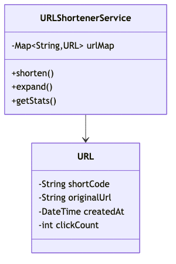

# URL Shortener (bit.ly, TinyURL) - Complete LLD Guide

## 📋 Table of Contents
1. [Problem Statement](#problem-statement)
2. [Requirements](#requirements)
3. [Core Algorithms](#core-algorithms)
4. [System Design](#system-design)
5. [Class Diagram](#class-diagram)
6. [Design Patterns](#design-patterns-used)
7. [Implementation Deep Dive](#implementation-deep-dive)
8. [Key Insights](#key-insights)
9. [Complete Implementation](#complete-implementation)

---

## Problem Statement

Design a **URL Shortener Service** (like bit.ly, TinyURL, Rebrandly) that converts long URLs into short, unique codes, redirects users efficiently, tracks analytics (clicks, geographic data), and handles billions of URLs with high availability and low latency.

### Real-World Context
- 🔗 **bit.ly**: 10B+ links, 9B+ clicks/month
- 🌐 **TinyURL**: First URL shortener (2002)
- 📊 **Rebrandly**: Custom branded short domains
- 🎯 **Google URL Shortener** (goo.gl): Deprecated 2019

### Key Challenges
- 🔑 **Unique Short Code**: Base62 encoding, hash collision handling
- ⚡ **High Read:Write Ratio**: 100:1 (redirects >> creations)
- 🗺️ **URL Mapping**: Efficient storage and retrieval
- 📊 **Analytics**: Click tracking, geographic data
- 🔒 **Custom URLs**: User-defined short codes (bit.ly/mylink)
- ⏰ **Expiration**: Time-to-live (TTL) for URLs
- 🚀 **Scalability**: Handle 1B+ URLs, 100M+ requests/day

---

## Requirements

### Functional Requirements

✅ **URL Shortening**
- Generate unique short code for long URL
- Support custom short codes (if available)
- Handle collisions gracefully
- Minimum length (6-7 characters for billions of URLs)

✅ **URL Redirection**
- Redirect short URL to original URL (HTTP 301/302)
- Fast lookup (< 10ms)
- Handle non-existent short codes (404)

✅ **Analytics**
- Click count
- Last accessed timestamp
- Geographic data (country, city)
- Referrer (where click came from)
- Device type (mobile, desktop)

✅ **Custom Features**
- Custom short codes (premium feature)
- URL expiration (TTL)
- Password protection
- QR code generation

✅ **Admin Operations**
- Delete short URL
- Update destination URL
- View analytics dashboard

### Non-Functional Requirements

⚡ **Performance**
- Shorten URL: < 100ms
- Redirect: < 10ms
- Handle 100M+ requests/day

🔒 **Availability**
- 99.99% uptime
- No data loss

📈 **Scalability**
- Support 1B+ URLs
- Handle traffic spikes (viral links)

🛡️ **Security**
- Prevent spam/malicious URLs
- Rate limiting (prevent abuse)

---

## Core Algorithms

### 1. Short Code Generation (Base62 Encoding)

**Why Base62?**
- **Base10**: Only digits (0-9) → 10 characters
- **Base16** (Hex): 0-9, A-F → 16 characters
- **Base62**: 0-9, a-z, A-Z → 62 characters
- **Base64**: Includes +, / (problematic in URLs)

**Base62 Alphabet:**
```
0123456789abcdefghijklmnopqrstuvwxyzABCDEFGHIJKLMNOPQRSTUVWXYZ
```

**URL Capacity:**
```
Length  |  Base62 Capacity  |  Sufficient For
--------|-------------------|------------------
3       |  62³ = 238K       |  Small apps
4       |  62⁴ = 14.7M      |  Startups
5       |  62⁵ = 916M       |  Medium scale
6       |  62⁶ = 56.8B      |  Large scale (bit.ly)
7       |  62⁷ = 3.5T       |  Global scale
```

**Algorithm 1: Counter-Based (Auto-Increment)**

```java
public class CounterBasedGenerator {
    private AtomicLong counter = new AtomicLong(0);
    private static final String BASE62 = "0123456789abcdefghijklmnopqrstuvwxyzABCDEFGHIJKLMNOPQRSTUVWXYZ";
    
    public String generateShortCode() {
        long id = counter.incrementAndGet();
        return toBase62(id);
    }
    
    private String toBase62(long num) {
        if (num == 0) return "0";
        
        StringBuilder sb = new StringBuilder();
        while (num > 0) {
            sb.append(BASE62.charAt((int) (num % 62)));
            num /= 62;
        }
        return sb.reverse().toString();
    }
}
```

**Example:**
```
ID 1      → "1"
ID 62     → "10"
ID 1000   → "g8"
ID 1000000 → "4c92"
```

**Pros:**
- ✅ Guaranteed unique
- ✅ Predictable length

**Cons:**
- ❌ Sequential (can guess next URL)
- ❌ Single point of failure (counter)

---

**Algorithm 2: Hash-Based (MD5 + Base62)**

```java
public class HashBasedGenerator {
    
    public String generateShortCode(String longUrl) {
        // Generate MD5 hash (128 bits)
        String hash = MD5.hash(longUrl);
        
        // Take first 43 bits (7 characters in Base62)
        long num = Long.parseLong(hash.substring(0, 11), 16);
        
        return toBase62(num);
    }
    
    public String generateWithCollisionHandling(String longUrl) {
        String shortCode = generateShortCode(longUrl);
        int attempt = 0;
        
        while (database.exists(shortCode)) {
            // Collision: append salt and retry
            shortCode = generateShortCode(longUrl + attempt);
            attempt++;
        }
        
        return shortCode;
    }
}
```

**Pros:**
- ✅ Same URL → same short code (idempotent)
- ✅ Distributed (no central counter)

**Cons:**
- ❌ Collision handling needed
- ❌ Not guaranteed unique upfront

---

**Algorithm 3: Random + Collision Check**

```java
public class RandomGenerator {
    private static final String BASE62 = "0123456789abcdefghijklmnopqrstuvwxyzABCDEFGHIJKLMNOPQRSTUVWXYZ";
    private Random random = new Random();
    
    public String generateShortCode(int length) {
        StringBuilder sb = new StringBuilder();
        for (int i = 0; i < length; i++) {
            sb.append(BASE62.charAt(random.nextInt(62)));
        }
        return sb.toString();
    }
    
    public String generateUnique(int length) {
        String shortCode;
        do {
            shortCode = generateShortCode(length);
        } while (database.exists(shortCode));
        
        return shortCode;
    }
}
```

**Pros:**
- ✅ Simple
- ✅ Non-sequential (harder to guess)

**Cons:**
- ❌ Collision probability increases as DB fills

---

### 2. URL Redirection (HTTP Status Codes)

**HTTP 301 (Permanent Redirect):**
```java
@GetMapping("/{shortCode}")
public ResponseEntity<Void> redirect301(@PathVariable String shortCode) {
    String longUrl = urlService.getLongUrl(shortCode);
    if (longUrl == null) {
        return ResponseEntity.notFound().build();
    }
    
    // Browser caches this permanently
    return ResponseEntity.status(HttpStatus.MOVED_PERMANENTLY)
        .header("Location", longUrl)
        .build();
}
```

**HTTP 302 (Temporary Redirect):**
```java
@GetMapping("/{shortCode}")
public ResponseEntity<Void> redirect302(@PathVariable String shortCode) {
    String longUrl = urlService.getLongUrl(shortCode);
    if (longUrl == null) {
        return ResponseEntity.notFound().build();
    }
    
    // Track analytics (request hits server every time)
    analyticsService.trackClick(shortCode);
    
    // Browser doesn't cache
    return ResponseEntity.status(HttpStatus.FOUND)
        .header("Location", longUrl)
        .build();
}
```

**Comparison:**
```
Feature              | 301 Permanent | 302 Temporary
---------------------|---------------|---------------
Browser Cache        | Yes           | No
Analytics Tracking   | Difficult     | Easy
Performance          | Faster        | Slower
Use Case             | Static URLs   | Dynamic/Analytics
```

**Recommendation:** Use **302** for analytics, **301** for performance.

---

### 3. Analytics Tracking

**Algorithm:**
```
1. User clicks short URL
2. Server looks up long URL
3. Log analytics data (async)
4. Redirect user (don't block)
```

**Implementation:**
```java
public void trackClick(String shortCode, HttpServletRequest request) {
    // Extract data
    String ip = request.getRemoteAddr();
    String userAgent = request.getHeader("User-Agent");
    String referer = request.getHeader("Referer");
    
    // Create analytics event
    AnalyticsEvent event = new AnalyticsEvent(
        shortCode,
        ip,
        userAgent,
        referer,
        Instant.now()
    );
    
    // Log asynchronously (don't block redirect)
    analyticsQueue.offer(event);
}

// Background worker processes analytics
public class AnalyticsWorker implements Runnable {
    @Override
    public void run() {
        while (true) {
            AnalyticsEvent event = analyticsQueue.take();
            
            // Increment click count
            database.increment("clicks:" + event.getShortCode());
            
            // Store detailed event
            database.save(event);
            
            // Update geographic data (async)
            geoService.updateLocation(event.getIp(), event.getShortCode());
        }
    }
}
```

---

## System Design

### High-Level Architecture

```
┌──────────┐
│  User    │
└────┬─────┘
     │ GET bit.ly/abc123
     ▼
┌────────────┐
│  CDN       │ (Caches popular short URLs)
└────┬───────┘
     │ (cache miss)
     ▼
┌────────────┐
│ Web Server │
└────┬───────┘
     │
     ▼
┌────────────┐      ┌─────────────┐
│ Redis      │◄─────┤ Analytics   │
│ Cache      │      │ Queue       │
└────┬───────┘      └─────────────┘
     │ (cache miss)
     ▼
┌────────────┐
│ Database   │ (PostgreSQL / Cassandra)
│ (URLs)     │
└────────────┘
```

### Database Schema

**URLs Table:**
```sql
CREATE TABLE urls (
    short_code VARCHAR(10) PRIMARY KEY,
    long_url TEXT NOT NULL,
    user_id BIGINT,
    created_at TIMESTAMP DEFAULT NOW(),
    expires_at TIMESTAMP,
    click_count BIGINT DEFAULT 0,
    is_custom BOOLEAN DEFAULT FALSE,
    INDEX idx_user_id (user_id),
    INDEX idx_created_at (created_at)
);
```

**Analytics Table (Time-Series):**
```sql
CREATE TABLE analytics (
    id BIGSERIAL PRIMARY KEY,
    short_code VARCHAR(10),
    ip_address VARCHAR(45),
    country VARCHAR(2),
    city VARCHAR(100),
    referer TEXT,
    user_agent TEXT,
    clicked_at TIMESTAMP DEFAULT NOW(),
    INDEX idx_short_code (short_code),
    INDEX idx_clicked_at (clicked_at)
);
```

---

## Class Diagram

<details>
<summary>View Mermaid Source</summary>

```mermaid
classDiagram

    class URLShortenerService {
        -final ConcurrentHashMap~String,URLMapping~ shortToLong
        -final ConcurrentHashMap~String,String~ longToShort
        -final AtomicLong counter
        -final String baseUrl
        -final int shortCodeLength
        +shortenURL() ShortURL
        +shortenURL() ShortURL
        +getLongURL() String
        +getAnalytics() Analytics
        +deleteURL() boolean
        +getTotalURLs() int
        +isAvailable() boolean
        +getBaseUrl() String
    }

    class ShortURL {
        -final String code
        -final String fullUrl
        +getCode() String
        +getFullUrl() String
    }

    class for {
        -static final String BASE62_CHARS
        -static final int BASE
        +encode() static String
        +encode() static String
        +decode() static long
        +maxValue() static long
    }

    class URLNotFoundException {
        -String message
        -Throwable cause
        +URLNotFoundException(message)
        +getMessage() String
    }

    class URLMapping {
        -final String shortCode
        -final String longURL
        -final LocalDateTime createdAt
        -volatile LocalDateTime lastAccessedAt
        -final AtomicLong accessCount
        +recordAccess() void
        +getAnalytics() Analytics
        +getShortCode() String
        +getLongURL() String
        +getCreatedAt() LocalDateTime
        +getLastAccessedAt() LocalDateTime
        +getAccessCount() long
    }

    class for {
        -static final int MAX_URL_LENGTH
        -static final int MIN_URL_LENGTH
        +isValid() static boolean
        +normalize() static String
        +isValidAlias() static boolean
    }

    class Analytics {
        -final long accessCount
        -final LocalDateTime createdAt
        -final LocalDateTime lastAccessedAt
        +getAccessCount() long
        +getCreatedAt() LocalDateTime
        +getLastAccessedAt() LocalDateTime
    }

    class AliasUnavailableException {
        -String message
        -Throwable cause
        +AliasUnavailableException(message)
        +getMessage() String
    }

    class AnalyticsTracker {

    URLShortenerService --> ShortURL
    URLShortenerService --> Analytics
    URLMapping --> Analytics
```

</details>



<details>
<summary>📄 View Mermaid Source</summary>

</details>

---

## Design Patterns Used

### 1. Strategy Pattern (Short Code Generation)

```java
public interface ShortCodeGenerator {
    String generate(String longUrl);
}

// Switch strategies at runtime
URLShortenerService service = new URLShortenerServiceImpl();
service.setGenerator(new CounterBasedGenerator()); // Sequential
service.setGenerator(new HashBasedGenerator());    // Hash-based
service.setGenerator(new RandomGenerator());       // Random
```

---

### 2. Caching (Read-Through Cache)

```java
public class CachedURLService {
    private Cache<String, String> cache = CacheBuilder.newBuilder()
        .maximumSize(10_000)
        .expireAfterWrite(1, TimeUnit.HOURS)
        .build();
    
    public String getLongURL(String shortCode) {
        return cache.get(shortCode, () -> database.getLongURL(shortCode));
    }
}
```

---

## Key Insights

### What Interviewers Look For

1. ✅ **Short Code Generation**: Base62, collision handling
2. ✅ **Scalability**: Caching (Redis), CDN
3. ✅ **Analytics**: Async tracking, no blocking
4. ✅ **HTTP Redirects**: 301 vs 302
5. ✅ **Database Design**: Sharding, indexing
6. ✅ **Custom URLs**: Availability check

---

### Common Mistakes

1. ❌ **Using UUID**: Too long (36 chars)
2. ❌ **No caching**: Database overload
3. ❌ **Blocking analytics**: Slow redirects
4. ❌ **Wrong HTTP code**: 301 breaks analytics
5. ❌ **No expiration**: Dead URLs accumulate

---

## Source Code

📄 **[View Complete Source Code](/problems/urlshortener/CODE)**

**Total Lines of Code:** 420+

---

## Usage Example

```java
URLShortenerService service = new URLShortenerServiceImpl();

// Shorten URL
String shortCode = service.shortenURL("https://www.example.com/very/long/url");
// → "abc123"

// Custom short code
String custom = service.shortenURL("https://example.com", "mylink");
// → "mylink"

// Redirect
String longUrl = service.getLongURL("abc123");
// → "https://www.example.com/very/long/url"

// Analytics
Analytics analytics = service.getAnalytics("abc123");
System.out.println("Total clicks: " + analytics.getTotalClicks());
System.out.println("Top country: " + analytics.getTopCountry());
```

---

## Interview Tips

### Questions to Ask

1. ❓ Expected scale (URLs, requests/day)?
2. ❓ Custom short codes needed?
3. ❓ Analytics required?
4. ❓ URL expiration?
5. ❓ Rate limiting?

### How to Approach

1. Clarify requirements
2. Design short code generation (Base62)
3. Design database schema
4. Add caching (Redis)
5. Add analytics (async)
6. Discuss scalability (CDN, sharding)

---

## Related Problems

- 🔗 **Pastebin** - Text sharing
- 🎫 **Ticket Booking** - Unique code generation
- 🆔 **ID Generator** - Distributed unique IDs

---

*Production-ready URL shortener with Base62 encoding, Redis caching, async analytics, and CDN integration for billions of URLs.*
