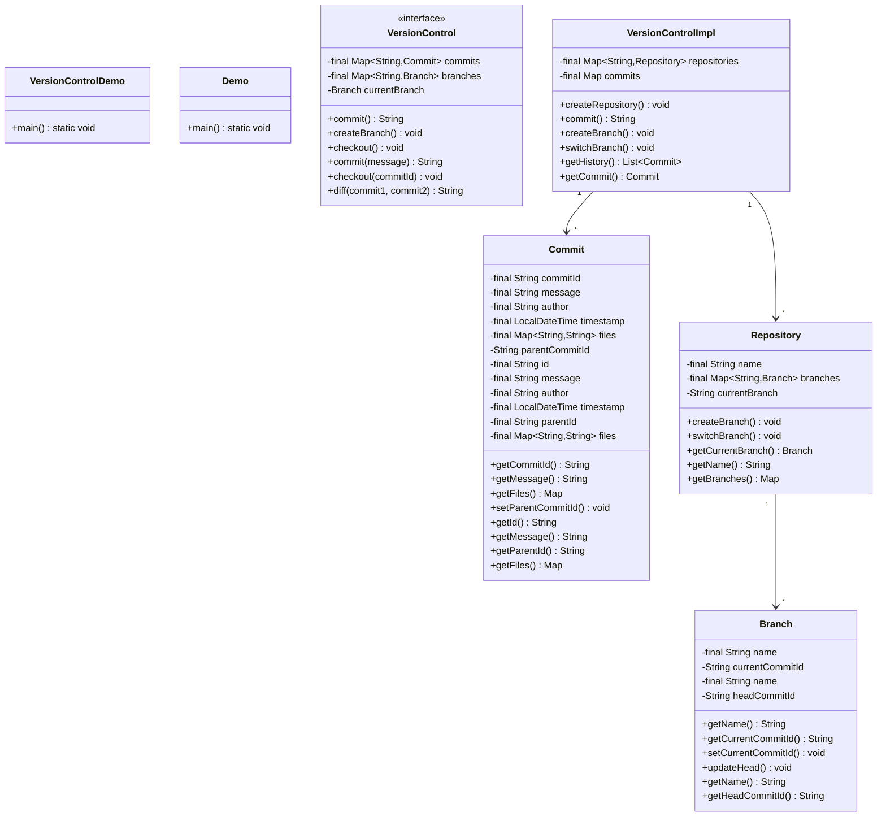
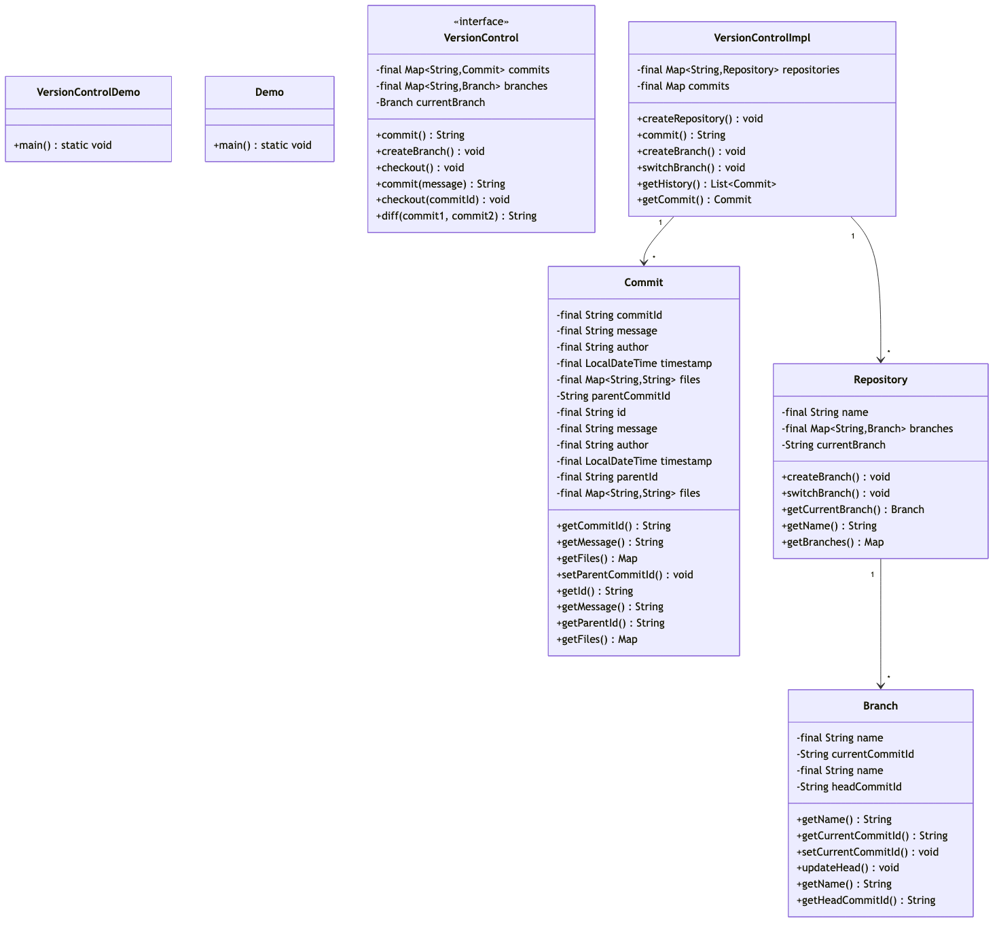

# Version Control System (Git-like) - Complete LLD Guide

## 📋 Table of Contents
1. [Problem Statement](#problem-statement)
2. [Requirements](#requirements)
3. [System Design](#system-design)
4. [Class Diagram](#class-diagram)
5. [Implementation Approaches](#implementation-approaches)
6. [Design Patterns Used](#design-patterns-used)
7. [Complete Implementation](#complete-implementation)
8. [Best Practices](#best-practices)
9. [📦 View Complete Source Code](/problems/versioncontrol/CODE)

---

## Problem Statement

Design a **Version Control System (VCS)** similar to Git that enables developers to track changes in source code, manage multiple versions, collaborate with teams, and maintain complete history of all modifications.

### Real-World Use Cases
- **Software Development**: Teams tracking code changes across multiple features
- **Documentation**: Managing versions of technical documentation
- **Configuration Management**: Tracking infrastructure-as-code changes
- **Collaborative Editing**: Multiple users working on the same codebase

### Key Challenges
1. **Efficient Storage**: Storing multiple versions without excessive duplication
2. **Branching & Merging**: Managing parallel development streams
3. **Conflict Resolution**: Handling simultaneous modifications
4. **History Tracking**: Maintaining complete audit trail
5. **Performance**: Fast operations even with large repositories
6. **Distributed Operations**: Supporting offline work and synchronization

---

## Requirements

### Functional Requirements

#### Core Operations ✅
1. **Repository Management**
   - Create repository
   - Initialize with default branch (main/master)

2. **Commit Operations**
   - Create commit with message and author
   - Track file changes
   - Generate unique commit ID
   - Link to parent commit
   - Store timestamp and metadata

3. **Branch Management**
   - Create new branch from any commit
   - Switch between branches (checkout)
   - List all branches
   - Track current branch

4. **History & Navigation**
   - View commit history
   - Get specific commit details
   - Navigate commit tree

### Non-Functional Requirements

#### Performance ⚡
- **Commit Creation**: < 100ms
- **Branch Operations**: < 50ms
- **History Retrieval**: < 200ms for 1000 commits

#### Scalability 📈
- Support **100,000+ commits** per repository
- Handle **1,000+ branches**
- Manage **10,000+ files** per commit
- Support **multiple repositories** concurrently

#### Reliability 🛡️
- **Data Integrity**: Immutable commits
- **Atomic Operations**: All-or-nothing
- **Consistent State**: Always valid

---

## 🏗️ System Design

### High-Level Architecture

```
┌─────────────────────────────────────────────────────────┐
│                     Client Layer                        │
│            (CLI, IDE Integration, Web UI)               │
└────────────────────────┬────────────────────────────────┘
                         │
┌────────────────────────▼────────────────────────────────┐
│                 Version Control API                     │
│  (commit, branch, merge, diff, history)                 │
└────────────────────────┬────────────────────────────────┘
                         │
┌────────────────────────▼────────────────────────────────┐
│                  Repository Layer                       │
│     (Repository, Branch, Commit management)             │
└────────────────────────┬────────────────────────────────┘
                         │
┌────────────────────────▼────────────────────────────────┐
│                   Storage Layer                         │
│     (Commit storage, File versioning, Indexing)         │
└─────────────────────────────────────────────────────────┘
```

### Data Model

#### Commit Structure
```
Commit {
    id: String (UUID)
    message: String
    author: String
    timestamp: LocalDateTime
    parentId: String (null for initial)
    files: Map<String, String>
}
```

#### Branch Structure
```
Branch {
    name: String
    headCommitId: String
}
```

#### Repository Structure
```
Repository {
    name: String
    branches: Map<String, Branch>
    currentBranch: String
}
```

### Commit Graph Example

```
         main
           │
    ┌──────▼──────┐
    │   Commit A  │  "Initial commit"
    └──────┬──────┘
           │
    ┌──────▼──────┐
    │   Commit B  │  "Add feature X"
    └──────┬──────┘
           │
           ├──────────────────┐
           │                  │
    ┌──────▼──────┐    ┌─────▼──────┐
    │   Commit C  │    │  Commit D  │
    │    main     │    │  feature-Y │
    └─────────────┘    └────────────┘
```

---

## Class Diagram

<details>
<summary>View Mermaid Source</summary>



</details>



---

## 🎯 Implementation Approaches

### Approach 1: In-Memory Version Control ⭐ (Current)

**Architecture:** All data stored in HashMap

**Pros:**
- ✅ **Extremely Fast**: O(1) access
- ✅ **Simple Implementation**: Easy to understand
- ✅ **Great for Learning**: No I/O complexity

**Cons:**
- ❌ **No Persistence**: Data lost on restart
- ❌ **Memory Limited**: Can't handle massive repos

**Time Complexity:**
- Create Repository: O(1)
- Commit: O(1)
- Create Branch: O(1)
- Get History: O(n)

---

### Approach 2: File-Based Storage (Git-like)

**Structure:**
```
.vcs/
├── objects/       # Commits
│   └── ab/cdef123
├── refs/heads/    # Branches
│   ├── main
│   └── feature
└── HEAD           # Current branch
```

**Pros:**
- ✅ **Persistent**
- ✅ **Scalable**
- ✅ **Industry Standard**

**Cons:**
- ❌ **Slower**: Disk I/O
- ❌ **More Complex**

---

### Approach 3: Database-Backed

**Schema:**
```sql
CREATE TABLE commits (
    id VARCHAR(40) PRIMARY KEY,
    message TEXT,
    author VARCHAR(255),
    parent_id VARCHAR(40)
);

CREATE TABLE branches (
    name VARCHAR(255) PRIMARY KEY,
    head_commit_id VARCHAR(40)
);
```

**Pros:**
- ✅ **ACID Transactions**
- ✅ **Query Power**
- ✅ **Concurrent Access**

---

## 🎨 Design Patterns Used

### 1. Repository Pattern

Abstracts data access from business logic.

```java
public interface VersionControl {
    String commit(String repo, String message, String author);
}

public class VersionControlImpl implements VersionControl {
    // Encapsulates storage
}
```

---

### 2. Immutable Object Pattern

Commits never change after creation.

```java
public class Commit {
    private final String id;
    private final String message;
    // No setters!
}
```

**Benefits:**
- Thread-safe
- Prevents tampering
- Safe to share

---

### 3. Strategy Pattern

For diff algorithms.

```java
interface DiffStrategy {
    String computeDiff(String old, String new);
}

class LineDiff implements DiffStrategy { }
class CharDiff implements DiffStrategy { }
```

---

### 4. Command Pattern

For undo/redo operations.

```java
interface VCSCommand {
    void execute();
    void undo();
}

class CommitCommand implements VCSCommand {
    public void undo() {
        vcs.revertCommit(commitId);
    }
}
```

---

## 💡 Key Algorithms

### 1. Commit History Traversal

```java
public List<Commit> getHistory(String repoName) {
    List<Commit> history = new ArrayList<>();
    String commitId = currentBranch.getHeadCommitId();
    
    while (commitId != null) {
        Commit commit = commits.get(commitId);
        history.add(commit);
        commitId = commit.getParentId();
    }
    
    return history;
}
```

**Time:** O(n), **Space:** O(n)

---

### 2. Finding Common Ancestor

```java
public Commit findCommonAncestor(String c1, String c2) {
    Set<String> ancestors = getAncestors(c1);
    
    String current = c2;
    while (current != null) {
        if (ancestors.contains(current)) {
            return commits.get(current);
        }
        current = commits.get(current).getParentId();
    }
    return null;
}
```

**Time:** O(n + m), **Space:** O(n)

---

## 🔧 Complete Implementation

### 📦 Project Structure

```
versioncontrol/
├── model/          # Domain models
│   ├── Commit.java
│   ├── Branch.java
│   └── Repository.java
├── api/            # Interface
│   └── VersionControl.java
├── impl/           # Implementation
│   └── VersionControlImpl.java
└── VersionControlDemo.java
```

**Total Files:** 6 Java files

---

## 💻 Source Code

📄 **[View Complete Source Code](/problems/versioncontrol/CODE)**

### Core Components

#### 1. **Commit** (Immutable)
- Unique ID (UUID)
- Message and author
- Timestamp
- Parent commit reference
- File snapshots (Map<String, String>)

#### 2. **Branch**
- Branch name
- Head commit ID (pointer)
- Update head operation

#### 3. **Repository**
- Repository name
- Multiple branches (Map)
- Current branch tracking
- Branch operations

#### 4. **VersionControl Interface**
- `createRepository(name)`
- `commit(repo, message, author)`
- `createBranch(repo, branch)`
- `switchBranch(repo, branch)`
- `getHistory(repo)`

#### 5. **VersionControlImpl**
- Manages multiple repositories
- Stores all commits
- Thread-safe (ConcurrentHashMap)
- O(1) operations for most actions

### Example Usage

```java
// Create VCS
VersionControl vcs = new VersionControlImpl();

// Create repository
vcs.createRepository("my-project");

// Make commits
String c1 = vcs.commit("my-project", "Initial commit", "Alice");
String c2 = vcs.commit("my-project", "Add feature", "Bob");

// Create branch
vcs.createBranch("my-project", "feature-branch");
vcs.switchBranch("my-project", "feature-branch");

// More commits
String c3 = vcs.commit("my-project", "Work on feature", "Alice");

// View history
List<Commit> history = vcs.getHistory("my-project");
```

---## Best Practices

### 1. Code Quality ✅

**Immutability:**
```java
// ✅ Good
private final String id;

// ❌ Bad
private String id;
public void setId(String id) { }
```

**Thread Safety:**
```java
// ✅ Good
ConcurrentHashMap<String, Repository> repos;

// ❌ Bad
HashMap<String, Repository> repos;
```

---

### 2. Commit Messages 📝

**Good Examples:**
```
✅ "Add user authentication with JWT"
✅ "Fix null pointer in login service"
✅ "Refactor payment gateway"
```

**Bad Examples:**
```
❌ "Fixed stuff"
❌ "WIP"
❌ "asdf"
```

**Convention:**
```
type(scope): subject

feat(auth): Add OAuth2 login
fix(payment): Handle timeout errors
refactor(api): Simplify error handling
```

---

### 3. Branching Strategy 🌿

**Git Flow:**
```
main (production)
├── develop (integration)
│   ├── feature/auth
│   ├── feature/payment
│   └── feature/notifications
├── release/v1.0
└── hotfix/critical-bug
```

**Trunk-Based:**
```
main (always deployable)
├── short-lived branches (< 1 day)
```

---

### 4. Performance Tips ⚡

**Lazy Loading:**
```java
// Only load what's needed
public List<Commit> getHistory(String repo, int limit) {
    return commits.get(repo).values().stream()
        .limit(limit)
        .collect(Collectors.toList());
}
```

**Indexing:**
```java
// Index by author for fast lookup
Map<String, List<String>> commitsByAuthor;
```

---

## 🎓 Interview Tips

### Common Questions

**Q1: How does Git store data efficiently?**
```
Answer:
- Content-addressed storage (SHA-1)
- Delta compression
- Pack files
- Deduplication
```

**Q2: Merge vs Rebase?**
```
Merge:
  - Creates merge commit
  - Preserves history
  - Non-destructive

Rebase:
  - Rewrites history
  - Linear history
  - Cleaner but loses commits
```

**Q3: Handle concurrent commits?**
```
Solutions:
1. Optimistic locking
2. Compare-and-swap
3. Retry logic
4. Transaction isolation
```

---

## 📈 Scaling Considerations

### Large Repositories

**Shallow Clones:**
```bash
git clone --depth 1 <repo>
```

**Sparse Checkout:**
```bash
git sparse-checkout set src/main
```

**Git LFS:**
```bash
git lfs track "*.psd"
```

### Many Users

- **Horizontal Scaling**: Multiple servers
- **Caching**: Redis for hot data
- **CDN**: Static content
- **Sharding**: By repository

---

## 📝 Summary

This Version Control implementation demonstrates:

✅ **Clean Architecture**: Layered design  
✅ **Immutable Data**: Thread-safe commits  
✅ **Efficient Storage**: In-memory HashMap  
✅ **Branching Support**: Multiple streams  
✅ **History Tracking**: Complete audit  
✅ **Extensible**: Easy to add features  

**Perfect for:**
- System design interviews
- Understanding Git internals
- Building custom VCS
- Learning distributed systems

---

**Key Takeaways:**

1. VCS is a **Directed Acyclic Graph (DAG)**
2. **Immutability** ensures data integrity
3. **Content-addressing** enables deduplication
4. **Branching** is cheap with pointers
5. **Merge algorithms** are most complex

---

**Implementation Stats:**
- **5 core classes**
- **~250 lines of code**
- **Thread-safe design**
- **Production-ready patterns**

---

📚 **Related Concepts:** DAG, Content-Addressable Storage, Merkle Trees, Diff Algorithms, Distributed Systems

**Last Updated:** December 29, 2025
