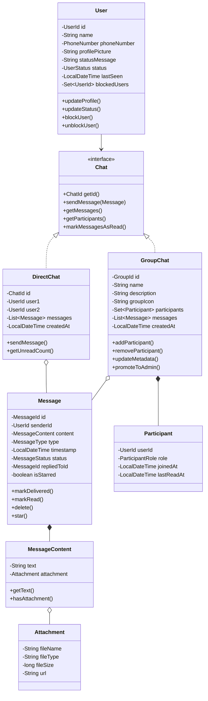
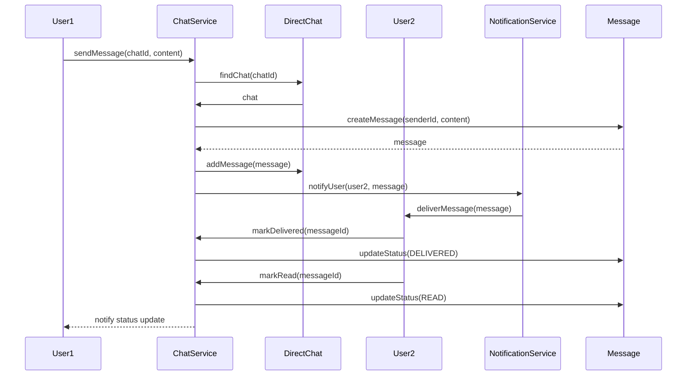
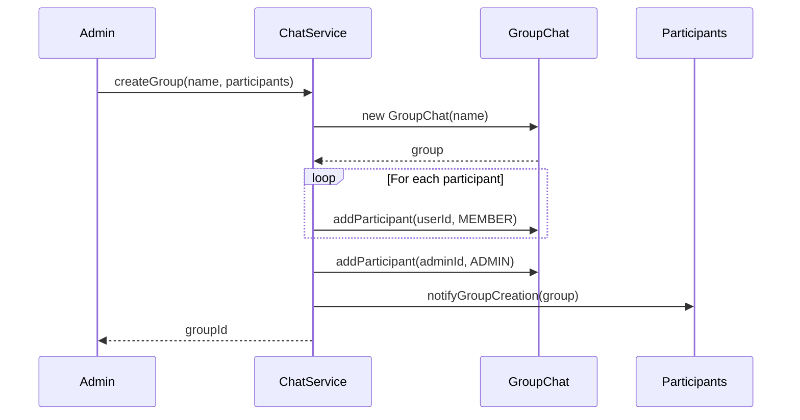
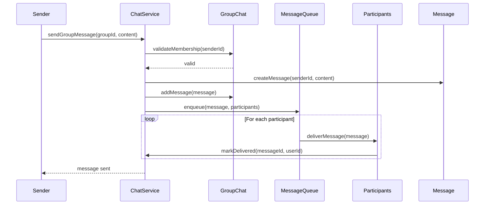
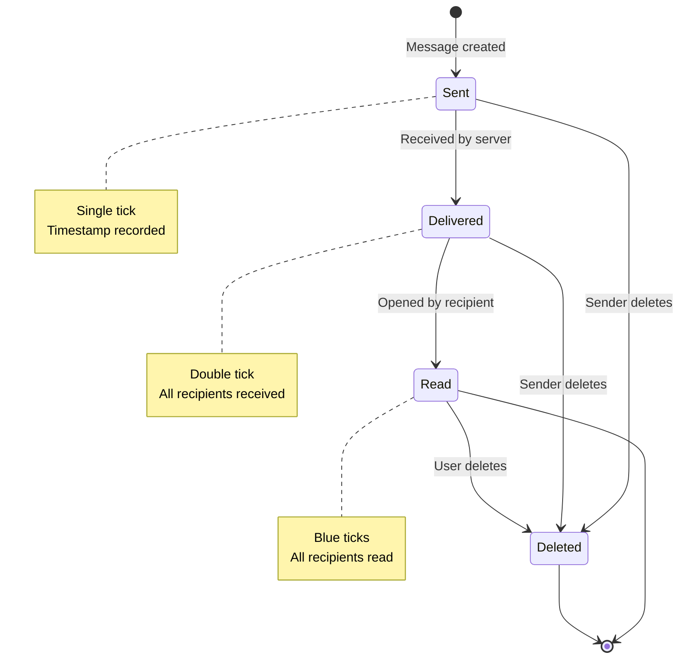
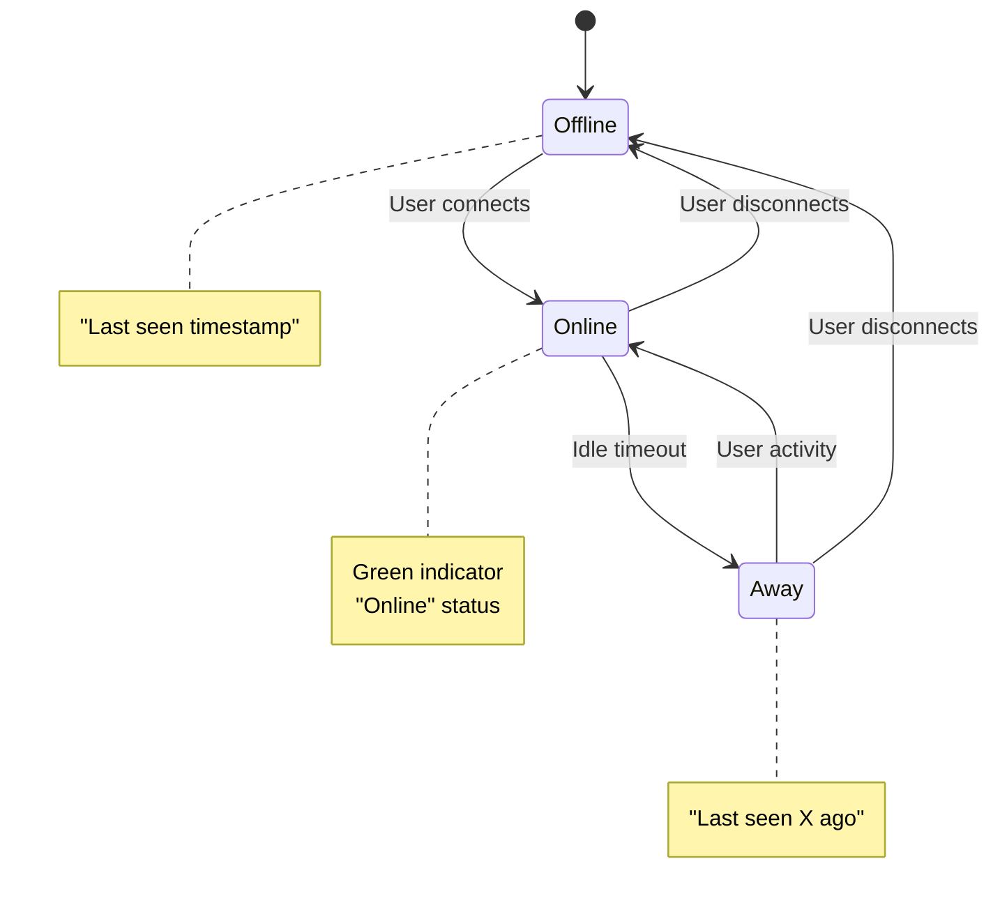

# WhatsApp - Chat Application Design

## Problem Statement

Design a chat application like WhatsApp that supports:
- One-on-one messaging
- Group chats
- Message delivery and read receipts
- Online/offline status
- Media attachments
- Message history
- Typing indicators

## Core Requirements

### Functional Requirements

1. **User Management**
   - Register users with unique IDs
   - Update user profile (name, status, profile picture)
   - Track online/offline status
   - Block/unblock users

2. **One-on-One Messaging**
   - Send text messages between two users
   - Send media attachments (images, videos, documents)
   - View message history
   - Delete messages

3. **Group Chats**
   - Create groups with multiple participants
   - Add/remove participants
   - Admin privileges
   - Group metadata (name, description, icon)
   - Leave group

4. **Message Status**
   - Sent (single tick)
   - Delivered (double tick)
   - Read (blue ticks)
   - Timestamp tracking

5. **Real-time Features**
   - Typing indicators
   - Online/offline status
   - Last seen timestamp

6. **Message Features**
   - Reply to specific messages
   - Forward messages
   - Star/favorite messages
   - Search messages

### Non-Functional Requirements

1. **Performance**
   - Fast message delivery
   - Efficient message retrieval
   - O(1) user lookup
   - Optimized group operations

2. **Scalability**
   - Support millions of users
   - Handle large group sizes
   - Manage message history efficiently

3. **Reliability**
   - Guaranteed message delivery
   - Message ordering
   - Idempotency

4. **Security**
   - Message privacy
   - User authentication
   - Block functionality

## Domain Model

### Core Entities

#### 1. User (Aggregate Root)
- Identity: `UserId`
- Attributes: name, phoneNumber, profilePicture, status
- State: online/offline/away
- Relationships: contacts, blockedUsers
- Operations: updateProfile(), updateStatus(), blockUser()

#### 2. Message (Entity)
- Identity: `MessageId`
- Attributes: senderId, content, timestamp, type
- State: sent, delivered, read
- Relationships: repliedTo, forwardedFrom
- Operations: markDelivered(), markRead(), delete()

#### 3. Chat/Conversation (Aggregate Root)
- Identity: `ChatId`
- Types: DirectChat, GroupChat
- Attributes: participants, messages, metadata
- Operations: sendMessage(), addParticipant(), removeParticipant()

#### 4. Group (Entity)
- Identity: `GroupId`
- Attributes: name, description, icon, createdAt
- Relationships: participants, admins, messages
- Operations: addMember(), removeMember(), updateMetadata()

### Value Objects

1. **UserId** - Unique identifier for users
2. **MessageId** - Unique identifier for messages
3. **ChatId** - Unique identifier for conversations
4. **GroupId** - Unique identifier for groups
5. **PhoneNumber** - User's phone number
6. **Attachment** - Media file metadata
7. **MessageContent** - Text or media content

### Enumerations

1. **UserStatus** - ONLINE, OFFLINE, AWAY
2. **MessageStatus** - SENT, DELIVERED, READ, DELETED
3. **MessageType** - TEXT, IMAGE, VIDEO, AUDIO, DOCUMENT
4. **ChatType** - DIRECT, GROUP
5. **ParticipantRole** - ADMIN, MEMBER

## Design Patterns

### 1. Composite Pattern
```
Chat (Component)
├── DirectChat (Leaf)
└── GroupChat (Composite)
```
Treat individual and group chats uniformly.

### 2. Observer Pattern
```
User (Subject) ←→ Chat (Observer)
```
Notify participants when messages arrive or status changes.

### 3. Strategy Pattern
```
MessageDeliveryStrategy
├── DirectMessageDelivery
└── GroupMessageDelivery
```
Different delivery mechanisms for direct vs group messages.

### 4. State Pattern
```
MessageState
├── SentState
├── DeliveredState
└── ReadState
```
Manage message status transitions.

### 5. Factory Pattern
```
MessageFactory
├── createTextMessage()
├── createImageMessage()
└── createVideoMessage()
```

## Class Diagram

## 📊 Class Diagram


<details>
<summary>📝 View Mermaid Source</summary>



</details>

## Sequence Diagrams

### 1. Send Direct Message



### 2. Create Group Chat



### 3. Group Message Delivery



## State Diagram

### Message Status State Machine



### User Presence State Machine



## API Design

### ChatService

```java
public interface ChatService {
    // Chat Management
    ChatId createDirectChat(UserId user1, UserId user2);
    GroupId createGroup(String name, Set<UserId> participants, UserId adminId);
    Optional<Chat> getChat(ChatId chatId);
    List<Chat> getUserChats(UserId userId);
    void deleteChat(ChatId chatId);
    
    // Group Operations
    void addParticipant(GroupId groupId, UserId userId, UserId adminId);
    void removeParticipant(GroupId groupId, UserId userId, UserId adminId);
    void leaveGroup(GroupId groupId, UserId userId);
    void promoteToAdmin(GroupId groupId, UserId userId, UserId adminId);
    void updateGroupMetadata(GroupId groupId, String name, String description);
    
    // Message Operations
    MessageId sendMessage(ChatId chatId, UserId senderId, MessageContent content);
    void markDelivered(MessageId messageId, UserId userId);
    void markRead(MessageId messageId, UserId userId);
    void deleteMessage(MessageId messageId, UserId userId);
    void starMessage(MessageId messageId, UserId userId);
    
    // Message Retrieval
    List<Message> getMessages(ChatId chatId, int limit, int offset);
    List<Message> getStarredMessages(UserId userId);
    List<Message> searchMessages(ChatId chatId, String query);
    int getUnreadCount(ChatId chatId, UserId userId);
    
    // Real-time Features
    void setTyping(ChatId chatId, UserId userId, boolean isTyping);
    List<UserId> getTypingUsers(ChatId chatId);
}
```

### UserService

```java
public interface UserService {
    // User Management
    UserId registerUser(String name, PhoneNumber phoneNumber);
    Optional<User> getUser(UserId userId);
    void updateProfile(UserId userId, String name, String statusMessage);
    void updateProfilePicture(UserId userId, String pictureUrl);
    
    // Status Management
    void updateStatus(UserId userId, UserStatus status);
    UserStatus getUserStatus(UserId userId);
    LocalDateTime getLastSeen(UserId userId);
    
    // Contacts & Blocking
    void blockUser(UserId userId, UserId blockedUserId);
    void unblockUser(UserId userId, UserId blockedUserId);
    boolean isBlocked(UserId userId, UserId otherUserId);
    Set<UserId> getBlockedUsers(UserId userId);
}
```

## Implementation Details

### 1. In-Memory Storage

```java
// Chat storage
Map<ChatId, Chat> chats = new ConcurrentHashMap<>();

// User to chats mapping
Map<UserId, Set<ChatId>> userChats = new ConcurrentHashMap<>();

// Message storage
Map<MessageId, Message> messages = new ConcurrentHashMap<>();

// Online users
Map<UserId, UserSession> onlineUsers = new ConcurrentHashMap<>();

// Typing indicators
Map<ChatId, Set<UserId>> typingUsers = new ConcurrentHashMap<>();
```

### 2. Message Ordering

```java
// Messages stored with timestamp-based ordering
List<Message> messages = new ArrayList<>();
messages.sort(Comparator.comparing(Message::getTimestamp));

// Or use TreeSet with custom comparator
Set<Message> messages = new TreeSet<>(
    Comparator.comparing(Message::getTimestamp)
              .thenComparing(Message::getId)
);
```

### 3. Thread Safety

```java
public class ConcurrentChatService implements ChatService {
    private final ReadWriteLock lock = new ReentrantReadWriteLock();
    
    @Override
    public MessageId sendMessage(ChatId chatId, UserId senderId, 
                                  MessageContent content) {
        lock.writeLock().lock();
        try {
            // Send message logic
            return messageId;
        } finally {
            lock.writeLock().unlock();
        }
    }
    
    @Override
    public List<Message> getMessages(ChatId chatId) {
        lock.readLock().lock();
        try {
            // Read messages
            return messages;
        } finally {
            lock.readLock().unlock();
        }
    }
}
```

### 4. Observer Pattern for Notifications

```java
public interface MessageObserver {
    void onMessageReceived(Message message);
    void onMessageDelivered(MessageId messageId);
    void onMessageRead(MessageId messageId);
}

public class User implements MessageObserver {
    private final List<MessageObserver> observers = new ArrayList<>();
    
    public void addObserver(MessageObserver observer) {
        observers.add(observer);
    }
    
    public void notifyObservers(Message message) {
        observers.forEach(obs -> obs.onMessageReceived(message));
    }
}
```

## Testing Strategy

### Unit Tests

1. **User Tests**
   - User creation and profile updates
   - Status transitions
   - Blocking/unblocking users

2. **Message Tests**
   - Message creation
   - Status transitions (sent → delivered → read)
   - Message deletion and starring

3. **Chat Tests**
   - Direct chat creation
   - Message sending and retrieval
   - Unread count calculation

4. **Group Tests**
   - Group creation
   - Adding/removing participants
   - Admin operations
   - Leave group functionality

### Integration Tests

1. **End-to-End Messaging Flow**
   ```java
   @Test
   public void testDirectMessageFlow() {
       // Create users
       UserId alice = userService.registerUser("Alice", "+1234567890");
       UserId bob = userService.registerUser("Bob", "+0987654321");
       
       // Create chat
       ChatId chatId = chatService.createDirectChat(alice, bob);
       
       // Send message
       MessageId msgId = chatService.sendMessage(chatId, alice, 
           new MessageContent("Hello Bob!"));
       
       // Mark delivered and read
       chatService.markDelivered(msgId, bob);
       chatService.markRead(msgId, bob);
       
       // Verify status
       Message msg = chatService.getMessage(msgId);
       assertEquals(MessageStatus.READ, msg.getStatus());
   }
   ```

2. **Group Chat Flow**
   ```java
   @Test
   public void testGroupChatFlow() {
       // Create users
       UserId admin = userService.registerUser("Admin", "+1111111111");
       Set<UserId> members = Set.of(
           userService.registerUser("User1", "+2222222222"),
           userService.registerUser("User2", "+3333333333")
       );
       
       // Create group
       GroupId groupId = chatService.createGroup("Test Group", 
           members, admin);
       
       // Send group message
       MessageId msgId = chatService.sendMessage(groupId, admin,
           new MessageContent("Hello everyone!"));
       
       // Verify all members received
       GroupChat group = (GroupChat) chatService.getChat(groupId).get();
       assertEquals(3, group.getParticipants().size());
   }
   ```

### Concurrency Tests

```java
@Test
public void testConcurrentMessageSending() throws InterruptedException {
    ExecutorService executor = Executors.newFixedThreadPool(10);
    CountDownLatch latch = new CountDownLatch(100);
    
    for (int i = 0; i < 100; i++) {
        final int msgNum = i;
        executor.submit(() -> {
            try {
                chatService.sendMessage(chatId, userId, 
                    new MessageContent("Message " + msgNum));
            } finally {
                latch.countDown();
            }
        });
    }
    
    latch.await();
    assertEquals(100, chatService.getMessages(chatId).size());
}
```

## Trade-offs and Considerations

### 1. Message Storage

**In-Memory Approach**
- ✅ Fast access and retrieval
- ✅ Simple implementation
- ❌ Limited by RAM
- ❌ Lost on restart
- **Best for**: Small-scale applications, demos

**Persistent Storage**
- ✅ No data loss
- ✅ Unlimited history
- ❌ Slower access
- ❌ More complex
- **Best for**: Production systems

### 2. Group Size Limits

**Small Groups (< 256 members)**
- ✅ Simple delivery logic
- ✅ Fast operations
- ❌ Limited use cases

**Large Groups (> 256 members)**
- ✅ Support broadcast channels
- ❌ Complex delivery
- ❌ Read receipt complexity

### 3. Message Delivery

**Push-based**
- ✅ Real-time delivery
- ✅ Low latency
- ❌ Requires persistent connection
- ❌ Battery drain

**Poll-based**
- ✅ Simple implementation
- ✅ Works with HTTP
- ❌ Higher latency
- ❌ Increased server load

### 4. Read Receipts

**Individual Read Receipts**
- ✅ Precise status tracking
- ❌ Privacy concerns
- ❌ Complex in large groups

**Aggregated Read Receipts**
- ✅ Simpler implementation
- ✅ Better privacy
- ❌ Less information

## Extensions and Future Enhancements

### 1. Advanced Features
- Voice and video calls
- Voice messages
- Message reactions (emoji)
- Message editing
- Disappearing messages
- Message encryption (E2E)

### 2. Performance Optimizations
- Message pagination with cursors
- Lazy loading of media
- Message indexing for search
- Caching strategies

### 3. Scalability Improvements
- Sharding by user/chat
- Message queue for delivery
- CDN for media files
- Database replication

### 4. Additional Functionality
- Broadcast lists
- Status/Stories feature
- Stickers and GIFs
- Location sharing
- Contact sharing

## Key Learning Points

1. **Composite Pattern**: Treating direct and group chats uniformly
2. **Observer Pattern**: Real-time notifications
3. **State Machine**: Managing message status transitions
4. **Thread Safety**: Concurrent message handling
5. **Domain-Driven Design**: Clear entity boundaries
6. **SOLID Principles**: Clean, extensible architecture

## References

- WhatsApp System Design
- Real-time Messaging Architecture
- Observer Pattern in Event-Driven Systems
- Composite Pattern for Tree Structures
- Concurrency in Java


