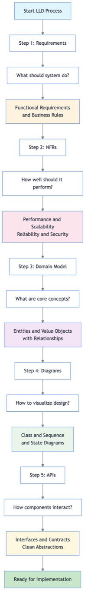
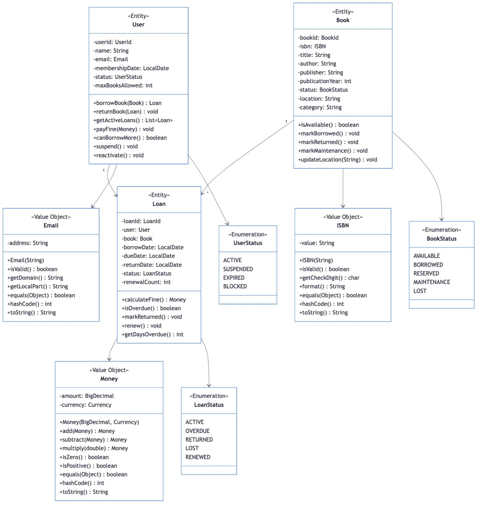
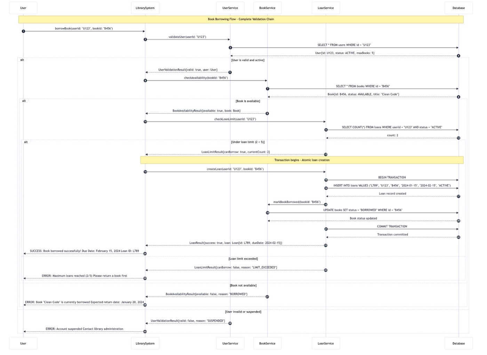
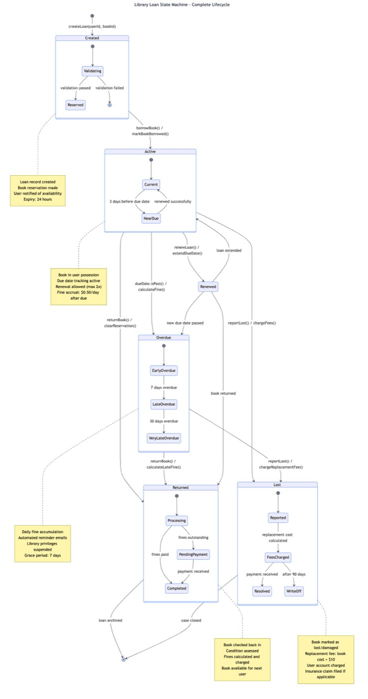

# Day 1: LLD Process & Fundamentals

## **Day 1 Learning Objectives**

Master the **fundamentals of Low-Level Design**:
- **LLD Process** - Systematic approach to system design
- **Requirements & NFRs** - How to gather and analyze requirements
- **Domain Modeling** - How to identify entities and relationships
- **UML Diagrams** - How to visualize system design
- **API Design** - How to create clean interfaces

---

## **Day 1 Materials**

### **Core Concepts**
| Topic | Guide | Key Focus |
|-------|-------|-----------|
| **LLD Process** | [Complete Guide](week1/day1/DAY1_LLD_PROCESS.md) | Requirements → NFRs → Domain → Diagrams → APIs |
| **Exercises** | [Practice Problems](week1/day1/EXERCISES.md) | Enterprise ATM & Food Delivery Platform |
| **Solutions** | [Detailed Solutions](week1/day1/EXERCISE_SOLUTIONS.md) | Step-by-step approach |

### **Visual Learning**

#### LLD Process Flow


#### Library System - Class Diagram


#### Book Borrowing - Sequence Diagram


#### Loan Lifecycle - State Diagram


### **Reference Guides**
| Topic | Guide | Key Concepts |
|-------|-------|--------------|
| **Class Diagrams** | [Java Guidelines](foundations/JAVA_CLASS_DIAGRAM_GUIDELINES.md) | Professional UML in Java |
| **Design Patterns** | [Patterns Catalog](foundations/DESIGN_PATTERNS_CATALOG.md) | All 23 GoF patterns |
| **OOP Relationships** | [Association, Aggregation & Composition](foundations/ASSOCIATION_AGGREGATION_COMPOSITION.md) | Object relationships |

---

## **Day 1 Learning Path**

```
1. LLD Process Overview
   ↓
2. Requirements Analysis (Functional & Non-Functional)
   ↓
3. Domain Modeling (Entities, Value Objects, Relationships)
   ↓
4. UML Diagrams (Class, Sequence, State)
   ↓
5. API Design (Clean interfaces)
   ↓
6. Hands-on Exercises (ATM & Food Delivery)
```

---

## **The LLD Process**

### **Step-by-Step Methodology**
```
Requirements Gathering
         ↓
Non-Functional Requirements (NFRs)
         ↓
Domain Modeling
         ↓
UML Diagrams
         ↓
API Design
         ↓
Implementation Planning
```

### **Key Deliverables**
- **Requirements Document** - What the system should do
- **NFRs Specification** - Performance, scalability, reliability goals
- **Domain Model** - Core entities and relationships
- **UML Diagrams** - Visual system design
- **API Contracts** - Clean interfaces and contracts

---

## **Quick Reference**

### **Requirements Types**
- **Functional**: What the system does
- **Non-Functional**: How well the system performs

### **Domain Concepts**
- **Entity**: Has identity, mutable (User, Order)
- **Value Object**: No identity, immutable (Money, Address)
- **Aggregate**: Consistency boundary
- **Repository**: Data access abstraction

### **UML Diagram Types**
- **Class**: Object structure and relationships
- **Sequence**: Process flow over time
- **State**: Object lifecycle and transitions
- **Component**: System architecture

### **Relationship Types**
- **Association**: "Uses-a" (loose coupling)
- **Aggregation**: "Has-a" (weak ownership)
- **Composition**: "Part-of" (strong ownership)

---

## **Day 1 Success Criteria**

By the end of Day 1, you should be able to:

### **Knowledge**
- Explain the complete LLD process
- Distinguish between functional and non-functional requirements
- Identify entities, value objects, and relationships
- Choose appropriate UML diagrams for different purposes

### **Skills**
- Gather and analyze requirements systematically
- Create professional UML diagrams
- Design clean APIs and interfaces
- Apply domain-driven design principles

### **Practice**
- Complete Enterprise ATM System exercise
- Complete Global Food Delivery Platform exercise
- Create UML diagrams for real systems
- Prepare for Day 2 (SOLID & GRASP principles)

---

## **Navigation**

- **→ Next**: [Day 2 - SOLID & GRASP](week1/day2/README.md)
- **↑ Home**: [Main README](home.md)

---

**Day 1 establishes the foundation for systematic, professional Low-Level Design!**
