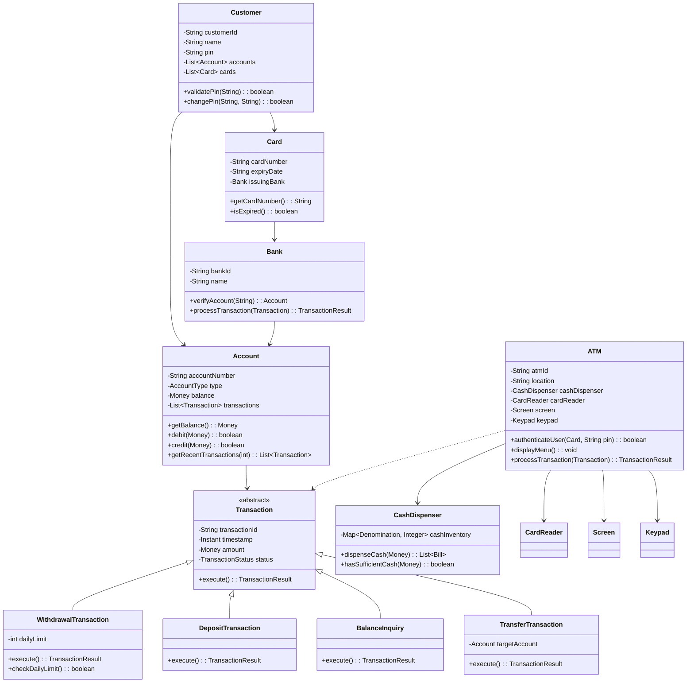
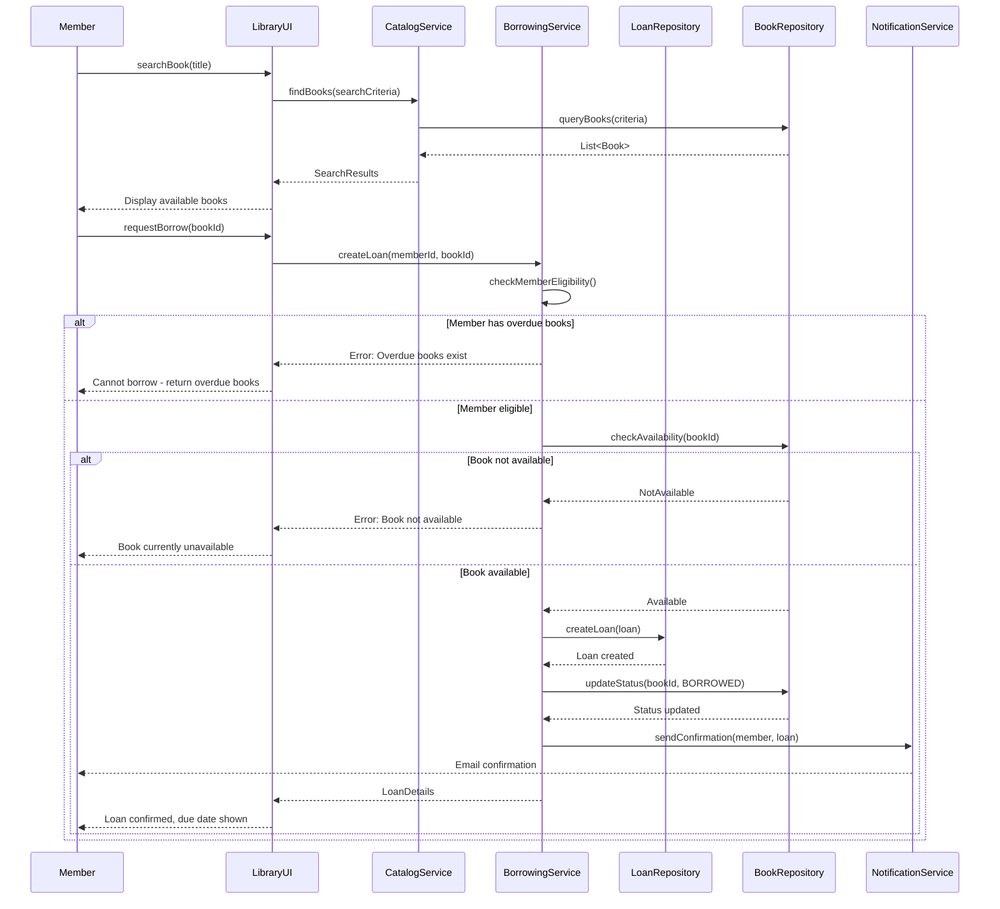
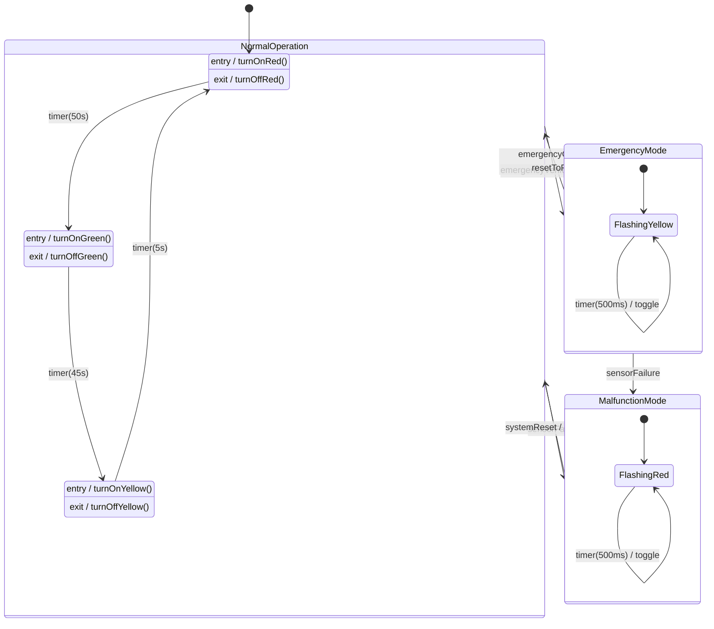
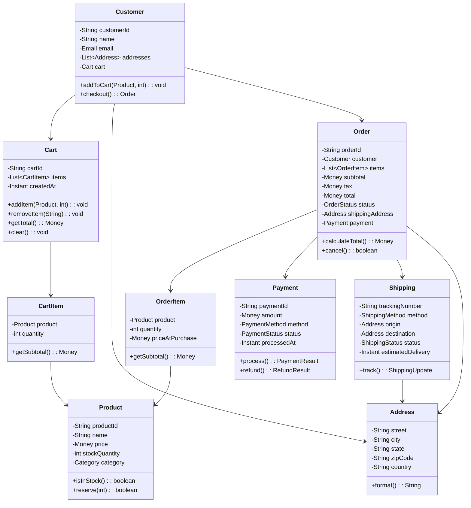
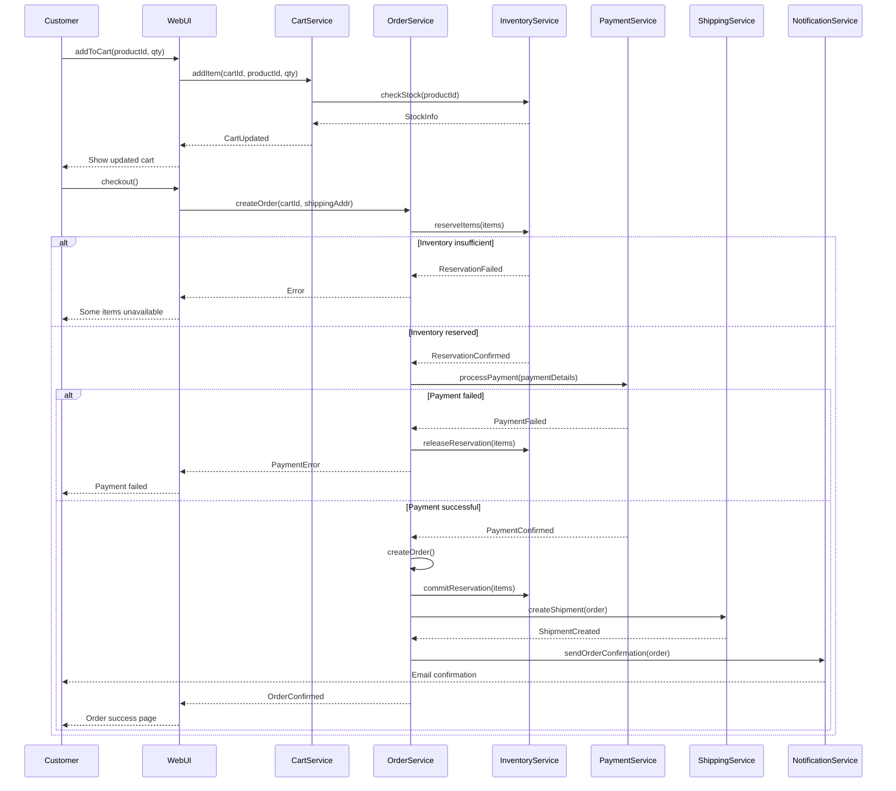
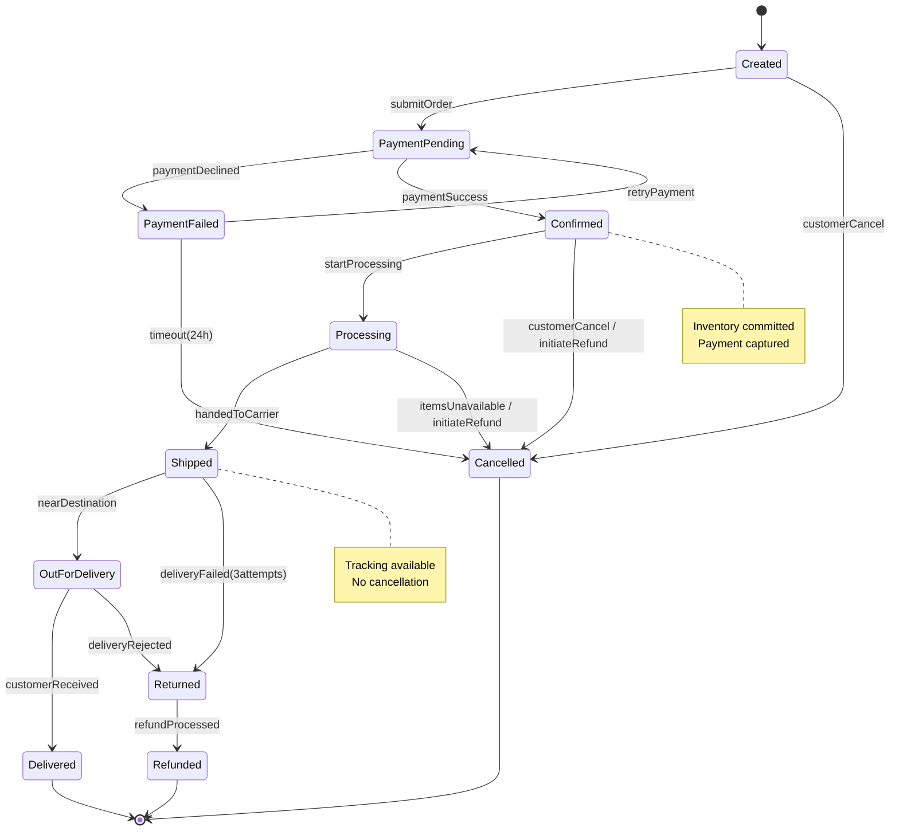
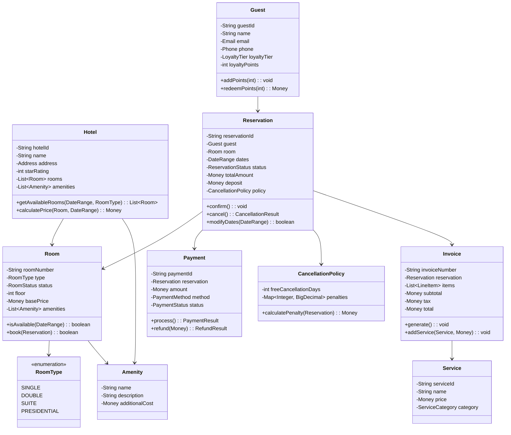
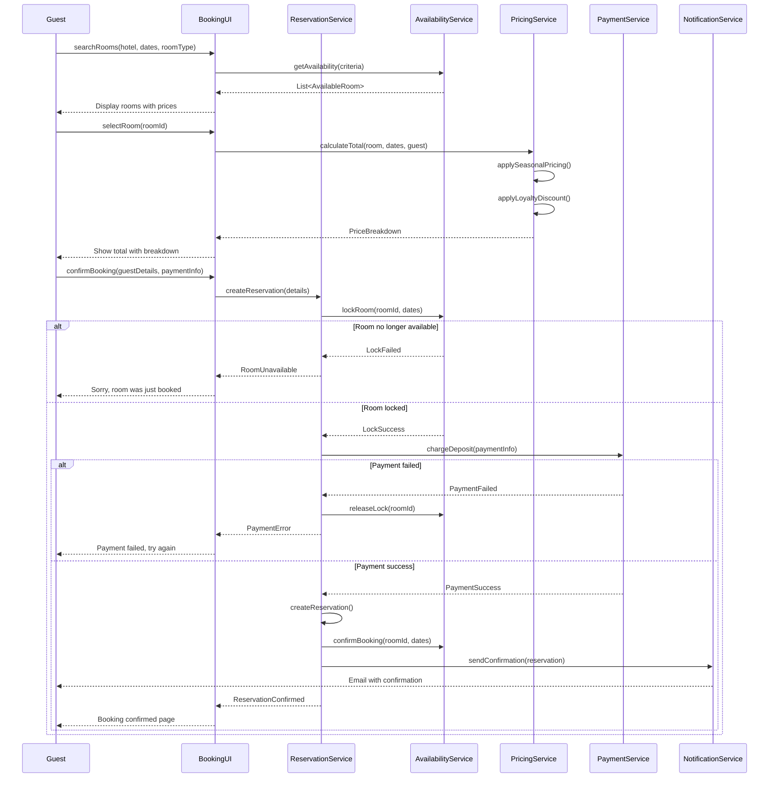
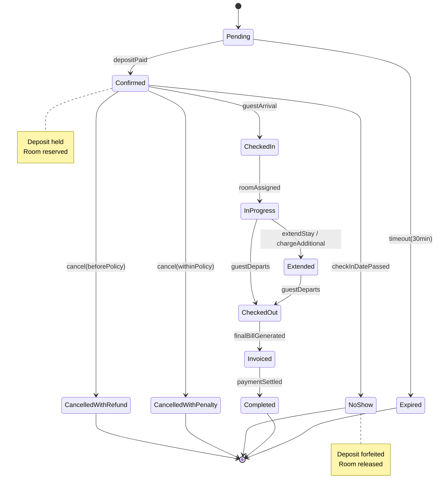

# Day 3 Exercise Solutions 🎯

---

## ✅ **Solution 1: ATM Machine Class Diagram**

### **Key Design Decisions**
1. **Transaction as abstract class**: Allows different transaction types with common behavior
2. **CashDispenser separate**: Single Responsibility - manages physical cash
3. **Bank association**: Centralized account verification
4. **Daily limit in Withdrawal**: Business rule encapsulation

---

## ✅ **Solution 2: Library Management Sequence Diagram**

### **Key Points**
- **Alt fragments**: Handle both success and failure cases
- **Service separation**: Catalog vs Borrowing responsibilities
- **Notification**: Async confirmation to member

---

## ✅ **Solution 3: Traffic Light State Diagram**

### **State Actions**
- **Entry actions**: Turn on appropriate light
- **Exit actions**: Turn off light before transition
- **Timer events**: Trigger state transitions

---

## ✅ **Solution 4: E-commerce Order Flow**

### **Part A: Class Diagram**

### **Part B: Sequence Diagram**

### **Part C: State Diagram**

---

## ✅ **Solution 5: Hotel Booking System**

### **Class Diagram**

### **Sequence Diagram: Booking Flow**

### **State Diagram: Reservation Lifecycle**

---

## 📝 **Key Takeaways**

1. **Class Diagrams**: Focus on responsibilities and relationships, not just attributes
2. **Sequence Diagrams**: Show happy path and error cases with alt/opt fragments
3. **State Diagrams**: Include entry/exit actions and guard conditions
4. **Consistency**: Use same naming conventions across all diagram types
