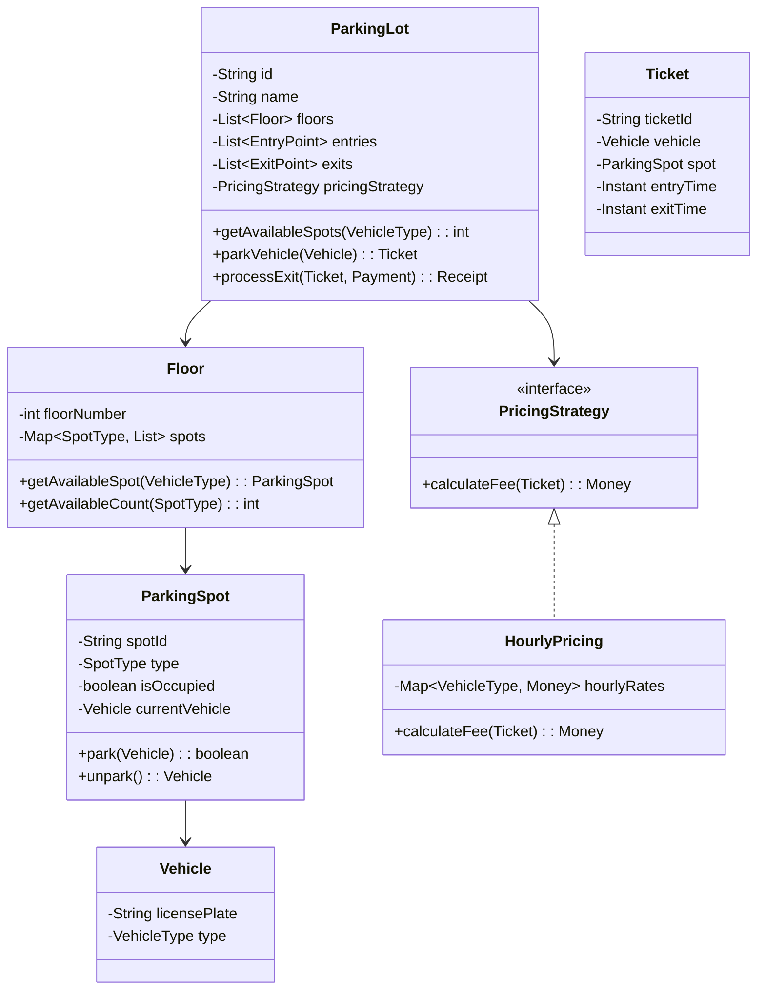

# Weekend 1: Parking Lot System 🚗

**Project**: Build a complete Parking Lot management system with multiple pricing policies and extensibility.

---

## 🎯 **Project Goals**

- Apply Week 1 concepts: OO modeling, UML diagrams, value objects
- Implement a complete, working system
- Practice extensible design with pricing strategies
- Handle concurrency for spot allocation

---

## 📋 **Requirements**

### **Functional**
1. Multiple floors with different spot types (Motorcycle, Compact, Regular, Large)
2. Entry/exit points with ticket generation
3. Multiple pricing strategies (Hourly, Daily, Weekly)
4. Real-time availability tracking
5. Payment processing

### **Non-Functional**
- Thread-safe spot allocation
- Entry/exit processing < 100ms
- Support 10,000+ spots

---

## 🏗️ **Class Diagram**



---

## 💻 **Implementation Guide**

### **Step 1: Core Models** (30 min)
- Create `Vehicle`, `VehicleType`, `SpotType` enums
- Implement `ParkingSpot` with thread-safe operations
- Build `Floor` with spot management

### **Step 2: Ticket & Payment** (30 min)
- Implement `Ticket` as immutable value object
- Create `Payment` and `Receipt` models
- Add `Money` value object for pricing

### **Step 3: Pricing Strategies** (30 min)
- Define `PricingStrategy` interface
- Implement `HourlyPricing`
- Add `DailyPricing` and `WeekendPricing`

### **Step 4: ParkingLot Service** (45 min)
- Implement spot allocation algorithm
- Add concurrent entry/exit handling
- Create occupancy reporting

### **Step 5: Testing** (30 min)
- Unit tests for each component
- Integration tests for full flow
- Concurrency tests

---

## 📁 **Code Location**

```
src/main/java/com/you/lld/problems/parkinglot/
├── api/
│   ├── ParkingService.java
│   ├── PricingStrategy.java
│   └── SpaceAllocationStrategy.java
├── model/
│   ├── ParkingLot.java
│   ├── Floor.java
│   ├── ParkingSpot.java
│   ├── Vehicle.java
│   ├── Ticket.java
│   └── Payment.java
├── impl/
│   ├── ParkingServiceImpl.java
│   ├── HourlyPricingStrategy.java
│   └── NearestSpotAllocation.java
└── exceptions/
    ├── ParkingFullException.java
    └── InvalidTicketException.java
```

---

## ✅ **Acceptance Criteria**

- [ ] Park a motorcycle in compact/motorcycle spot
- [ ] Park a car in regular/large spot
- [ ] Calculate hourly fees correctly
- [ ] Handle concurrent parking requests
- [ ] Generate valid tickets with unique IDs
- [ ] Process payments and generate receipts
- [ ] Report real-time availability

---

**Next Week**: [Week 2 - Patterns and Persistence](week2/README.md) →
