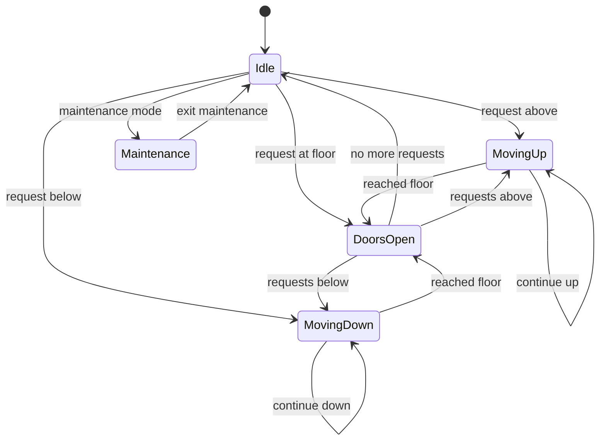

# Weekend 2: Elevator System 🛗

**Project**: Build an elevator control system with multiple scheduling algorithms and state management.

---

## 🎯 **Project Goals**

- Apply Week 2 patterns: State, Strategy, Observer
- Implement scheduling algorithms (SCAN, LOOK)
- Build a state machine for elevator control
- Handle concurrent requests

---

## 📋 **Requirements**

### **Functional**
1. Multiple elevators in a building
2. Handle floor requests (up/down buttons)
3. Handle destination requests (inside elevator)
4. Display current floor and direction
5. Support maintenance mode

### **Non-Functional**
- Minimize average wait time
- Fair request handling
- Thread-safe operation

---

## 🏗️ **State Machine**



---

## 🔄 **Scheduling Algorithms**

### **SCAN (Elevator Algorithm)**
```java
public class ScanScheduler implements ElevatorScheduler {
    
    @Override
    public int getNextFloor(Elevator elevator, Set<Integer> requests) {
        int current = elevator.getCurrentFloor();
        Direction direction = elevator.getDirection();
        
        // Continue in current direction if possible
        List<Integer> inDirection = requests.stream()
            .filter(f -> direction == Direction.UP ? f > current : f < current)
            .sorted(direction == Direction.UP ? 
                    Comparator.naturalOrder() : Comparator.reverseOrder())
            .collect(Collectors.toList());
        
        if (!inDirection.isEmpty()) {
            return inDirection.get(0);
        }
        
        // Reverse direction
        List<Integer> opposite = requests.stream()
            .filter(f -> direction == Direction.UP ? f < current : f > current)
            .sorted(direction == Direction.UP ? 
                    Comparator.reverseOrder() : Comparator.naturalOrder())
            .collect(Collectors.toList());
        
        return opposite.isEmpty() ? current : opposite.get(0);
    }
}
```

### **LOOK Algorithm**
```java
public class LookScheduler implements ElevatorScheduler {
    
    @Override
    public int getNextFloor(Elevator elevator, Set<Integer> requests) {
        // Like SCAN, but only goes to furthest request, not end of building
        int current = elevator.getCurrentFloor();
        Direction direction = elevator.getDirection();
        
        OptionalInt nextInDirection = requests.stream()
            .mapToInt(Integer::intValue)
            .filter(f -> direction == Direction.UP ? f > current : f < current)
            .reduce(direction == Direction.UP ? Integer::min : Integer::max);
        
        if (nextInDirection.isPresent()) {
            return nextInDirection.getAsInt();
        }
        
        // Reverse and find closest in opposite direction
        return requests.stream()
            .mapToInt(Integer::intValue)
            .filter(f -> direction == Direction.UP ? f < current : f > current)
            .reduce(direction == Direction.UP ? Integer::max : Integer::min)
            .orElse(current);
    }
}
```

---

## 💻 **Core Implementation**

```java
public class Elevator implements Runnable {
    private final int id;
    private int currentFloor;
    private Direction direction;
    private ElevatorState state;
    private final Set<Integer> destinationFloors;
    private final ElevatorScheduler scheduler;
    private final List<ElevatorObserver> observers;
    
    public void addDestination(int floor) {
        synchronized (destinationFloors) {
            destinationFloors.add(floor);
            destinationFloors.notifyAll();
        }
        notifyObservers();
    }
    
    @Override
    public void run() {
        while (!Thread.interrupted()) {
            int nextFloor = scheduler.getNextFloor(this, destinationFloors);
            
            if (nextFloor != currentFloor) {
                moveToFloor(nextFloor);
            }
            
            if (destinationFloors.contains(currentFloor)) {
                openDoors();
                destinationFloors.remove(currentFloor);
            }
            
            if (destinationFloors.isEmpty()) {
                waitForRequest();
            }
        }
    }
}

public class ElevatorController {
    private final List<Elevator> elevators;
    private final RequestDispatcher dispatcher;
    
    public void requestElevator(int floor, Direction direction) {
        // Find best elevator for this request
        Elevator best = dispatcher.dispatch(floor, direction, elevators);
        best.addDestination(floor);
    }
}
```

---

## 📁 **Code Location**

```
src/main/java/com/you/lld/problems/elevator/
├── api/
│   ├── ElevatorController.java
│   ├── ElevatorScheduler.java
│   └── RequestDispatcher.java
├── model/
│   ├── Elevator.java
│   ├── Floor.java
│   ├── Request.java
│   └── Building.java
├── state/
│   ├── ElevatorState.java
│   ├── IdleState.java
│   ├── MovingState.java
│   └── DoorsOpenState.java
├── scheduler/
│   ├── ScanScheduler.java
│   └── LookScheduler.java
└── impl/
    └── ElevatorControllerImpl.java
```

---

## ✅ **Acceptance Criteria**

- [ ] Elevators respond to floor requests
- [ ] SCAN algorithm minimizes travel
- [ ] State transitions are correct
- [ ] Multiple elevators coordinate efficiently
- [ ] Display shows real-time status
- [ ] Maintenance mode works correctly

---

**Next Week**: [Week 3 - Services and Infrastructure](week3/README.md) →
