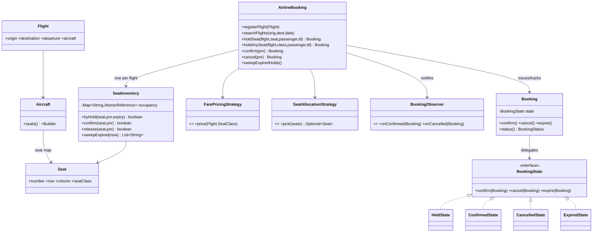
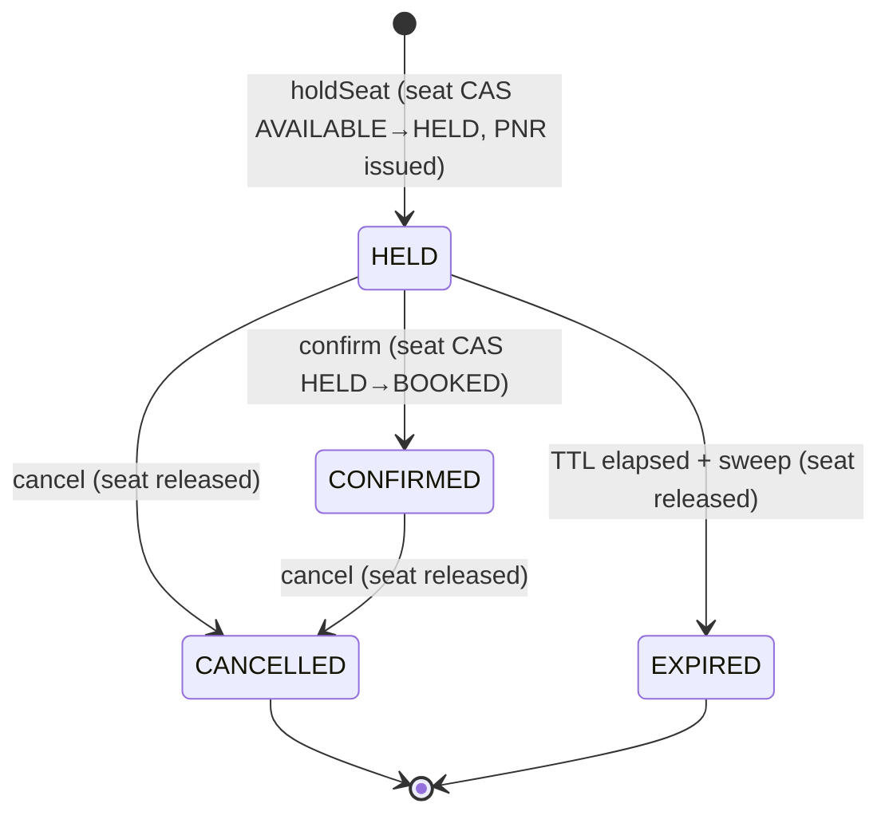

# Airline / Flight Seat Booking

**One-liner:** Book a specific seat on a flight — search by route/date, hold a seat with a TTL, confirm the hold into a PNR, or cancel — with per-seat lock-free concurrency so two passengers can never book the same seat.

## Package structure

```
airlinebooking/
  model/                         entities & value objects (immutable where possible)
    Airport, SeatClass, Seat, Aircraft(+Builder), Flight, Passenger
    Booking (State context), BookingStatus
    BookingState, HeldState, ConfirmedState, CancelledState, ExpiredState
  service/                       interfaces only (one per concern)
    FlightSearchService, FarePricingStrategy, SeatAllocationStrategy, BookingObserver
  service/impl/
    InMemoryFlightSearchService
    ClassBasedPricingStrategy, DynamicPricingStrategy          (Strategy: pricing)
    FrontToBackSeatAllocationStrategy, WindowPreferredSeatAllocationStrategy (Strategy: allocation)
    EmailBookingObserver, SmsBookingObserver                   (Observer)
    SeatInventory                                              (per-seat CAS + TTL sweep)
  AirlineBooking.java            facade/orchestrator (the "god object")
  AirlineBookingDemo.java        runnable 5-scenario demo
  SeatUnavailableException, BookingNotFoundException
```

## Patterns

| Pattern | Where | Why |
|---------|-------|-----|
| **State** | `BookingState` + `HeldState`/`ConfirmedState`/`CancelledState`/`ExpiredState`, context = `Booking` | Lifecycle transition rules (HELD→CONFIRMED/CANCELLED/EXPIRED) live one-per-state instead of a sprawling `switch`; illegal transitions throw from the state itself. |
| **Strategy** | `FarePricingStrategy` (class-based / dynamic), `SeatAllocationStrategy` (front-to-back / window-preferred) | Swap pricing or auto-assign policy without touching the orchestrator. |
| **Observer** | `BookingObserver` + email/SMS impls; subject = `AirlineBooking` | Multi-channel confirmation/cancellation notifications; add a channel by registering an observer, subject never changes. |
| **Builder** | `Aircraft.Builder` | Declare a seat map cabin-by-cabin ("N rows × M seats"); rows numbered continuously. |
| **Facade** | `AirlineBooking` | Single entry point wiring search, inventory, strategies, observers. |
| **Lock-free CAS** | `SeatInventory` per-seat `AtomicReference<Occupancy>` | AVAILABLE→HELD→BOOKED transitions are atomic compare-and-set; exactly one racer wins, no global lock. |

## Class diagram



## Booking state diagram



## Run

```bash
# Demo
mvn -q compile exec:java -Dexec.mainClass="com.you.lld.problems.airlinebooking.AirlineBookingDemo"

# Tests
mvn -q test -Dtest=AirlineBookingTest
```

## Talking points

1. **Seat map with classes is the core model.** `Aircraft.Builder` lays out cabins (FIRST/BUSINESS/ECONOMY) as rows × columns; each `Seat` is an immutable position, and availability lives *outside* the seat in `SeatInventory` so seats are shareable and cache-friendly.
2. **Lock-free per-seat CAS is the correctness backbone.** Each seat has its own `AtomicReference<Occupancy>`; reserving is a compare-and-set from AVAILABLE (or an expired hold) to HELD. Exactly one of N racers wins; different seats never contend. No mutex, no double-booking.
3. **Hold-with-TTL is both eager and lazy.** A background daemon sweeper releases expired holds and drives their bookings to EXPIRED (State). `tryHold` *also* treats an expired hold as available and CASes over it, so a stale hold never blocks a new booker even between sweeps.
4. **State pattern makes the lifecycle self-validating.** `Booking` delegates `confirm/cancel/expire` to its current state; a confirmed booking rejects `expire`, a cancelled one rejects everything — no status `switch` scattered across the service.
5. **Strategy + Observer keep the orchestrator stable.** Pricing (flat vs demand surge) and auto-assign policy (front-to-back vs window) are pluggable; notification channels are added by registering observers — the facade never changes.
