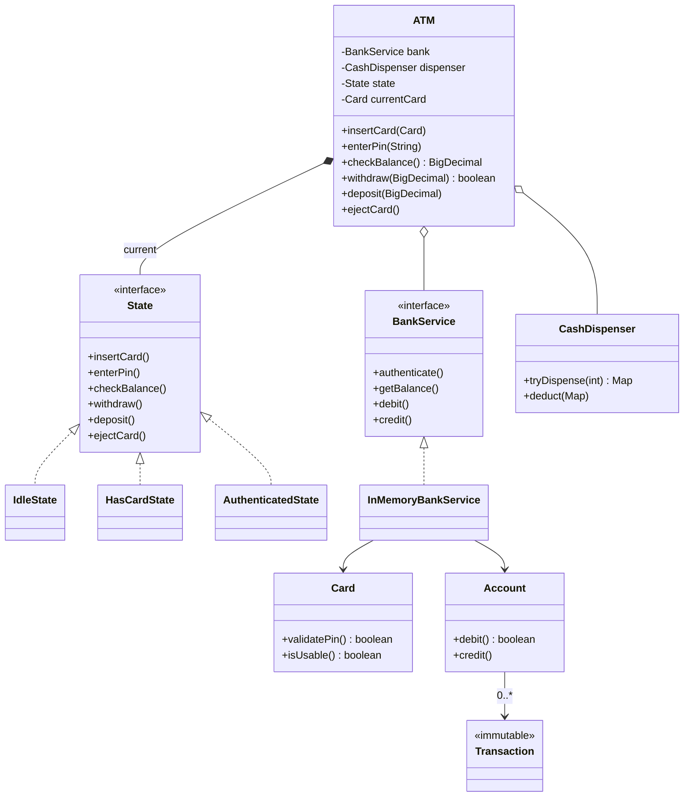
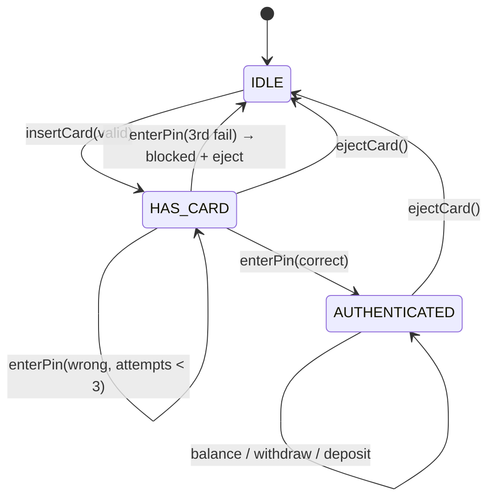

# ATM System — LLD

Design an ATM machine that supports card authentication, balance inquiry, cash withdrawal, and deposits.

## Package Structure

```
atm/
  model/
    Card.java              — PIN validation, auto-block after 3 failures
    Account.java           — synchronized balance ops (debit/credit)
    Transaction.java       — immutable record of a completed operation
  service/
    BankService.java       — interface: authenticate, getBalance, debit, credit
    impl/
      InMemoryBankService.java — HashMap-backed bank backend
      CashDispenser.java       — greedy denomination dispensing (TreeMap, largest-first)
  ATM.java                 — orchestrator, State pattern (3 inner state classes)
  ATMDemo.java             — 4 interview scenarios
```

## Design Patterns

| Pattern | Where | Why |
|---------|-------|-----|
| **State** | `ATM.java` (IdleState, HasCardState, AuthenticatedState) | ATM is a state machine. Each state only allows valid operations; invalid ones throw. Adding a new state (e.g. Maintenance) means adding one class, not touching existing code. |
| **Strategy** | `BankService` interface | ATM works identically whether the backend is in-memory or a remote RPC client. Swap at construction time. |
| **Two-phase dispense** | `CashDispenser.tryDispense()` + `deduct()` | Plan without side effects, then commit. Allows refund-on-failure in the withdrawal flow. |

## Class Diagram



## State Diagram



## Run

```bash
mvn compile exec:java -Dexec.mainClass="com.you.lld.problems.atm.ATMDemo"
```

## Key Interview Talking Points

- **Withdrawal ordering**: debit account FIRST → try dispense → refund on failure. Never lose money.
- **State pattern over if-chains**: invalid ops throw via default methods. No forgotten cases, Open/Closed compliant.
- **Card auto-block**: 3 consecutive wrong PINs → blocked. HasCardState detects this and auto-ejects back to IDLE.
- **Greedy dispensing**: O(d) for standard denominations. Mention DP alternative for exotic denoms if asked.
- **Two-phase dispense**: `tryDispense()` is side-effect-free; `deduct()` only runs after confirmed debit.
