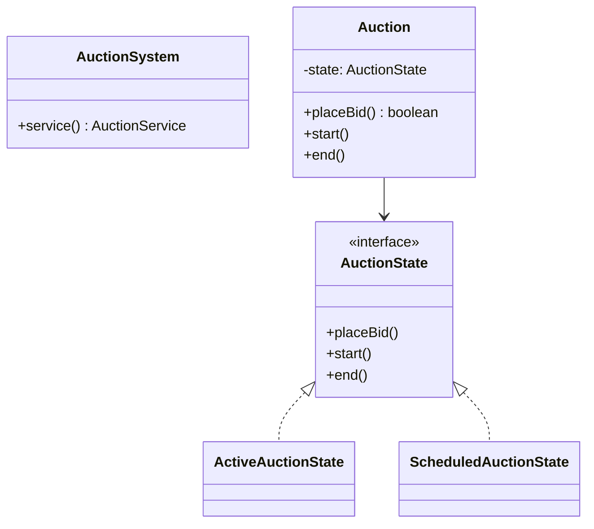
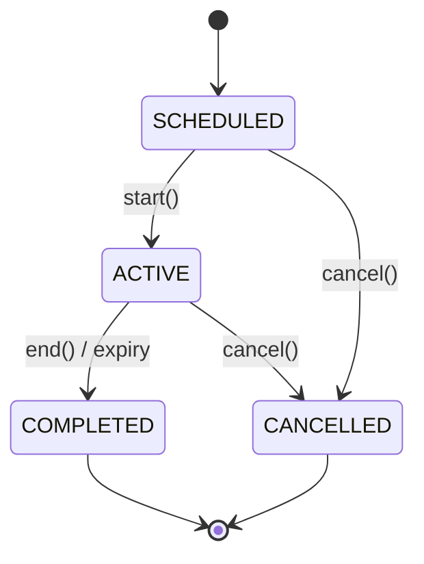

# Auction — LLD

Online auction with State-pattern lifecycle, synchronized bidding, and proxy (auto) bids.

## Package Structure

```
auction/
  model/          Auction, Bid, ProxyBid, AuctionStatus, BidStatus
  state/          AuctionState + Scheduled/Active/Completed/Cancelled
  service/        AuctionService
  service/impl/   AuctionServiceImpl
  AuctionSystem.java  Facade
  AuctionDemo.java
```

## Design Patterns

| Pattern | Where | Why |
|---------|-------|-----|
| **State** | `AuctionState` hierarchy | Legal transitions (scheduled→active→completed); reject invalid ops. |
| **Synchronized aggregate** | `Auction.placeBid()` | Race-free price updates under concurrent bidders. |
| **Proxy bidding** | `ProxyBid` + counter-bid resolver | Bidder sets max; system auto-increments by increment. |
| **Facade** | `AuctionSystem` | Interview entry point. |

## Class Diagram



## State Diagram



## Run Demo

```bash
mvn -q compile exec:java -Dexec.mainClass="com.you.lld.problems.auction.AuctionDemo"
```

## Key Talking Points

- **Synchronized bids** — all price mutations on `Auction` hold the monitor; service uses `ConcurrentHashMap` for lookup only.
- **Minimum increment** — `nextMinimumBid = current + increment`; rejects stale/low bids atomically.
- **Proxy bidding** — register max; on rival bid, auto-counter up to max; highest max wins proxy wars.
- **Auto-expiry** — daemon scheduler ends ACTIVE auctions past `endTime`.
- **Self-bid guard** — seller cannot bid or proxy on own listing.
