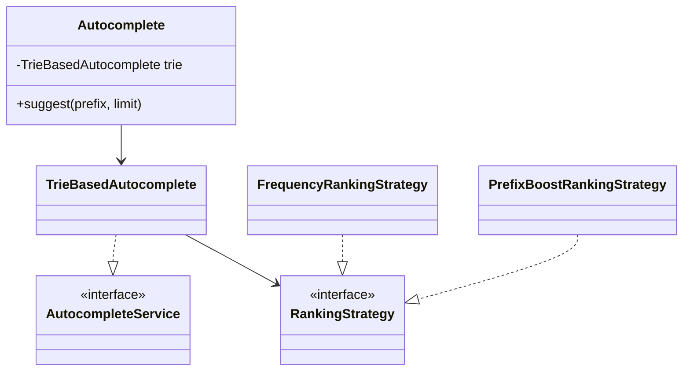

# Autocomplete

Type-ahead suggestions over a trie with pluggable ranking strategies.

## Package structure

```
autocomplete/
  model/           TrieNode, Suggestion
  service/         AutocompleteService, RankingStrategy
  service/impl/    TrieBasedAutocomplete, FrequencyRankingStrategy, PrefixBoostRankingStrategy
  Autocomplete.java
  AutocompleteDemo.java
```

## Patterns

| Pattern | Where | Why |
|---------|-------|-----|
| **Trie** | `TrieBasedAutocomplete` | O(prefix length) lookup, shared prefixes |
| **Strategy** | `RankingStrategy` | Swap frequency vs prefix-boost without changing trie |
| **Facade** | `Autocomplete` | Single entry point for interviews |

## Class diagram



## Run demo

```bash
mvn -q compile exec:java -Dexec.mainClass="com.you.lld.problems.autocomplete.AutocompleteDemo"
```

## Talking points

- Trie gives prefix lookup in O(L); collect top-k with a min-heap during DFS.
- Ranking is a Strategy — frequency-only vs prefix-length boost for UX tuning.
- `synchronized` trie ops give interview-grade thread-safety story (read-write lock for scale).
- Remove prunes dead branches; re-add increments frequency in O(1) per level.
