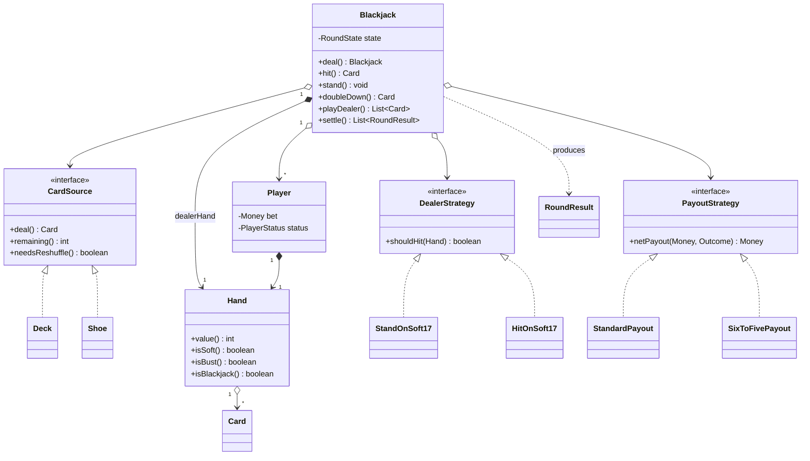
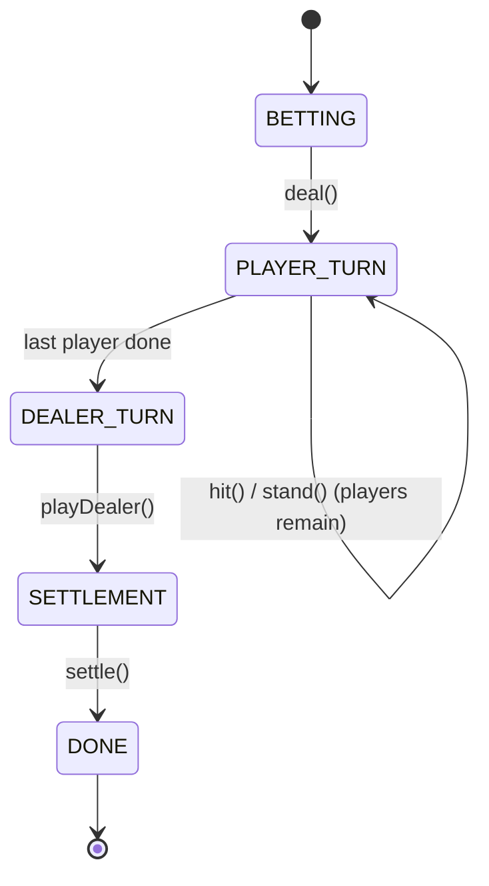

# Blackjack / Deck of Cards

**Model a standard 52-card deck and a single round of casino Blackjack: shuffle, deal, player hit/stand/double-down, Ace soft/hard valuation, a pluggable dealer draw policy, and 3:2 / 6:5 payout settlement — all reproducible from a seed.**

## Package structure

```
blackjack/
  model/
    Suit, Rank            — enums; Rank carries the base (Ace-as-1) value
    Card                  — immutable (Suit, Rank) value object
    CardSource            — interface: deal / remaining / needsReshuffle
    Deck                  — 52-card CardSource; factory methods (ordered / seeded / scripted)
    Shoe                  — multi-deck CardSource with a cut-card reshuffle threshold
    Hand                  — mutable card set; pure soft/hard value(), isBust, isBlackjack
    Player                — round-scoped seat: name, bet, hand, status
    PlayerStatus          — enum: PLAYING / STANDING / BUST
    Outcome               — enum: BLACKJACK / WIN / PUSH / LOSE
    RoundState            — enum: BETTING -> PLAYER_TURN -> DEALER_TURN -> SETTLEMENT -> DONE
    RoundResult           — immutable settlement record (outcome + net payout)
  service/
    DealerStrategy        — interface: shouldHit(dealerHand)
    PayoutStrategy        — interface: netPayout(bet, outcome)
  service/impl/
    StandOnSoft17         — S17 dealer rule
    HitOnSoft17           — H17 dealer rule
    StandardPayout        — 3:2 blackjack, 1:1 win
    SixToFivePayout       — 6:5 blackjack, 1:1 win
  Blackjack               — orchestrator / round state machine (the "god object") + Builder
  BlackjackDemo           — 5 scenarios + Ace-valuation showcase
```

## Patterns

| Pattern | Where | Why |
|---|---|---|
| **Strategy** | `DealerStrategy` (S17/H17), `PayoutStrategy` (3:2 / 6:5) | The only rules that genuinely vary between casinos; swap them without touching the round loop. |
| **State machine** | `Blackjack` + `RoundState` enum | Five strictly linear phases; each operation guards its phase so illegal calls fail fast. An enum guard beats a class-per-state hierarchy at this size. |
| **Factory method** | `Deck.standardOrdered/shuffled/of`, `Shoe.of` | A caller can never hand-assemble an invalid or unshuffled deck; the seed lives at the factory boundary. |
| **Builder** | `Blackjack.Builder` | Assemble a round from injected strategies + seated players, validate once, then hand back an immutable table. |
| **Dependency inversion** | `CardSource` abstraction | The orchestrator runs identically against a single `Deck` or a 6-deck `Shoe`. |

## Class diagram



## State diagram



## Run

```bash
# Demo
mvn -q compile exec:java -Dexec.mainClass="com.you.lld.problems.blackjack.BlackjackDemo"

# Tests
mvn -q test -Dtest=BlackjackTest
```

## Talking points

1. **Ace soft/hard valuation is the crux.** Sum every card with Ace = 1 (the hard total), then promote a *single* Ace to 11 if `hard + 10 <= 21`. Two Aces at 11 already bust (22), so at most one Ace is ever soft — this one rule handles A-6 (soft 17), A-A-9 (21), and A-6-10 (demotes back to 17) with no special cases.
2. **Rules that vary are strategies; rules that don't are code.** Dealer draw policy and payout ratios differ by house, so they are injected interfaces. Deciding *which* outcome occurred (comparing totals, bust-always-loses, blackjack-beats-21) is invariant game logic and stays in the orchestrator.
3. **State machine over state classes.** Five linear phases guarded by a `RoundState` enum: every public method asserts its phase and advances it, so "hit before deal" or "settle twice" throw immediately. A GoF State class hierarchy would be more ceremony than five one-way transitions justify.
4. **Reproducibility by construction.** All randomness is a seeded `Random` created inside `Deck.shuffled(seed)` / `Shoe.of(n, seed)`. Same seed → identical deal, every run (see Scenario 5b). Tests use fully scripted `Deck.of(...)` decks so no assertion depends on chance.
5. **Single-threaded by nature.** A table is dealt from by one round loop; players act in strict turn order, so there is no shared concurrent state and no locking. Parallelism lives one layer up — many independent tables, each confined to its own thread.
```
