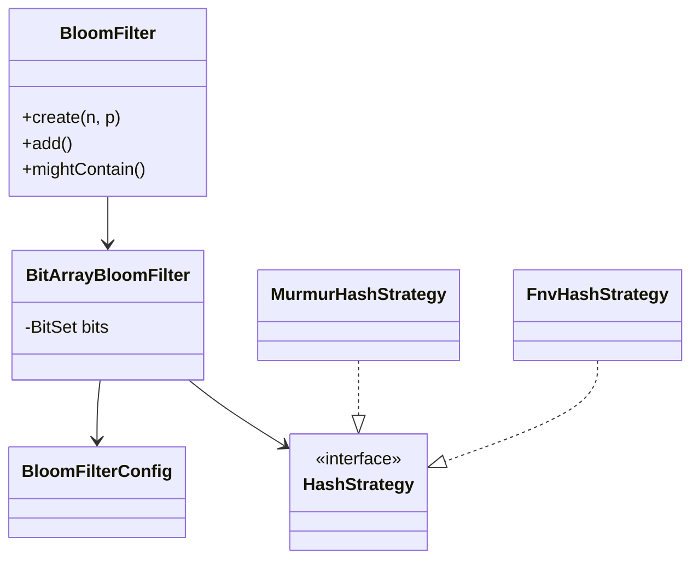

# Bloom Filter

Probabilistic set membership with a bit array and pluggable hash strategies.

## Package structure

```
bloomfilter/
  model/           BloomFilterConfig
  service/         HashStrategy
  service/impl/    BitArrayBloomFilter, MurmurHashStrategy, FnvHashStrategy
  BloomFilter.java
  BloomFilterDemo.java
```

## Patterns

| Pattern | Where | Why |
|---------|-------|-----|
| **Strategy** | `HashStrategy` | Swap Murmur vs FNV without changing filter logic |
| **Builder/Factory** | `BloomFilter.create(n, p)` | Optimal m and k from expected load |
| **Facade** | `BloomFilter` | Hides bit array + config wiring |

## Class diagram



## Run demo

```bash
mvn -q compile exec:java -Dexec.mainClass="com.you.lld.problems.bloomfilter.BloomFilterDemo"
```

## Talking points

- No false negatives: if added, all k bits are set; absent keys may collide (false positive).
- Optimal sizing: m ≈ −n ln p / (ln 2)², k ≈ (m/n) ln 2.
- Strategy pattern for hash functions — same bit array, different distributions.
- `synchronized` adds for thread-safe membership checks in interview scope.
