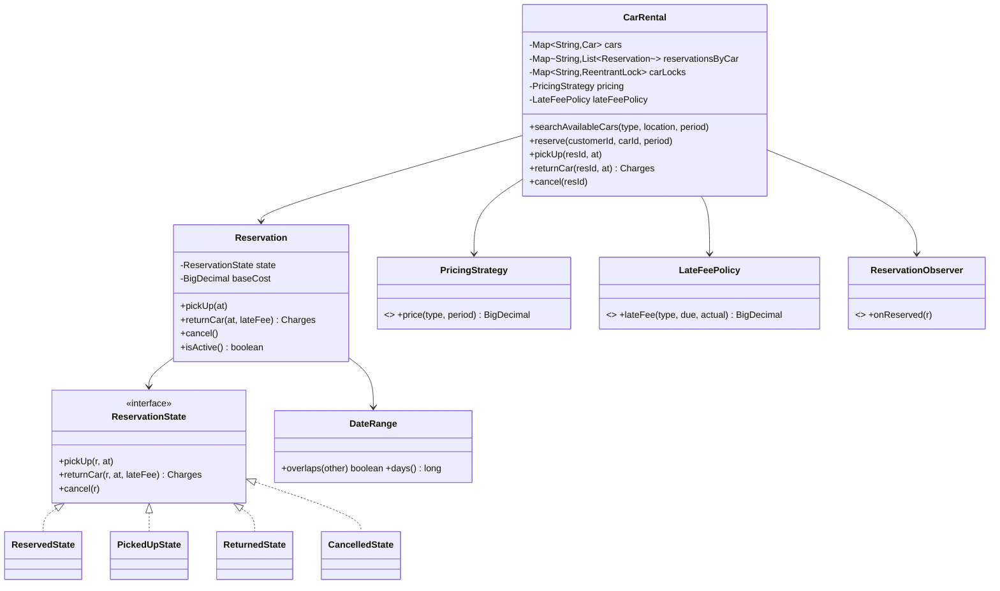
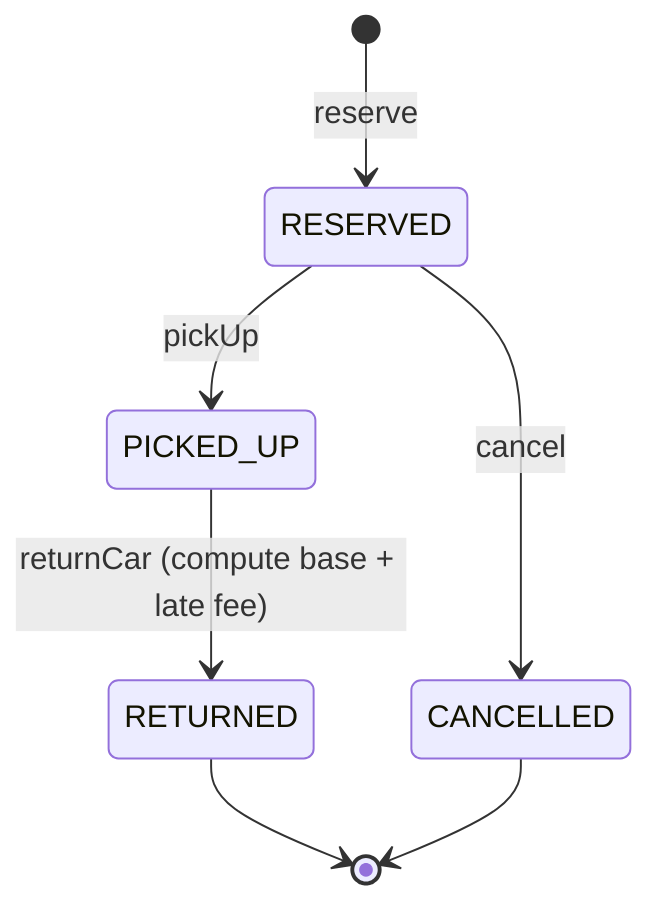

# Car Rental System

Reserve a car (economy / SUV / luxury) at a pickup branch for a half-open date
range `[pickup, dropoff)`, run the **pick-up → return** lifecycle, and compute
charges = daily pricing **plus a late fee** when returned past the due date —
concurrency-safe so two threads can never double-book the same car over
overlapping dates.

## Package structure

```
carrental/
  CarRental.java              — facade/orchestrator: fleet, reservations, per-car locking
  CarRentalDemo.java          — 6 runnable scenarios
  CarUnavailableException.java
  model/
    Car, CarType, CarStatus, Location, Customer   — inventory value objects/enums
    DateRange                 — half-open [pickup, dropoff); overlap + day count
    Reservation               — mutable aggregate; holds a ReservationState
    ReservationStatus         — enum tag (RESERVED/PICKED_UP/RETURNED/CANCELLED)
    ReservationState + ReservedState / PickedUpState / ReturnedState / CancelledState
                              — State pattern (lifecycle), co-located with the entity
    Charges                   — immutable base + lateFee breakdown
  service/                    — interfaces: PricingStrategy, LateFeePolicy, ReservationObserver
  service/impl/
    DailyPricingStrategy, WeeklyPricingStrategy, SeasonalPricingStrategy
    StandardLateFeePolicy, GracePeriodLateFeePolicy
    EmailNotificationObserver, SmsReminderObserver
```

## Patterns & why

| Pattern | Where | Why |
|---|---|---|
| **Strategy** | `PricingStrategy` (Daily/Weekly/Seasonal), `LateFeePolicy` (Standard/Grace) | Pricing and late-fee rules vary independently and must be swappable without touching reservation logic. |
| **Decorator** | `SeasonalPricingStrategy` wraps a `PricingStrategy`; `GracePeriodLateFeePolicy` wraps a `LateFeePolicy` | Add surge / grace behavior on top of any base rule instead of a combinatorial subclass explosion. |
| **State** | `ReservationState` + 4 states | The legal-transition matrix (RESERVED→PICKED_UP→RETURNED, RESERVED→CANCELLED) lives in the type system; illegal verbs throw instead of silently corrupting status. |
| **Observer** | `ReservationObserver` (Email/SMS) | Fire confirmations/reminders/receipts without the orchestrator knowing about channels. |
| **Facade** | `CarRental` | One entry point hides inventory, locking and strategy wiring. |

## Class diagram



## Reservation state diagram



## Run the demo

```bash
mvn -q compile exec:java -Dexec.mainClass="com.you.lld.problems.carrental.CarRentalDemo"
mvn -q test -Dtest=CarRentalTest
```

## Talking points

1. **Half-open `[pickup, dropoff)` intervals** make back-to-back rentals fall
   out naturally: `[.,13)` and `[13,.)` don't overlap, so a car returned on the
   13th is bookable from the 13th. Overlap test is the one-liner
   `a.pickup < b.dropoff && b.pickup < a.dropoff`.
2. **Per-car `ReentrantLock`** makes check-then-reserve atomic *without* a global
   lock: threads targeting different cars never contend, only same-car racers
   serialize. The concurrency test fires 64 threads at one car+window and asserts
   exactly one wins.
3. **Availability is derived, not stored.** A car has no `RENTED` flag; whether
   it's free for a window is computed from its active reservations, which is why
   cancel instantly frees the car (the cancelled reservation is no longer
   `isActive()`).
4. **Late fee is computed at return, base cost is frozen at reserve.** The base
   quote can't drift if tariffs change mid-rental; the `LateFeePolicy` runs only
   against the scheduled-vs-actual return time.
5. **Two independent Strategy axes** (pricing, late-fee) plus Decorators
   (seasonal surge, grace period) mean new commercial rules are new classes, not
   edits to the orchestrator.
```
