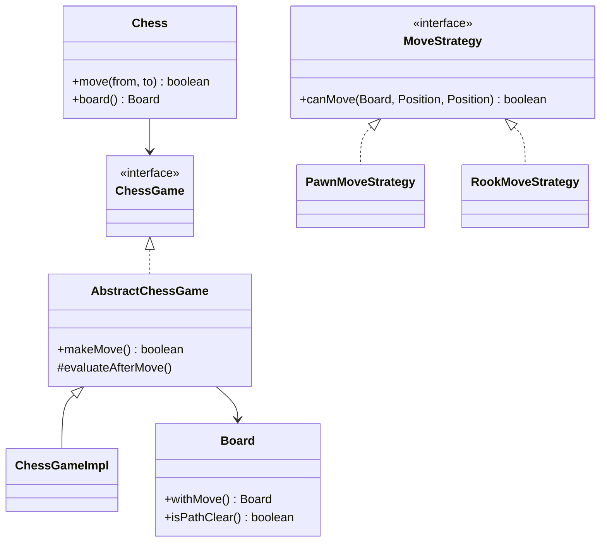

# Chess — LLD

Design a two-player chess game with legal move validation, check detection, and checkmate.

## Package Structure

```
chess/
  model/          Board (immutable), Piece, Position, Color, PieceType
  service/        ChessGame, MoveStrategy, AbstractChessGame (template)
  service/impl/   ChessGameImpl, per-piece MoveStrategy classes, MoveStrategyFactory
  notation/       MoveNotation (algebraic helper)
  Chess.java      Facade
  ChessDemo.java  5 interview scenarios
```

## Design Patterns

| Pattern | Where | Why |
|---------|-------|-----|
| **Strategy** | `MoveStrategy` + Pawn/Rook/Knight/… | Each piece's movement rules change independently; no giant switch in game logic. |
| **Immutable Board** | `Board.withMove()` | Safe simulation for check detection without undo hacks. |
| **Template Method** | `AbstractChessGame.makeMove()` | Fixed flow (validate → apply → switch turn → evaluate); hooks for check/checkmate. |

## Class Diagram



## Run Demo

```bash
mvn -q compile exec:java -Dexec.mainClass="com.you.lld.problems.chess.ChessDemo"
```

## Key Talking Points

- **Immutable board** — `wouldLeaveInCheck` uses `board.withMove()` instead of mutate-and-undo.
- **Strategy per piece** — add castling/en passant by extending the relevant strategy, not the game class.
- **Template flow** — `makeMove` is `final`; subclasses only customize check/checkmate messaging.
- **Thread-safety** — `synchronized makeMove` on the game instance for concurrent UI/API access.
- **Scope** — no castling, en passant, or promotion in this baseline; call out as follow-ups.
