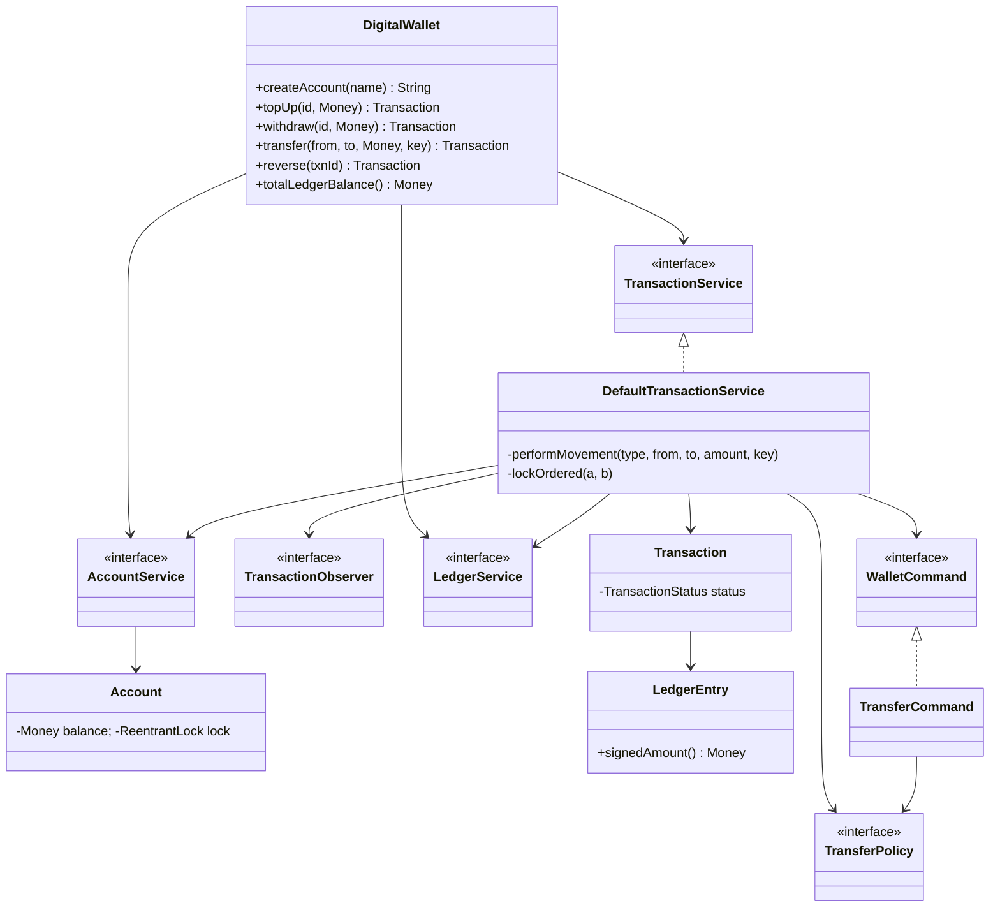
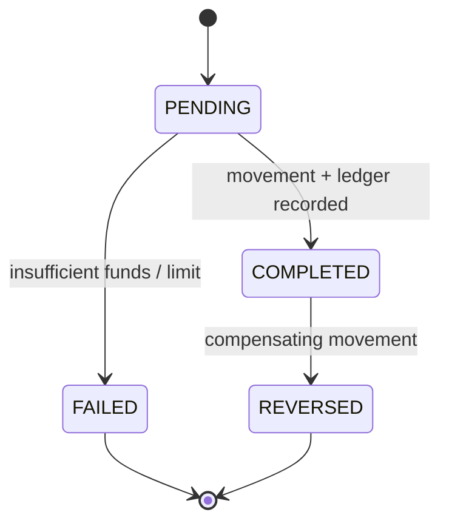

# Digital Wallet — LLD

Design a Paytm/Venmo-style wallet: top-up, withdraw, and **atomic peer-to-peer transfers** on a **double-entry ledger**, with **idempotent** transfers and **deadlock-free ordered locking**.

## Package Structure

```
digitalwallet/
  model/          Money, Account, Transaction, LedgerEntry,
                  TransactionType, TransactionStatus, EntryDirection
  service/        AccountService, LedgerService, TransactionService,
                  TransferPolicy, TransactionObserver, WalletCommand  (interfaces)
                  + InsufficientFundsException, LimitExceededException
  service/impl/   InMemoryAccountService, InMemoryLedgerService,
                  DefaultTransactionService (the engine),
                  TopUpCommand / WithdrawCommand / TransferCommand / ReversalCommand,
                  DailyLimitTransferPolicy / UnlimitedTransferPolicy,
                  LoggingTransactionObserver
  DigitalWallet.java      Facade / orchestrator (owns the SYSTEM cash account)
  DigitalWalletDemo.java  7 runnable scenarios
```

## Core idea (what makes this different)

Every operation is the **same primitive**: a double-entry movement of money from one
account to another.

| Operation  | Movement             | Funds check?              |
|------------|----------------------|---------------------------|
| Top-up     | `SYSTEM → wallet`    | no (SYSTEM may overdraw)  |
| Withdraw   | `wallet → SYSTEM`    | yes                       |
| Transfer   | `walletA → walletB`  | yes                       |
| Reversal   | reverse of original  | yes                       |

A single **system cash account** (overdraft-enabled) is the external-world counterparty,
so the whole ledger — and the sum of *all* account balances — is **conserved at zero**
for every operation, not just transfers.

## Design Patterns

| Pattern | Where | Why |
|---------|-------|-----|
| **Command** | `WalletCommand` + TopUp/Withdraw/Transfer/Reversal | Each operation is an executable, auditable unit with its own pre-conditions; shares one locked-movement core. |
| **Strategy** | `TransferPolicy` + `DailyLimitTransferPolicy` / `UnlimitedTransferPolicy` | Swap limit/fee rules without touching the transfer flow. |
| **Observer** | `TransactionObserver` + `LoggingTransactionObserver` | Notifications/analytics decoupled from money movement. |
| **State** | `TransactionStatus.canTransitionTo` | Enforce `PENDING → COMPLETED/FAILED`, `COMPLETED → REVERSED`; illegal transitions throw. |
| **Facade** | `DigitalWallet` | One entry point wiring registry + ledger + engine. |

## Class Diagram



## Transaction State Diagram



## Run Demo

```bash
mvn -q compile exec:java -Dexec.mainClass="com.you.lld.problems.digitalwallet.DigitalWalletDemo"
mvn -q test -Dtest=DigitalWalletTest
```

## Key Talking Points

- **Deadlock-free transfer** — a transfer locks *both* accounts, but always in a global
  order (ascending account id), so the A→B / B→A cycle can never form. Locks are
  `ReentrantLock`s exposed by `Account`; the pre-funds-check runs while both are held, so
  the debit+credit is truly all-or-nothing.
- **Idempotency** — `transfer(..., key)` runs the work inside `ConcurrentHashMap.computeIfAbsent`,
  so the first call executes once and caches its `Transaction`; every replay returns the
  same object without moving funds. A *failed* attempt caches nothing, leaving the key
  free for a genuine retry.
- **Double-entry ledger** — each movement appends a balanced DEBIT/CREDIT pair, so
  `totalLedgerBalance()` is always `0.00` and each account's live balance equals the
  signed sum of its entries (`reconciledBalance`).
- **BigDecimal money, never double** — `Money` normalises to scale 2 with `HALF_EVEN`.
- **Not a payment gateway** — no external processors/cards; the interesting surface is the
  in-house ledger + concurrency, not routing to a PSP.
