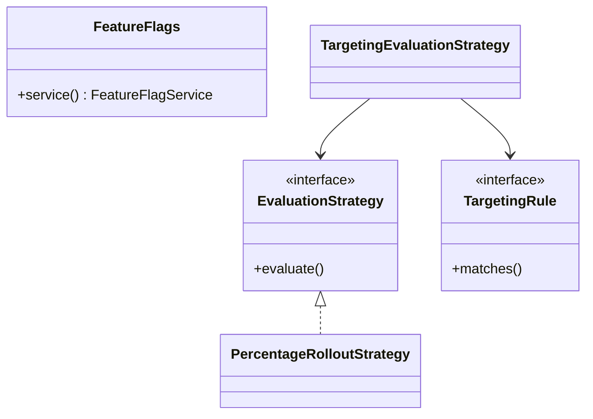
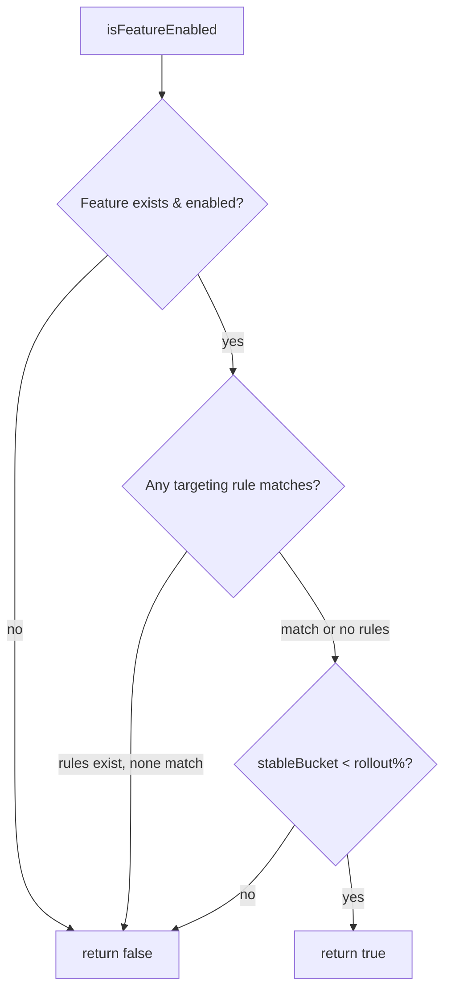

# Feature Flags — LLD

Feature toggle system with kill switch, targeting rules, and stable percentage rollout.

## Package Structure

```
featureflags/
  model/          Feature, User
  targeting/      TargetingRule, GroupTargetingRule, EmailDomainTargetingRule
  service/        FeatureFlagService, EvaluationStrategy
  service/impl/   FeatureFlagServiceImpl, PercentageRolloutStrategy, TargetingEvaluationStrategy
  FeatureFlags.java   Facade
  FeatureFlagsDemo.java
```

## Design Patterns

| Pattern | Where | Why |
|---------|-------|-----|
| **Strategy** | `EvaluationStrategy` | Swap rollout algorithms (%, ring, allowlist). |
| **Composite rules** | `TargetingEvaluationStrategy` | Chain targeting + rollout cleanly. |
| **Stable hashing** | `PercentageRolloutStrategy` | Same user always same bucket for a feature. |
| **Kill switch** | `Feature.enabled` | Instant global off without deploy. |
| **Facade** | `FeatureFlags` | Interview entry point. |

## Class Diagram



## Evaluation Flow



## Run Demo

```bash
mvn -q compile exec:java -Dexec.mainClass="com.you.lld.problems.featureflags.FeatureFlagsDemo"
```

## Key Talking Points

- **Kill switch first** — global `enabled=false` short-circuits before any rule evaluation.
- **Targeting before rollout** — beta group must match rule; then percentage applies within cohort.
- **Stable bucket** — `hash(featureId + userId) % 100` ensures consistent UX across sessions.
- **Thread-safe registry** — `ConcurrentHashMap` for feature definitions; evaluation is read-only.
- **Extensible rules** — add `EmailDomainTargetingRule`, geo, plan tier without changing service.
