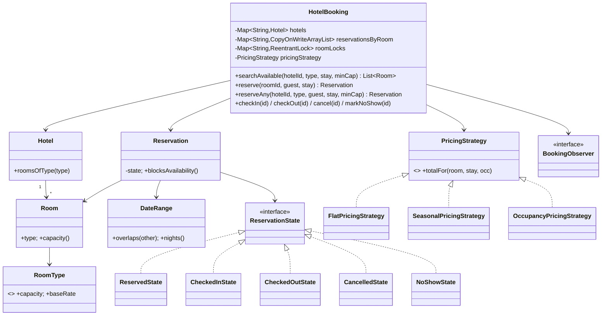
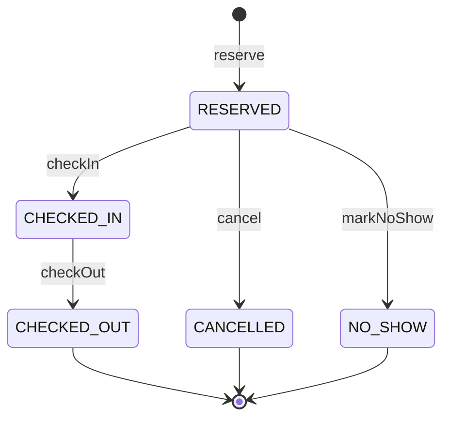

# Hotel Management / Booking

> Reserve hotel rooms over a **date range** `[checkIn, checkOut)`, rejecting any booking that overlaps an existing one for the same room, with a check-in / check-out lifecycle and pluggable pricing.

## Package structure

```
hotelbooking/
  model/
    DateRange.java            value object — half-open interval, overlap + nights
    RoomType.java             enum — capacity + base rate (SINGLE/DOUBLE/DELUXE/SUITE)
    Room.java                 immutable bookable room
    Hotel.java                immutable hotel + roomsOfType()
    Guest.java                immutable customer
    Reservation.java          booking entity; delegates lifecycle to a state
    ReservationStatus.java    enum — RESERVED/CHECKED_IN/CHECKED_OUT/CANCELLED/NO_SHOW
    ReservationState.java     State interface
    ReservedState / CheckedInState / CheckedOutState / CancelledState / NoShowState
  service/
    PricingStrategy.java      Strategy interface (total for a stay)
    BookingObserver.java      Observer interface (lifecycle notifications)
  service/impl/
    FlatPricingStrategy.java          baseRate * nights
    SeasonalPricingStrategy.java      per-night multiplier by month
    OccupancyPricingStrategy.java     surge by occupancy ratio
    ConsoleNotificationObserver.java  prints confirmations (email/SMS stand-in)
  HotelBooking.java           orchestrator/facade + concurrency (per-room locks)
  RoomNotAvailableException.java
  HotelBookingDemo.java       runnable demo, 5 scenarios
```

## Patterns

| Pattern | Where | Why (one line) |
|---------|-------|----------------|
| **Strategy** | `PricingStrategy` → Flat / Seasonal / Occupancy | Swap pricing policy at runtime without touching booking logic. |
| **State** | `ReservationState` → 5 states | Legal lifecycle transitions live in one place each; no status `switch`. |
| **Observer** | `BookingObserver` → `ConsoleNotificationObserver` | Confirmation/audit side-effects stay out of the entity and core logic. |
| **Value Object** | `DateRange` | Immutable half-open interval owns overlap + nights arithmetic. |
| **Facade** | `HotelBooking` | Single entry point wiring rooms, reservations, pricing, observers. |

## Class diagram



## State diagram



Only `RESERVED` and `CHECKED_IN` **block availability**; the three terminal states free the room's dates.

## Run

```bash
mvn -q compile exec:java -Dexec.mainClass="com.you.lld.problems.hotelbooking.HotelBookingDemo"
mvn -q test -Dtest=HotelBookingTest
```

## Talking points

1. **Date-range, not fixed seat.** The bookable unit is a room over a half-open interval `[checkIn, checkOut)`. Overlap is the classic interval test `a.in < b.out && b.in < a.out`; the exclusive check-out boundary is exactly what lets a checkout-day stay and a check-in-day stay share the room.
2. **Atomic check-then-reserve under a per-room lock.** The overlap scan and the insert happen in one locked section keyed by room id, so two threads can never both pass "is it free?" for the same room + overlapping dates — exactly one wins (verified by a 32-thread test).
3. **State pattern for the lifecycle.** Each state object owns its legal transitions; illegal ones (e.g. cancel after check-in) throw. `blocksAvailability()` is derived from status, so cancelling naturally frees the dates without deleting records.
4. **Strategy pricing consumes occupancy.** Flat and seasonal ignore demand; `OccupancyPricingStrategy` surges on the fraction of same-type rooms booked for the dates — sampled lock-free to avoid lock-ordering hazards.
5. **Observer keeps notifications out of the core.** Confirmations/cancellations fan out to subscribers after the lock is released, so slow channels never stall bookings.
