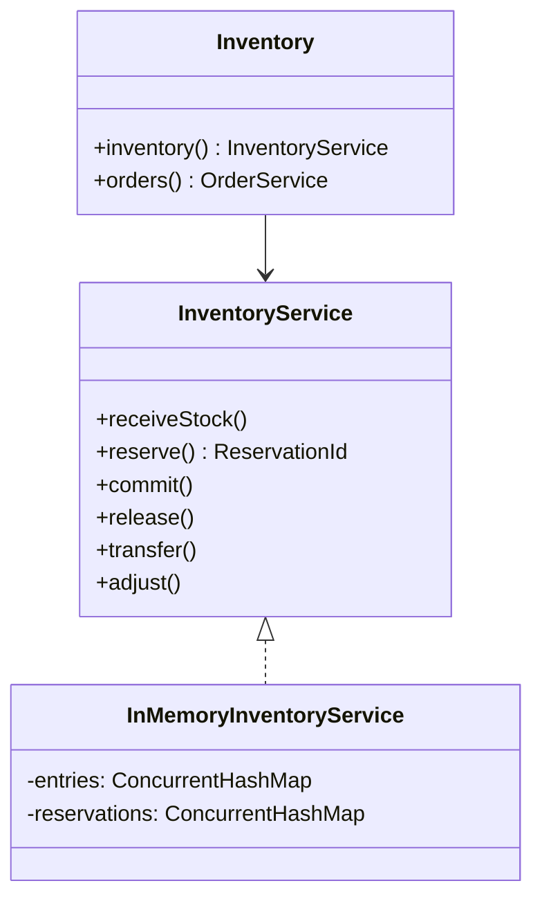
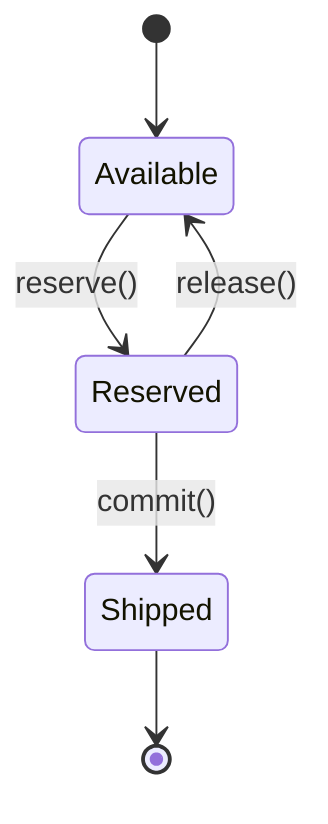

# Inventory — LLD

Multi-warehouse inventory with Reserve-Commit-Release lifecycle to prevent overselling under concurrent orders.

## Package Structure

```
inventory/
  model/          SkuId, WarehouseId, ReservationId, StockSnapshot, Order, Product (value objects)
  service/        InventoryService, OrderService
  service/impl/   InMemoryInventoryService, InMemoryOrderService
  Inventory.java  Facade
  InventoryDemo.java
```

## Design Patterns

| Pattern | Where | Why |
|---------|-------|-----|
| **Reserve-Commit-Release** | `InventoryService` | Hold stock at checkout; deduct on ship; return on cancel. |
| **Fine-grained locking** | Per `(sku, warehouse)` lock | High concurrency without global mutex. |
| **Lock ordering** | `transfer()` | Compare warehouse IDs to avoid deadlock on cross-warehouse moves. |
| **Facade** | `Inventory` | Single entry for inventory + order orchestration. |

## Class Diagram



## State: Reservation Lifecycle



## Run Demo

```bash
mvn -q compile exec:java -Dexec.mainClass="com.you.lld.problems.inventory.InventoryDemo"
```

## Key Talking Points

- **Available = onHand − reserved** — never sell reserved units; commit atomically drops both reserved and onHand.
- **Multi-warehouse** — each `(sku, warehouse)` is an independent stock cell; transfer uses ordered locking.
- **Thread-safety** — `ConcurrentHashMap` for lookup; `synchronized` per entry for quantity mutations.
- **Order integration** — reserve on payment confirm, commit on delivery, release on cancel.
- **Adjust guard** — cycle-count cannot drop onHand below already-reserved quantity.
