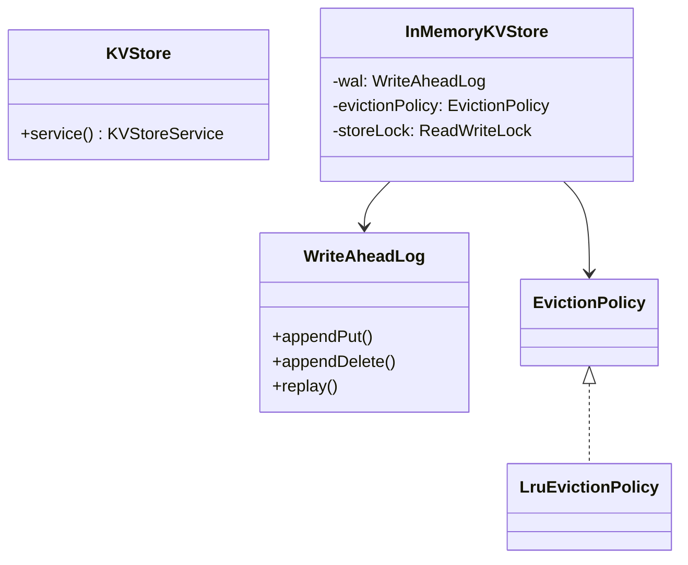

# KV Store — LLD

In-memory key-value store with WAL durability, TTL, LRU eviction, and concurrent access.

## Package Structure

```
kvstore/
  model/          KeyValue, Transaction
  persistence/    WriteAheadLog
  eviction/       EvictionPolicy, LruEvictionPolicy
  snapshot/       Snapshot
  service/        KVStoreService
  service/impl/   InMemoryKVStore
  KVStore.java    Facade
  KVStoreDemo.java
```

## Design Patterns

| Pattern | Where | Why |
|---------|-------|-----|
| **WAL** | `WriteAheadLog` | Append before mutate; replay for recovery. |
| **Strategy** | `EvictionPolicy` / `LruEvictionPolicy` | Swap LRU for LFU/TTL-max without rewrite. |
| **ReadWriteLock** | `InMemoryKVStore` | Many concurrent reads; exclusive writes. |
| **Decorator-like txn** | `Transaction` staging | Commit batches writes atomically. |
| **Facade** | `KVStore` | Interview entry point. |

## Class Diagram



## Run Demo

```bash
mvn -q compile exec:java -Dexec.mainClass="com.you.lld.problems.kvstore.KVStoreDemo"
```

## Key Talking Points

- **WAL before write** — every PUT/DELETE logged; crash recovery replays log.
- **Lazy TTL** — expired keys removed on GET + background sweeper.
- **LRU eviction** — access-order `LinkedHashMap`; evict oldest when over max capacity.
- **ReadWriteLock** — reads parallel; writes exclusive for consistent eviction + store.
- **Snapshot isolation** — point-in-time copy for restore without stopping writers (demo uses read lock).
