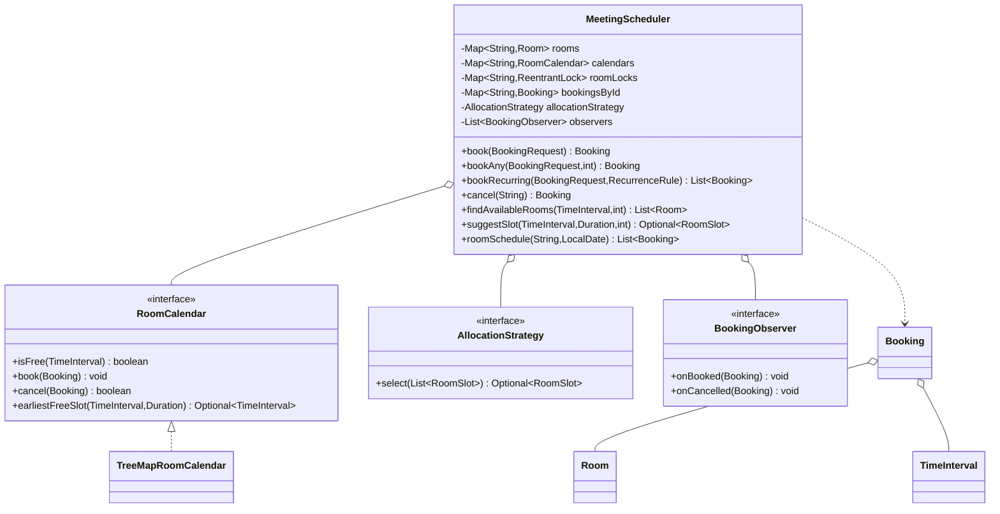
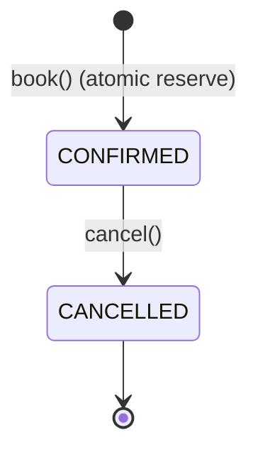

# Meeting Room / Calendar Scheduler — LLD

Register rooms, book them for half-open intervals with **O(log n) overlap
detection**, reject double-bookings, cancel, find free rooms by capacity, suggest
the earliest slot, and expand recurring meetings — all **thread-safe** so two
threads can never both win the same room+slot.

## Package Structure

```
meetingscheduler/
  model/            TimeInterval, Room, Attendee, Booking, BookingStatus,
                    BookingRequest, RoomSlot, RecurrenceRule, Frequency  (immutable VOs/entities)
  service/          RoomCalendar, AllocationStrategy, BookingObserver     (interfaces only)
  service/impl/     TreeMapRoomCalendar (O(log n) overlap via floor/ceiling),
                    FirstFitAllocation, SmallestSufficientCapacityAllocation,
                    AttendeeNotifier (observer)
  exception/        BookingConflictException, RoomNotFoundException,
                    BookingNotFoundException, NoRoomAvailableException
  MeetingScheduler.java      facade / orchestrator (registry + per-room locks)
  MeetingSchedulerDemo.java  6 runnable scenarios
```

## Design Patterns

| Pattern | Where | Why |
|---------|-------|-----|
| **Strategy** | `AllocationStrategy` (`FirstFit`, `SmallestSufficientCapacity`) | Swap "which room" policy without touching orchestrator or calendar. |
| **Observer** | `BookingObserver` / `AttendeeNotifier` | Notify attendees on book/cancel without baking it into the entity (SRP). |
| **Facade** | `MeetingScheduler` | One entry point over registry, calendars, locks, strategy, observers. |
| **Command (VO)** | `BookingRequest` | Bundle booking params; reuse when expanding recurrences. |

## Core Data Structure

Per-room `TreeMap<startTime, Booking>`. For a candidate `[s, e)` only two
neighbours can collide:
- `floorEntry(s)` — earlier-starting meeting collides iff its `end > s`;
- `ceilingEntry(s)` — later-starting meeting collides iff its `start < e`.

Both are `O(log n)`; no day scan. Half-open `[start, end)` makes back-to-back
meetings (`end == start`) legal.

## Concurrency

- Registry maps are `ConcurrentHashMap`.
- The "no overlap" invariant is guarded by a **per-room `ReentrantLock`**; the
  whole *check-free → insert* runs under it, so racing threads serialise and
  exactly one wins (proven by the 64-thread test).
- Per-room (not global) locking ⇒ different rooms book in parallel.
- Observers fire **after commit, outside the lock**.

## Class Diagram



## Booking State



## Run

```bash
mvn -q compile exec:java -Dexec.mainClass="com.you.lld.problems.meetingscheduler.MeetingSchedulerDemo"
mvn -q test -Dtest=MeetingSchedulerTest
```

## Talking Points

- **Half-open intervals** are the whole trick to correct conflict detection —
  `[9,10)` and `[10,11)` don't overlap; overlap ⇔ `s1 < e2 && s2 < e1`.
- **`TreeMap` floor/ceiling** gives `O(log n)` overlap check vs `O(n)` scan.
- **Per-room lock, not global** — check-then-insert atomicity where it matters,
  full parallelism across rooms.
- **Strategy vs Observer separation** — allocation policy and notification are
  each swappable and out of the entity, honouring OCP + SRP.
- **Recurrence is all-or-nothing** under a single lock hold: verify every
  occurrence free, then insert all — no partially-booked series.
