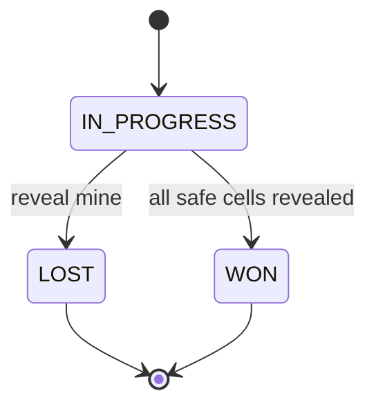

# Minesweeper

Grid game with BFS flood-fill reveal, flags, and win/loss state.

## Package structure

```
minesweeper/
  model/           Cell, Board, GameStatus, Difficulty
  service/         BoardGenerator
  service/impl/    RandomBoardGenerator
  Minesweeper.java
  MinesweeperDemo.java
```

## Patterns

| Pattern | Where | Why |
|---------|-------|-----|
| **State (enum)** | `GameStatus` | IN_PROGRESS → WON / LOST transitions |
| **Strategy** | `BoardGenerator` | Swap mine placement (random vs fixed) |
| **BFS** | `Board.revealBfs` | Iterative flood-fill avoids stack overflow |

## State diagram



## Run demo

```bash
mvn -q compile exec:java -Dexec.mainClass="com.you.lld.problems.minesweeper.MinesweeperDemo"
```

## Talking points

- First-click safety: mines placed after first reveal, excluding that cell.
- BFS queue expands zero-adjacency regions in O(cells).
- Flagged cells block reveal; game ignores moves after terminal state.
- `Difficulty` enum presets rows/cols/mine count.
