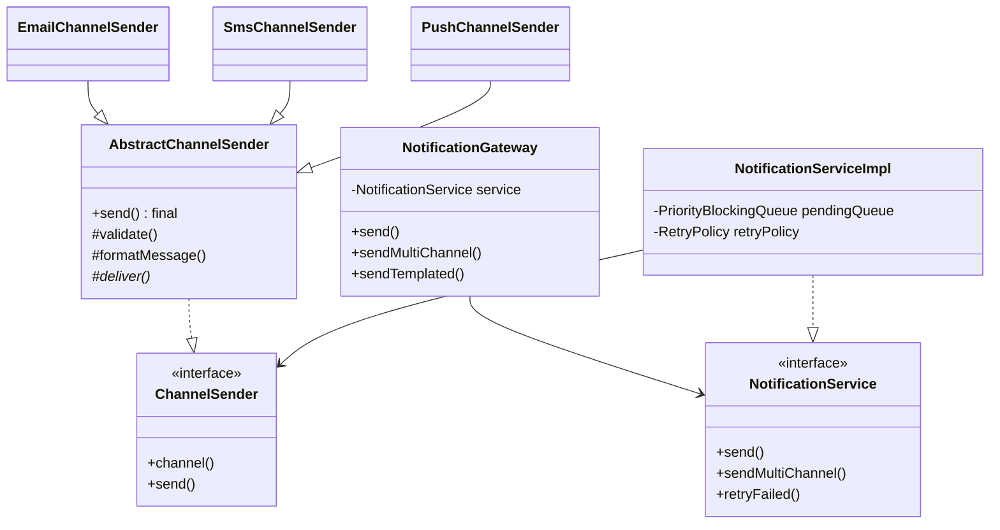

# Notification Service — LLD

Design a multi-channel notification system supporting Email, SMS, Push, and In-App delivery with priority queuing and retry.

## Package Structure

```
notification/
  model/           Notification, NotificationChannel, NotificationStatus, Priority
  service/         NotificationService, ChannelSender
  service/impl/    AbstractChannelSender (Template Method), Email/SMS/Push/InApp senders,
                   ChannelSenderFactory, NotificationTemplateRegistry, NotificationServiceImpl
  retry/           RetryPolicy (exponential backoff)
  NotificationGateway.java    Facade
  NotificationDemo.java
```

## Design Patterns

| Pattern | Where | Why |
|---------|-------|-----|
| **Template Method** | `AbstractChannelSender` | Shared validate → format → deliver pipeline; each channel overrides `deliver()` and optional `formatMessage()`. |
| **Composite (fan-out)** | `sendMultiChannel()` | One event dispatches to multiple channel senders without duplicating queue logic. |
| **Strategy** | `ChannelSender` + per-channel impls | Swap or mock delivery backends independently. |
| **Factory** | `ChannelSenderFactory` | Maps `NotificationChannel` enum to concrete sender at runtime. |

## Class Diagram



## Run Demo

```bash
mvn -q compile exec:java -Dexec.mainClass="com.you.lld.problems.notification.NotificationDemo"
```

## Key Talking Points

- **PriorityBlockingQueue** — thread-safe priority ordering (URGENT dequeued before LOW) without manual `wait/notify`.
- **Retry with exponential backoff** — `RetryPolicy.getDelayForAttempt(n)` = `baseDelay * 2^n`; max 3 attempts before FAILED.
- **Template Method per channel** — SMS truncates to 160 chars; Email adds subject line; shared validation in base class.
- **Multi-channel fan-out** — one API call enqueues N independent notifications; each channel retries independently.
- **ConcurrentHashMap registry** — status lookups are O(1) and safe under concurrent sends.
