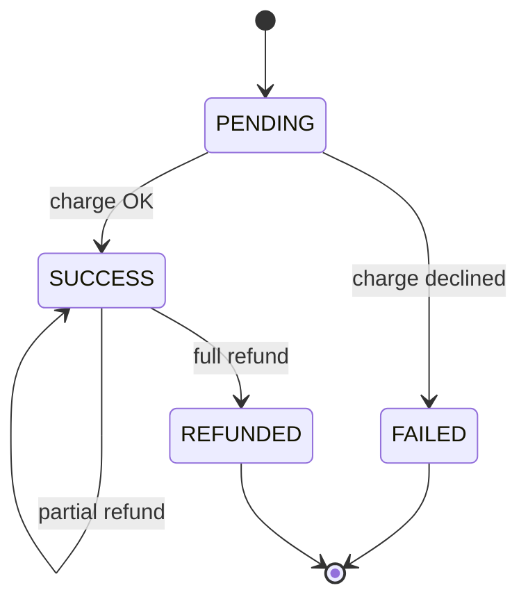

# Payment Gateway — LLD

Design a payment gateway with multiple payment methods, transaction lifecycle, refunds, and idempotency.

## Package Structure

```
paymentgateway/
  model/          Transaction, Refund, PaymentMethod, TransactionStatus
  service/        PaymentGatewayService, PaymentProcessor, TransactionState
  service/impl/   InMemoryPaymentGatewayService, Card/UPI/Wallet processors,
                  Pending/Success/Failed/Refunded states, factories
  PaymentGateway.java   Facade
  PaymentGatewayDemo.java
```

## Design Patterns

| Pattern | Where | Why |
|---------|-------|-----|
| **Strategy** | `PaymentProcessor` + Card/UPI/Wallet | Each method has different validation/charge rules. |
| **State** | `TransactionState` + Pending/Success/Failed/Refunded | Refund rules depend on lifecycle state, not scattered if-else. |
| **Idempotency** | `idempotencyKeys` map + `putIfAbsent` | Duplicate client requests return the same transaction. |

## State Diagram



## Run Demo

```bash
mvn -q compile exec:java -Dexec.mainClass="com.you.lld.problems.paymentgateway.PaymentGatewayDemo"
```

## Key Talking Points

- **Idempotency key** — checked before creating txn; `putIfAbsent` guards concurrent duplicates.
- **State objects** — `TransactionStateFactory.forStatus()` picks behavior for refund transitions.
- **Partial refunds** — track `refundedAmount` on txn; status stays SUCCESS until fully refunded.
- **Deterministic failure** — card processor fails amounts ending in `.13` for demo/testing.
- **Thread-safety** — `ConcurrentHashMap` registries; `synchronized(txn)` for refund atomicity.
