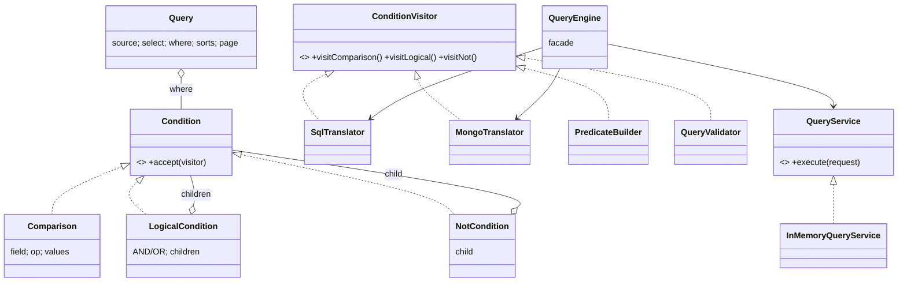

# Query DSL — Database Query Abstraction API

**One-liner:** A backend-neutral query DSL: callers build an immutable query AST via a fluent
builder; pluggable backends translate it (parameterized SQL, Mongo) or interpret it (in-memory),
behind a request/response service API.

## Package structure

```
querydsl/
├── model/                     # The AST (pure structure, zero backend knowledge)
│   ├── Condition              #   Composite root: leaf | AND/OR | NOT
│   ├── Comparison             #   leaf: field <op> value(s); arity checked at build
│   ├── LogicalCondition       #   AND / OR over children
│   ├── NotCondition           #   negation
│   ├── Criteria               #   static-factory DSL vocabulary: eq/gt/in/and/or/not…
│   ├── Operator               #   enum + per-operator arity rules
│   ├── Query (+Builder)       #   immutable: source/select/where/sorts/page
│   ├── SortSpec, Page         #   sort keys; offset pagination with server-side cap
│   └── TableSchema            #   declared field types, for semantic validation
├── api/                       # The wire contract (request/response schema)
│   ├── QueryRequest           #   requestId + query + timeout + includeTotalCount
│   ├── QueryResponse          #   status + rows + totalCount/hasMore + stats + errors[]
│   ├── QueryError             #   machine-readable code + message + field
│   └── ExecutionStats         #   rowsScanned, elapsedMicros
├── service/
│   ├── ConditionVisitor<T>    #   Visitor over the AST — one impl per backend concern
│   ├── QueryTranslator<T>     #   Strategy: AST -> backend-native form
│   └── QueryService           #   execute(request) -> response (never throws to callers)
├── service/impl/
│   ├── SqlTranslator          #   AST -> parameterized SQL ('?' + bind list)
│   ├── SqlStatement           #   sql + params, values never in the string
│   ├── MongoTranslator        #   AST -> Mongo find command (Open/Closed proof)
│   ├── PredicateBuilder       #   AST -> java.util.function.Predicate (Interpreter)
│   ├── QueryValidator         #   schema-aware: unknown fields, op/type mismatch
│   └── InMemoryQueryService   #   filter -> sort -> count -> paginate -> project
├── QueryEngine.java           # Facade: register / execute / toSql / toMongo
└── QueryDslDemo.java          # 7 scenarios end-to-end
```

## Patterns

| Pattern | Where | Why |
|---|---|---|
| **Composite** | `Condition` tree | boolean filters are inherently recursive (AND of ORs of leaves) |
| **Builder** | `Query.Builder`, `Criteria` | fluent construction of an immutable AST; some invalid queries are unrepresentable |
| **Visitor** | `ConditionVisitor` | backends walk the AST without the model knowing them; new backend = new visitor, zero model edits |
| **Strategy** | `QueryTranslator`, `QueryService` | swap SQL / Mongo / in-memory behind one contract |
| **Interpreter** | `PredicateBuilder` | the in-memory backend *evaluates* the AST per row |

## Class diagram



## Request / response JSON schema

**Request — `POST /api/v1/query`** (the `filter` tree mirrors the Condition AST 1:1):

```json
{
  "requestId": "req-7f3a",
  "source": "deployments",
  "select": ["id", "service", "status", "durationMs"],
  "filter": {
    "and": [
      { "field": "status", "op": "EQ", "value": "FAILED" },
      { "or": [
          { "field": "env", "op": "IN", "values": ["prod", "staging"] },
          { "field": "durationMs", "op": "GT", "value": 30000 }
      ]}
    ]
  },
  "sort": [ { "field": "durationMs", "direction": "DESC" } ],
  "page": { "limit": 20, "offset": 0 },
  "options": { "timeoutMs": 5000, "includeTotalCount": true }
}
```

**Success response:**

```json
{
  "requestId": "req-7f3a",
  "status": "SUCCESS",
  "data": {
    "rows": [ { "id": "d2", "service": "pipeline-svc", "status": "FAILED", "durationMs": 45000 } ],
    "returnedCount": 20,
    "totalCount": 133,
    "hasMore": true
  },
  "stats": { "rowsScanned": 1200, "elapsedMicros": 2107 }
}
```

**Validation-failure response** (all problems in one round-trip):

```json
{
  "requestId": "req-7f3a",
  "status": "INVALID_QUERY",
  "errors": [
    { "code": "UNKNOWN_FIELD", "message": "unknown field in filter: 'regoin'", "field": "regoin" },
    { "code": "INCOMPATIBLE_OPERATOR", "message": "CONTAINS is not applicable to NUMBER field 'durationMs'", "field": "durationMs" }
  ]
}
```

## Run

```bash
mvn -q compile exec:java -Dexec.mainClass="com.you.lld.problems.querydsl.QueryDslDemo"
mvn -q test -Dtest=QueryDslTest
```

## Interview talking points

1. **The wire filter schema and the in-memory AST are the same recursive shape** — parsing is
   direct recursive descent; there is one design, expressed twice.
2. **Visitor is the load-bearing pattern**: rendering/evaluation/validation live *outside* the
   model, so a new backend (Elasticsearch, Cassandra) is one new class — proven by
   `MongoTranslator` (~100 lines, zero model changes).
3. **Injection defense is two distinct mechanisms**: values become bind parameters (never enter
   the SQL string); identifiers can't be parameterized in SQL, so they pass a strict whitelist.
4. **Two validation layers**: syntactic (operator arity, page caps) fails fast at construction;
   semantic (unknown field, op/type mismatch) needs the schema and returns *all* errors at once.
5. **Immutability is the concurrency story**: a Query is shareable, reusable, loggable, and a
   natural cache key — the executor is stateless; the only mutable state is the table registry
   (`ConcurrentHashMap`).
