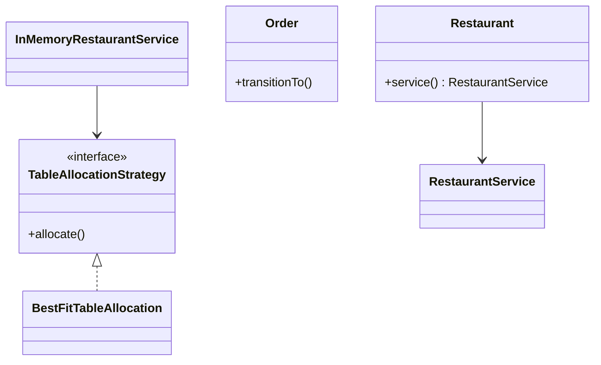
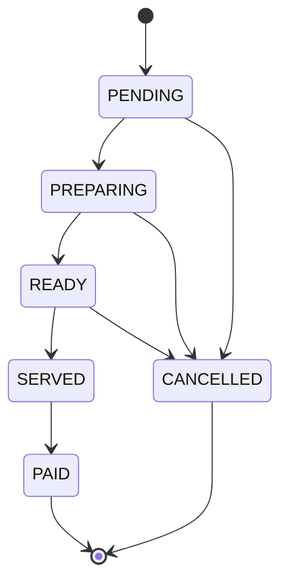

# Restaurant — LLD

Restaurant management: table allocation, reservations, order state machine, and billing.

## Package Structure

```
restaurant/
  model/          Table, Order, Reservation, MenuItem, Bill, *Status enums
  service/        RestaurantService, TableAllocationStrategy
  service/impl/   InMemoryRestaurantService, BestFitTableAllocation
  exceptions/     TableNotFoundException, OrderNotFoundException, ...
  Restaurant.java Facade
  RestaurantDemo.java
```

## Design Patterns

| Pattern | Where | Why |
|---------|-------|-----|
| **Strategy** | `TableAllocationStrategy` / `BestFitTableAllocation` | Swap first-fit vs best-fit without touching service. |
| **State machine** | `Order.transitionTo()` | Enforce PENDING→PREPARING→READY→SERVED→PAID. |
| **Synchronized resource** | Per-table lock | Safe concurrent reservation + seating. |
| **Facade** | `Restaurant` | Interview entry point. |

## Class Diagram



## Order State Diagram



## Run Demo

```bash
mvn -q compile exec:java -Dexec.mainClass="com.you.lld.problems.restaurant.RestaurantDemo"
```

## Key Talking Points

- **Best-fit allocation** — smallest table ≥ party size minimizes wasted capacity.
- **Per-table locking** — reservation and seating mutate table status under `synchronized(table)`.
- **Order FSM** — invalid skips (PENDING→PAID) rejected at domain layer.
- **Bill gates** — `generateBill` only after SERVED; frees table on PAID.
- **Reservation lifecycle** — cancel restores AVAILABLE without orphan orders.
