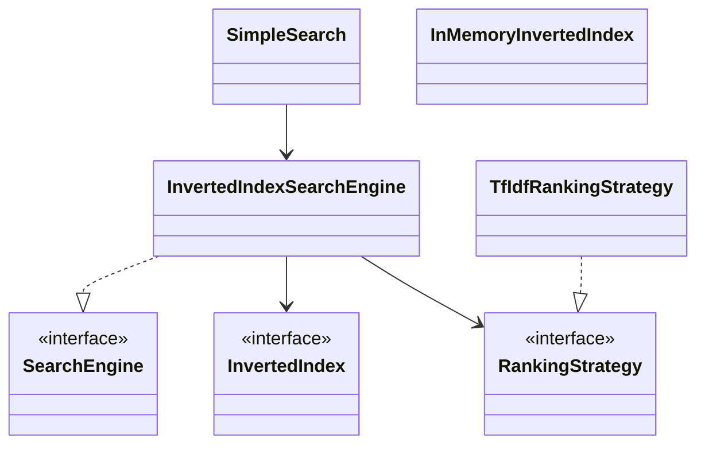

# Simple Search

In-memory search engine with inverted index and pluggable TF-IDF ranking.

## Package structure

```
simplesearch/
  model/           Document, SearchResult
  service/         SearchEngine, InvertedIndex, RankingStrategy
  service/impl/    InMemoryInvertedIndex, InvertedIndexSearchEngine, TfIdfRankingStrategy
  SimpleSearch.java
  SimpleSearchDemo.java
```

## Patterns

| Pattern | Where | Why |
|---------|-------|-----|
| **Inverted index** | `InMemoryInvertedIndex` | term → (docId, tf) postings |
| **Strategy** | `RankingStrategy` | TF-IDF vs match-count without re-indexing |
| **Facade** | `SimpleSearch` | Clean API for interviews |

## Class diagram



## Run demo

```bash
mvn -q compile exec:java -Dexec.mainClass="com.you.lld.problems.simplesearch.SimpleSearchDemo"
```

## Talking points

- Index title + content; postings store per-doc term frequency for real TF.
- TF-IDF: normalized tf × log-smoothed idf; OR semantics across query terms.
- Strategy swap changes ordering without touching the index.
- `synchronized` engine methods — compound index+search needs stronger isolation at scale.
