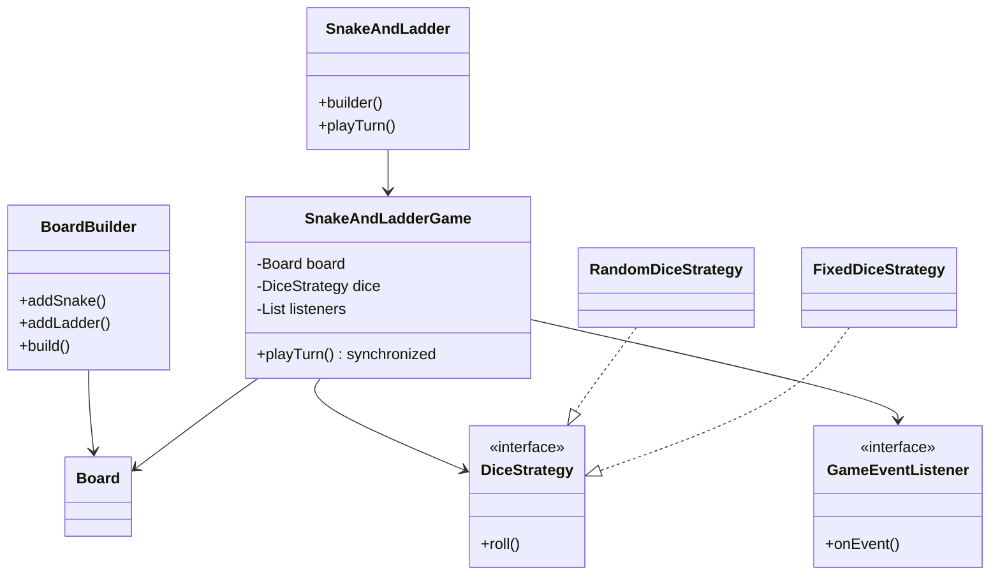

# Snake and Ladder — LLD

Design a multiplayer board game with configurable snakes/ladders, dice rolling, exact-win rule, and game event notifications.

## Package Structure

```
snakeandladder/
  model/           Player, Snake, Ladder, Board, GameResult, GameStats
  builder/         BoardBuilder (fluent board setup)
  service/         DiceStrategy
  service/impl/    RandomDiceStrategy, FixedDiceStrategy
  observer/        GameEvent, GameEventListener, LoggingGameEventListener
  SnakeAndLadderGame.java   Engine (synchronized turns)
  SnakeAndLadder.java       Facade + Builder
  SnakeAndLadderDemo.java
```

## Design Patterns

| Pattern | Where | Why |
|---------|-------|-----|
| **Builder** | `BoardBuilder` | Fluent construction of board size, snakes, ladders with validation. |
| **Strategy** | `DiceStrategy` — Random vs Fixed | Swap dice behavior for prod vs deterministic demos/tests. |
| **Observer** | `GameEventListener` | Decouple game engine from logging/UI/analytics subscribers. |

## Class Diagram



## Run Demo

```bash
mvn -q compile exec:java -Dexec.mainClass="com.you.lld.problems.snakeandladder.SnakeAndLadderDemo"
```

## Key Talking Points

- **Exact landing to win** — overshoot keeps player in place; classic interview edge case.
- **Snake/ladder chains** — landing on ladder top that is snake head resolves in a loop (max 20 hops).
- **Builder validates** — duplicate snake heads or out-of-bounds positions fail at `build()` time.
- **Observer for side effects** — engine fires SNAKE_HIT/LADDER_HIT/GAME_WON; listeners stay pluggable.
- **Synchronized `playTurn()`** — safe if multiple threads trigger turns (e.g. web sockets).
