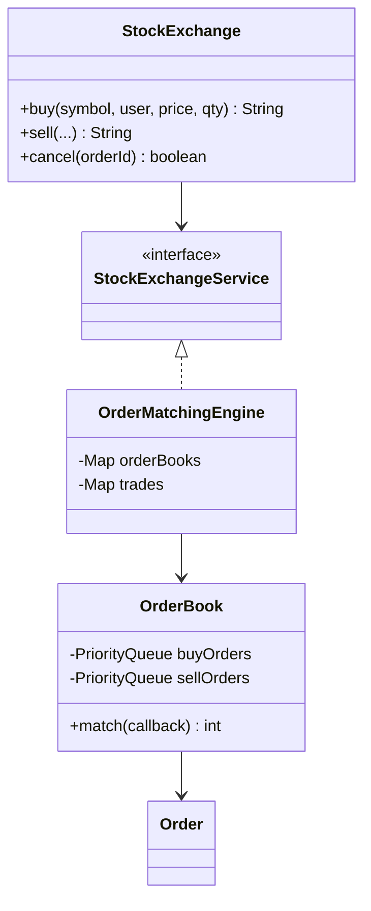

# Stock Exchange — LLD

Design an order-matching engine with price-time priority, partial fills, and cancellation.

## Package Structure

```
stockexchange/
  model/          Order, Trade, OrderBook, OrderType, OrderStatus
  service/        StockExchangeService
  service/impl/   OrderMatchingEngine
  StockExchange.java   Facade
  StockExchangeDemo.java
```

## Design Patterns

| Pattern | Where | Why |
|---------|-------|-----|
| **Priority Queues (heaps)** | `OrderBook` buy max-heap / sell min-heap | O(log n) best bid/ask; price-time comparators on `Order`. |
| **Callback** | `OrderBook.match(MatchCallback)` | Book owns matching loop; engine records trades. |
| **Facade** | `StockExchange` | Simple buy/sell/cancel API for demos and interviews. |

## Class Diagram



## Run Demo

```bash
mvn -q compile exec:java -Dexec.mainClass="com.you.lld.problems.stockexchange.StockExchangeDemo"
```

## Key Talking Points

- **Price-time priority** — best price first; FIFO among orders at the same price (`createdAt`).
- **Trade price** — incoming buy crosses resting sell → execute at sell (maker) price.
- **Partial fills** — `PARTIALLY_FILLED` status; remainder stays in heap until filled or cancelled.
- **Thread-safety** — `synchronized` methods on `OrderBook`; `ConcurrentHashMap` for order/trade registries.
- **No match** — bid < best ask → both orders rest on book; `getBestBid` / `getBestAsk` expose spread.
