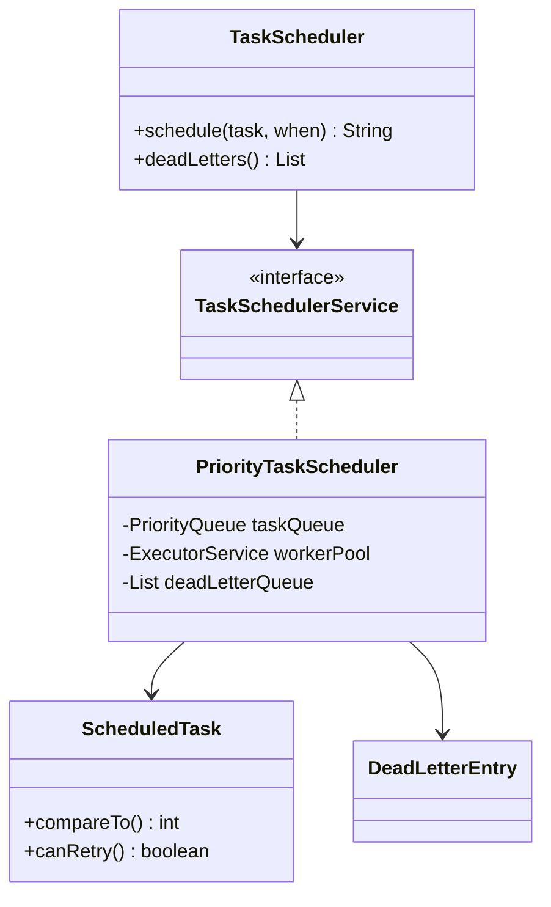

# Task Scheduler — LLD

Design a scheduler that runs delayed tasks by priority with retries and a dead-letter queue.

## Package Structure

```
taskscheduler/
  model/          ScheduledTask, Priority, DeadLetterEntry, TaskStatus
  service/        TaskSchedulerService
  service/impl/   PriorityTaskScheduler (PriorityQueue + thread pools)
  TaskScheduler.java   Facade
  TaskSchedulerDemo.java
```

## Design Patterns

| Pattern | Where | Why |
|---------|-------|-----|
| **Priority Queue** | `PriorityTaskScheduler` | O(log n) insert/poll; time-first, then higher priority. |
| **Producer/Consumer** | Poller thread + worker pool | Decouple due-task discovery from execution. |
| **Retry + DLQ** | `runTask()` catch block | Failed tasks retry with backoff; exhausted tasks land in DLQ. |

## Class Diagram



## Run Demo

```bash
mvn -q compile exec:java -Dexec.mainClass="com.you.lld.problems.taskscheduler.TaskSchedulerDemo"
```

## Key Talking Points

- **Comparator** — earlier `scheduledTime` wins; ties broken by higher `Priority.level`.
- **Two pools** — single-thread poller ticks every 1s; fixed worker pool executes due tasks.
- **Retry** — `attemptCount` vs `maxRetries`; re-queue with 1s delay on failure.
- **DLQ** — after max retries, task removed from active map and appended to dead-letter list.
- **Cancellation** — volatile flag + remove from queue; worker checks before run.
