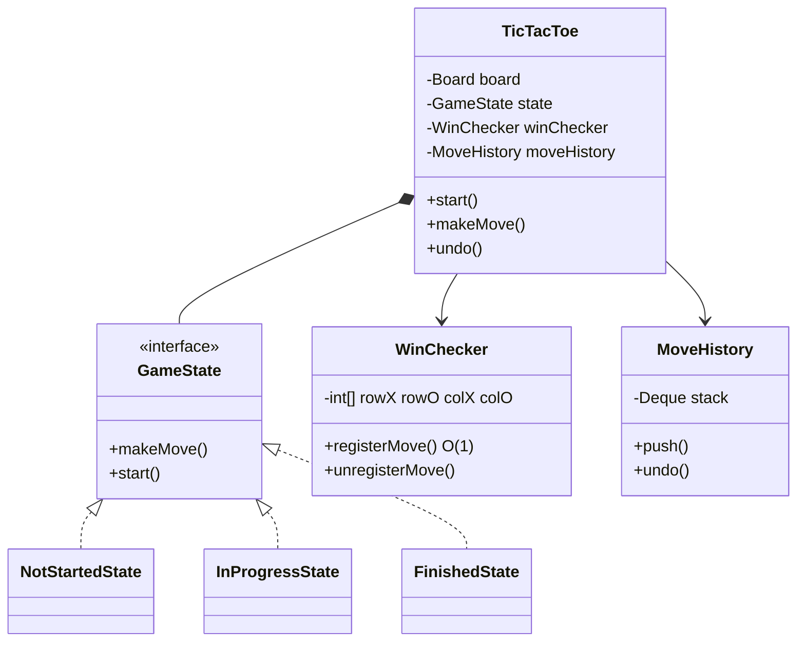

# Tic Tac Toe — LLD

Design a 3×3 Tic Tac Toe game with turn management, O(1) win detection, undo, and state-driven game flow.

## Package Structure

```
tictactoe/
  model/       Player, Position, Board, Move, GamePhase, MoveResult
  service/     WinChecker (O(1) incremental counters)
  state/       GameState, NotStartedState, InProgressState, FinishedState
  command/     MoveHistory (undo stack)
  TicTacToe.java      Orchestrator
  TicTacToeDemo.java
```

## Design Patterns

| Pattern | Where | Why |
|---------|-------|-----|
| **State** | `GameState` + NotStarted/InProgress/Finished | Each phase allows only valid operations; finished game rejects moves cleanly. |
| **Command** | `MoveHistory` | Undo pops last move and reverses board + win counters in O(1). |
| **Incremental win check** | `WinChecker` | Row/col/diag counters updated per move — O(1) vs O(n) board scan. |

## Class Diagram



## Run Demo

```bash
mvn -q compile exec:java -Dexec.mainClass="com.you.lld.problems.tictactoe.TicTacToeDemo"
```

## Key Talking Points

- **O(1) win check** — maintain per-row/col/diagonal counts for X and O; only check lines touched by last move.
- **State pattern** — `FinishedState.makeMove()` returns error without nested if-checks in orchestrator.
- **Undo via Command** — pop stack, clear cell, decrement win counters, restore current player.
- **Algebraic notation** — `a1`–`c3` maps to (row,col) for interview-friendly API.
- **Extensibility** — N×N board would need generalized counters; 3×3 keeps interview scope tight.
