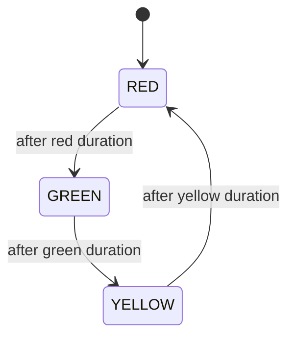

# Traffic Control

Traffic lights with State-based phase machine and Composite intersection groups.

## Package structure

```
trafficcontrol/
  model/           Signal, Direction, TrafficLight, Intersection
  service/         TrafficComponent, TrafficController
  service/state/   SignalState, GreenState, YellowState, RedState
  service/impl/    TrafficControllerImpl, IntersectionGroup
  TrafficControl.java
  TrafficControlDemo.java
```

## Patterns

| Pattern | Where | Why |
|---------|-------|-----|
| **State** | `SignalState` | RED → GREEN → YELLOW transitions with durations |
| **Composite** | `IntersectionGroup` | Coordinate multiple intersections |
| **Facade** | `TrafficControl` | Register components and run controller |

## State diagram



## Run demo

```bash
mvn -q compile exec:java -Dexec.mainClass="com.you.lld.problems.trafficcontrol.TrafficControlDemo"
```

## Talking points

- Each `TrafficLight` owns a `SignalState` — `advance()` delegates to `next()`.
- `Intersection` rotates which direction is green; others forced red.
- Emergency mode: all red; `exitEmergency` restores phase machine.
- `IntersectionGroup` ticks children in sequence for coordinated corridors.
