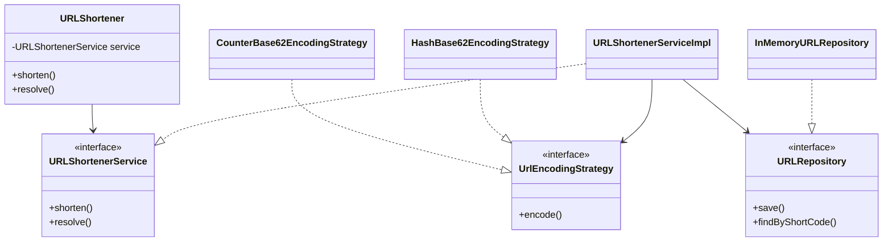

# URL Shortener — LLD

Design a service that maps long URLs to short codes with pluggable encoding, collision handling, and analytics.

## Package Structure

```
urlshortener/
  model/           ShortURL, URLMapping, Analytics, exceptions
  service/         URLShortenerService, URLRepository, UrlEncodingStrategy
  service/impl/    CounterBase62EncodingStrategy, HashBase62EncodingStrategy,
                   InMemoryURLRepository, URLShortenerServiceImpl, Base62Encoder, URLValidator
  URLShortener.java     Facade (swaps encoding mode)
  URLShortenerDemo.java
```

## Design Patterns

| Pattern | Where | Why |
|---------|-------|-----|
| **Strategy** | `UrlEncodingStrategy` — Counter vs Hash Base62 | Swap ID generation without touching shorten/resolve flow. |
| **Repository** | `URLRepository` + `InMemoryURLRepository` | Persistence abstracted; production swaps in Redis/Postgres. |
| **Facade** | `URLShortener` | Interview entry point wiring repo + strategy. |

## Class Diagram



## Run Demo

```bash
mvn -q compile exec:java -Dexec.mainClass="com.you.lld.problems.urlshortener.URLShortenerDemo"
```

## Key Talking Points

- **Dual encoding strategies** — counter gives sequential codes; hash gives deterministic codes per URL with linear probing on collision.
- **Idempotent shorten** — `longToShort` index returns existing code for duplicate URLs.
- **Collision handling** — both strategies probe up to 100 alternate codes before failing.
- **Thread-safe repository** — `ConcurrentHashMap` for bidirectional lookup under concurrent shorten/resolve.
- **Analytics on resolve** — `AtomicLong` access count + volatile last-accessed timestamp per mapping.
