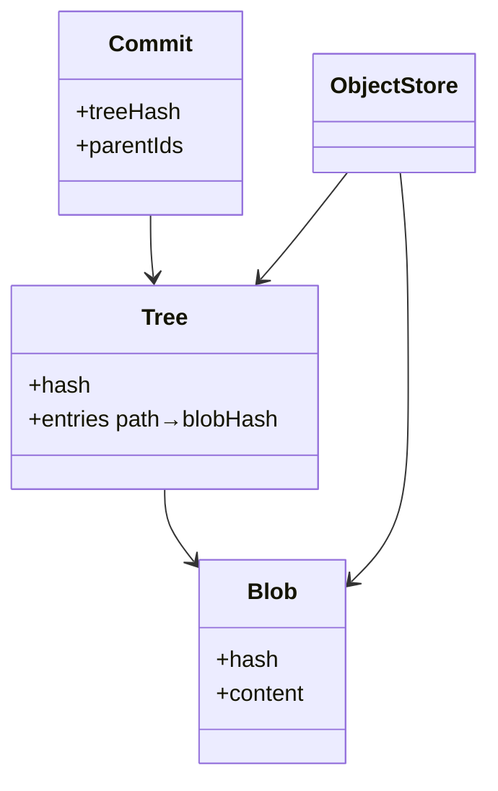

# Version Control

Simplified Git: content-addressed blobs/trees, commit DAG, branches, and 3-way merge.

## Package structure

```
versioncontrol/
  model/           Blob, Tree, Commit, Branch, Diff
  service/         ObjectStore, CommitStore, BranchManager, MergeStrategy, MergeBaseFinder
  service/impl/    InMemoryCommitStore, InMemoryBranchManager, SimpleMerge
  VersionControl.java
  Repository.java
  VersionControlDemo.java
```

## Patterns

| Pattern | Where | Why |
|---------|-------|-----|
| **DAG** | `Commit` parentIds | Merge commits have two parents |
| **Content addressing** | `Blob`, `Tree`, `ObjectStore` | Dedup by hash; commit points to tree |
| **Strategy** | `MergeStrategy` | Pluggable merge (fast-forward, 3-way) |
| **LCA** | `MergeBaseFinder` | Merge-base for 3-way conflict detection |

## Object model



## Run demo

```bash
mvn -q compile exec:java -Dexec.mainClass="com.you.lld.problems.versioncontrol.VersionControlDemo"
```

## Talking points

- Commit stores tree hash, not inline files — blobs deduplicated in `ObjectStore`.
- Fast-forward when our HEAD is ancestor of theirs.
- 3-way merge: base vs ours vs theirs; conflict when both diverged from base.
- Branch is a movable pointer; checkout hydrates working dir from commit tree.
