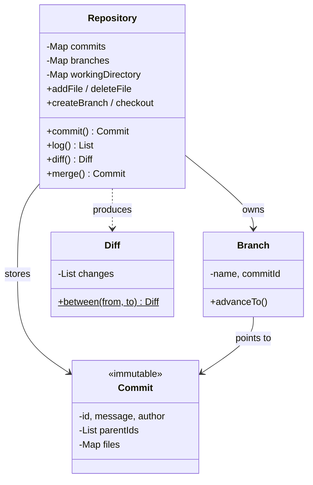

# Version Control System — LLD

Design a simplified Git: commits, branches, checkout, diff, merge with conflict detection.

## Package Structure

```
versioncontrol/
  model/
    Commit.java        — immutable snapshot (id, message, author, parentIds, files)
    Branch.java        — named movable pointer to a commit
    Diff.java          — list of file changes (ADD/MODIFY/DELETE) between two snapshots
  Repository.java      — orchestrator: init, commit, log, branch, checkout, diff, merge
  VersionControlDemo.java — 5 interview scenarios
```

## Design Patterns

| Pattern | Where | Why |
|---------|-------|-----|
| **Immutable Value Object** | `Commit` | Once created, never changes. Core invariant of version control. |
| **Snapshot** | `Commit.files` | Full file map per commit. O(1) checkout, no delta reconstruction. |
| **DAG traversal** | `Repository.isAncestor()` | BFS on commit parent graph for merge decisions (fast-forward vs merge). |
| **Static Factory** | `Diff.between()` | Encapsulates comparison logic, returns immutable result. |

## Class Diagram



## Run

```bash
mvn compile exec:java -Dexec.mainClass="com.you.lld.problems.versioncontrol.VersionControlDemo"
```

## Key Interview Talking Points

- **Branch = pointer**: creating a branch is O(1), just a new map entry. Git's core insight.
- **Commit = immutable snapshot**: full file map, not deltas. O(1) checkout. Mention packfiles as optimization.
- **Fast-forward vs merge**: ancestor check via BFS on the commit DAG. If HEAD is ancestor of source → just move pointer. Otherwise → merge commit with two parents.
- **Conflict detection**: same file with different content in both branches → report all conflicts, don't fail silently on the first.
- **Log = parent chain walk**: not an unordered dump. Walk parent[0] from HEAD to root.
