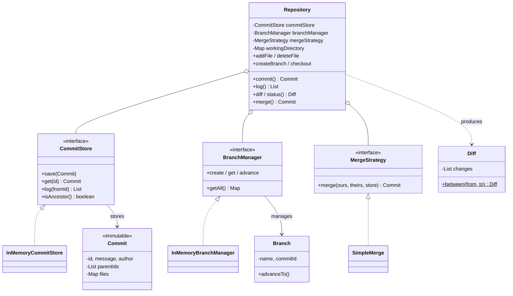

# Version Control System — LLD

Design a simplified Git: commits, branches, checkout, diff, merge with conflict detection.

## Package Structure

```
versioncontrol/
  model/
    Commit.java           — immutable snapshot (id, message, author, parentIds, files)
    Branch.java           — named movable pointer to a commit
    Diff.java             — list of file changes (ADD/MODIFY/DELETE) between two snapshots
  service/
    CommitStore.java      — interface: store/retrieve commits, log, ancestor check
    BranchManager.java    — interface: branch CRUD
    MergeStrategy.java    — interface: pluggable merge algorithm
    impl/
      InMemoryCommitStore.java   — HashMap-backed commit store + DAG traversal
      InMemoryBranchManager.java — HashMap-backed branch manager
      SimpleMerge.java           — fast-forward + merge commit with conflict detection
  Repository.java         — orchestrator: wires services, owns working directory
  VersionControlDemo.java — 5 interview scenarios
```

## SOLID Compliance

| Principle | How |
|-----------|-----|
| **SRP** | Repository = orchestrator. CommitStore = storage. BranchManager = branches. MergeStrategy = merge logic. Each class has one reason to change. |
| **OCP** | New merge strategy (rebase, squash) = new class implementing MergeStrategy. Repository untouched. |
| **LSP** | All interface implementations are substitutable (InMemory → Redis/DB without changing Repository). |
| **ISP** | Three focused interfaces instead of one god interface. Clients depend only on what they use. |
| **DIP** | Repository depends on CommitStore, BranchManager, MergeStrategy interfaces — not on HashMaps or concrete classes. |

## Design Patterns

| Pattern | Where | Why |
|---------|-------|-----|
| **Strategy** | `MergeStrategy` | Pluggable merge algorithms. SimpleMerge today, RebaseMerge tomorrow. |
| **Immutable Value Object** | `Commit`, `Diff` | Commits never change after creation. Core VCS invariant. |
| **Repository pattern** | `CommitStore` | Abstracts storage of commits. Could be HashMap, file system, or database. |
| **Static Factory** | `Diff.between()` | Encapsulates comparison logic, returns immutable result. |
| **DAG traversal** | `InMemoryCommitStore.isAncestor()` | BFS on commit parent graph for merge decisions. |

## Class Diagram



## Run

```bash
mvn compile exec:java -Dexec.mainClass="com.you.lld.problems.versioncontrol.VersionControlDemo"
```

## Key Interview Talking Points

- **Branch = pointer**: creating a branch is O(1), just a new map entry. Git's core insight.
- **Commit = immutable snapshot**: full file map, not deltas. O(1) checkout. Mention packfiles as optimization.
- **SOLID breakdown**: Repository orchestrates; CommitStore stores; BranchManager manages pointers; MergeStrategy is pluggable. Each has one reason to change.
- **Fast-forward vs merge**: ancestor check via BFS on the commit DAG. Ancestor → move pointer. Diverged → merge commit with two parents.
- **Conflict detection**: same file, different content in both branches → collect all conflicts and report.
