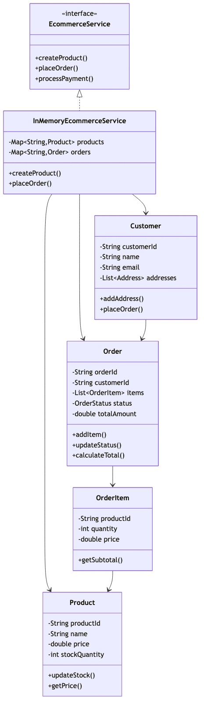
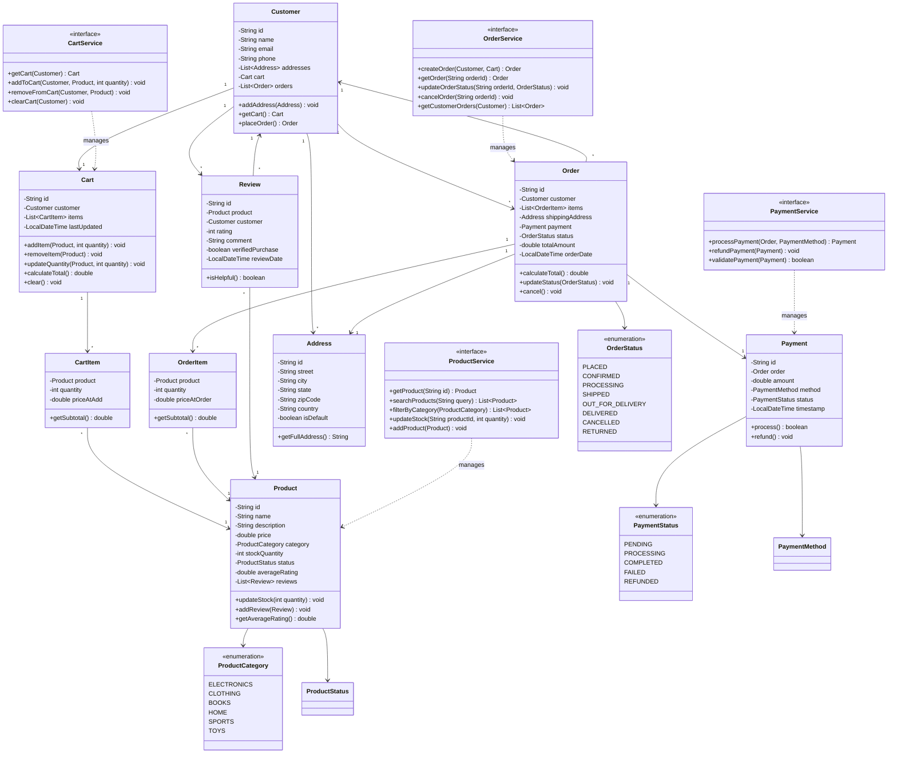

# Amazon E-commerce - Complete LLD Guide

## 📋 Table of Contents
1. [Problem Statement](#problem-statement)
2. [Requirements](#requirements)
3. [System Design](#system-design)
4. [Class Diagram](#class-diagram)
5. [Implementation Approaches](#implementation-approaches)
6. [Design Patterns Used](#design-patterns-used)
7. [Complete Implementation](#complete-implementation)
8. [Best Practices](#best-practices)

---

## Problem Statement

Design an **Amazon E-commerce** system that handles product catalog management, shopping cart operations, order placement, payment processing, and customer reviews. The system must support millions of products, concurrent shopping sessions, inventory management, and real-time order tracking.

### Key Challenges
- 🛒 **Shopping Cart Management**: Add/remove items, calculate totals, handle quantity updates
- 📦 **Product Catalog**: Search, filter by category, sort by price/rating
- 💳 **Order Processing**: Place order, payment integration, order status tracking
- ⭐ **Review System**: Customer ratings and reviews for products
- 🏢 **Inventory Management**: Stock availability, low stock alerts
- 💰 **Pricing & Discounts**: Dynamic pricing, coupons, bulk discounts
- 📊 **Multi-vendor Support**: Multiple sellers per product
- 🚚 **Order Fulfillment**: Warehouse assignment, shipping tracking

---

## Requirements

### Functional Requirements

✅ **Product Management**
- Add/update/delete products with details (name, description, price, category, images)
- Product categorization and sub-categories
- Inventory tracking (stock quantity, low stock alerts)
- Product status (Available, Out of Stock, Discontinued)
- Multiple product variants (size, color, etc.)

✅ **Customer Management**
- Register/login customers
- Customer profiles with addresses
- Order history and wishlist
- Customer preferences and recommendations

✅ **Shopping Cart**
- Add products to cart
- Update quantity or remove items
- Calculate subtotal, tax, shipping
- Save cart for later
- Cart expiry after inactivity

✅ **Order Processing**
- Create order from cart
- Select delivery address
- Choose payment method (Card, UPI, Wallet, COD)
- Order confirmation and tracking
- Order cancellation and refunds
- Order status updates (Placed, Confirmed, Shipped, Delivered, Cancelled)

✅ **Payment Processing**
- Multiple payment methods
- Payment validation
- Transaction recording
- Refund processing

✅ **Review & Rating System**
- Submit product reviews
- Rate products (1-5 stars)
- Helpful review voting
- Verified purchase badge

✅ **Search & Discovery**
- Search products by name, description
- Filter by category, price range, rating
- Sort by price, popularity, newest
- Recommended products

### Non-Functional Requirements

⚡ **Performance**:
- Product search < 200ms
- Cart operations < 100ms
- Order placement < 500ms
- Support 100,000+ concurrent users

🔒 **Concurrency**:
- Thread-safe cart operations
- Atomic inventory updates
- Optimistic locking for orders

🛡️ **Reliability**:
- ACID transactions for orders
- Payment idempotency
- Order confirmation emails

📈 **Scalability**:
- Horizontal scaling for APIs
- Database sharding by category/region
- Caching for product catalog
- CDN for product images

---

## System Design

### High-Level Architecture

```
┌─────────────────────────────────────────────────────┐
│                 Client Layer                        │
│         (Web, Mobile, API Gateway)                  │
└──────────────────┬──────────────────────────────────┘
                   │
┌──────────────────▼──────────────────────────────────┐
│              Service Layer                          │
│  ┌─────────────┬──────────────┬─────────────┐      │
│  │  Product    │   Cart       │   Order     │      │
│  │  Service    │   Service    │   Service   │      │
│  └─────────────┴──────────────┴─────────────┘      │
│  ┌─────────────┬──────────────┬─────────────┐      │
│  │  Payment    │   Customer   │   Review    │      │
│  │  Service    │   Service    │   Service   │      │
│  └─────────────┴──────────────┴─────────────┘      │
└──────────────────┬──────────────────────────────────┘
                   │
┌──────────────────▼──────────────────────────────────┐
│              Data Layer                             │
│  - Products DB (Read replicas)                      │
│  - Orders DB (Sharded)                              │
│  - Customers DB                                     │
│  - Redis Cache (Product catalog, cart)             │
│  - S3/CDN (Product images)                          │
└─────────────────────────────────────────────────────┘
```

### Key Workflows

**1. Product Browsing Flow:**
```
Customer → Search/Filter → Product List → Product Details → Add to Cart
```

**2. Order Placement Flow:**
```
View Cart → Update Quantities → Proceed to Checkout → Select Address 
→ Choose Payment → Confirm Order → Payment Processing → Order Confirmation
```

**3. Order Fulfillment Flow:**
```
Order Placed → Payment Confirmed → Warehouse Assignment → Picking/Packing 
→ Shipped → Out for Delivery → Delivered
```

---

## Class Diagram



<details>
<summary>📄 View Mermaid Source</summary>



</details>

---

## Implementation Approaches

### 1. Cart Management Strategy

#### ❌ **Approach 1: Database-Backed Cart**
Store cart in database on every operation.

**Problems:**
- High DB load for every cart action
- Slow response times (200-300ms)
- Unnecessary persistence for temporary data

#### ✅ **Approach 2: Redis-Backed Cart** (Chosen)
```java
class CartService {
    private RedisTemplate<String, Cart> redisTemplate;
    
    public void addToCart(Customer customer, Product product, int quantity) {
        String cartKey = "cart:" + customer.getId();
        Cart cart = redisTemplate.opsForValue().get(cartKey);
        // Add item to cart
        redisTemplate.opsForValue().set(cartKey, cart, 7, TimeUnit.DAYS);
    }
}
```

**Advantages:**
- ✅ **Fast**: < 10ms operations
- ✅ **Auto-expiry**: Carts expire after 7 days
- ✅ **Persistent**: Survive server restarts
- ✅ **Scalable**: Distributed caching

---

### 2. Inventory Management

#### ❌ **Approach 1: Check-Then-Update**
```java
if (product.getStockQuantity() >= quantity) {
    product.setStockQuantity(product.getStockQuantity() - quantity); // Race condition!
}
```

**Problem:** Race condition - multiple users can oversell stock

#### ✅ **Approach 2: Atomic Update with Optimistic Locking**
```java
@Version
private Long version;

public boolean reserveStock(int quantity) {
    // JPA will auto-retry if version mismatch
    if (stockQuantity >= quantity) {
        stockQuantity -= quantity;
        return true;
    }
    return false;
}
```

**Advantages:**
- ✅ **Thread-safe**: No overselling
- ✅ **Performance**: No locks, optimistic approach
- ✅ **Auto-retry**: Framework handles retries

---

### 3. Order Placement Algorithm

```
1. Validate Cart
   └─> Check cart not empty
   └─> Verify all products still available

2. Reserve Inventory
   └─> For each cart item:
       └─> Atomically decrease stock
       └─> Rollback all if any fails

3. Create Order
   └─> Generate order ID
   └─> Create OrderItems from CartItems
   └─> Lock prices (use current product price)
   └─> Set status = PLACED

4. Process Payment
   └─> Call payment gateway
   └─> If success: status = CONFIRMED
   └─> If failure: 
       └─> Release inventory
       └─> status = CANCELLED

5. Clear Cart & Notify
   └─> Empty customer's cart
   └─> Send order confirmation email
   └─> Update order tracking
```

**Time Complexity**: O(n) where n = number of cart items  
**Space Complexity**: O(n) for order items

---

## Design Patterns Used

| Pattern | Usage | Benefit |
|---------|-------|---------|
| **Strategy Pattern** | Multiple payment methods (Card, UPI, Wallet, COD) | Easy to add new payment providers |
| **Factory Pattern** | Create orders, payments, reviews | Centralized object creation |
| **Repository Pattern** | Data access for Product, Order, Customer | Abstract database operations |
| **Observer Pattern** | Order status updates trigger notifications | Decoupled event handling |
| **Decorator Pattern** | Add promotions, discounts to cart total | Flexible pricing rules |
| **Command Pattern** | Order operations (Place, Cancel, Refund) | Undo/redo, audit trail |
| **Facade Pattern** | AmazonService wraps Product, Cart, Order services | Simplified client interface |

---

## Complete Implementation

### 📦 Project Structure (28 files)

```
amazon/
├── model/
│   ├── Customer.java           # Customer profile and preferences
│   ├── Address.java            # Shipping/billing addresses
│   ├── Product.java            # Product catalog entry
│   ├── ProductCategory.java    # Category enum
│   ├── ProductStatus.java      # AVAILABLE, OUT_OF_STOCK, DISCONTINUED
│   ├── Cart.java               # Shopping cart
│   ├── CartItem.java           # Individual cart item
│   ├── Order.java              # Order entity
│   ├── OrderItem.java          # Individual order line item
│   ├── OrderStatus.java        # Order lifecycle states
│   ├── Payment.java            # Payment transaction
│   ├── PaymentMethod.java      # CARD, UPI, WALLET, COD
│   ├── PaymentStatus.java      # Payment lifecycle
│   ├── Review.java             # Product review and rating
│   └── Category.java           # Product category hierarchy
├── api/
│   ├── AmazonService.java      # Facade for all operations
│   ├── ProductService.java     # Product CRUD and search
│   ├── CartService.java        # Cart management
│   ├── OrderService.java       # Order processing
│   └── PaymentService.java     # Payment integration
├── impl/
│   ├── ProductServiceImpl.java # Product service implementation
│   └── OrderServiceImpl.java   # Order processing logic
└── exceptions/
    ├── ProductNotFoundException.java
    ├── InsufficientStockException.java
    ├── EmptyCartException.java
    ├── CustomerNotFoundException.java
    ├── OrderNotFoundException.java
    └── InvalidOperationException.java
```

**Total Files:** 28  
**Total Lines of Code:** ~1,008

---

## Source Code

### 📦 Complete Implementation

All source code files are available in the [**CODE.md**](/problems/amazon/CODE) file.

**Quick Links:**
- 📁 [View Project Structure](/problems/amazon/CODE#-project-structure-28-files)
- 💻 [Browse All Source Files](/problems/amazon/CODE#-source-code)

---

## Best Practices

### 1. Data Consistency
✅ **Transactional Order Placement**: Payment + Inventory + Order in single transaction  
✅ **Optimistic Locking**: Version field for concurrent updates  
✅ **Idempotent APIs**: Handle duplicate requests gracefully  
✅ **Audit Trail**: Log all order state changes  

### 2. Performance Optimization
✅ **Product Catalog Caching**: Redis cache with TTL  
✅ **Read Replicas**: Separate DB for product searches  
✅ **Database Indexing**: Index on category, price, rating  
✅ **Lazy Loading**: Load product reviews on-demand  

### 3. Scalability
✅ **Stateless Services**: Scale horizontally  
✅ **Database Sharding**: Shard by customer ID or region  
✅ **Event-Driven**: Use message queue for order events  
✅ **CDN**: Product images served from CDN  

### 4. Security
✅ **Authentication**: JWT tokens for API access  
✅ **Authorization**: Customers can only view their own orders  
✅ **PCI Compliance**: Never store card details  
✅ **Rate Limiting**: Prevent order spam  
✅ **Input Validation**: Sanitize all user inputs  

---

## 🚀 How to Use

### 1. Product Catalog Operations
```java
ProductService productService = new ProductServiceImpl();

// Search products
List<Product> results = productService.searchProducts("laptop");

// Filter by category
List<Product> electronics = productService.filterByCategory(ProductCategory.ELECTRONICS);

// Get product details
Product product = productService.getProduct("PROD123");
```

### 2. Shopping Cart Operations
```java
CartService cartService = new CartServiceImpl();

// Add to cart
cartService.addToCart(customer, product, 2);

// Update quantity
cartService.updateQuantity(customer, product, 3);

// Get cart
Cart cart = cartService.getCart(customer);
double total = cart.calculateTotal();
```

### 3. Order Placement
```java
OrderService orderService = new OrderServiceImpl();

// Create order from cart
Order order = orderService.createOrder(customer, cart);

// Process payment
PaymentService paymentService = new PaymentServiceImpl();
Payment payment = paymentService.processPayment(order, PaymentMethod.CARD);

// Check order status
OrderStatus status = order.getStatus(); // CONFIRMED
```

### 4. Review System
```java
Review review = new Review();
review.setProduct(product);
review.setCustomer(customer);
review.setRating(5);
review.setComment("Excellent product!");
review.setVerifiedPurchase(true);

product.addReview(review);
```

---

## 🧪 Testing Considerations

### Unit Tests
- ✅ Test cart operations (add, remove, update)
- ✅ Test order total calculations with tax and shipping
- ✅ Test inventory reservation and rollback
- ✅ Test payment processing success/failure

### Integration Tests
- ✅ End-to-end order placement flow
- ✅ Payment gateway integration
- ✅ Email notification on order confirmation

### Load Tests
- ✅ 100,000+ concurrent product searches
- ✅ 50,000+ concurrent cart operations
- ✅ 10,000+ orders per minute

---

## 📈 Scaling Considerations

### Database Optimization
1. **Sharding**: Shard orders by customer_id or date
2. **Partitioning**: Partition products by category
3. **Read Replicas**: 5+ replicas for product catalog
4. **Connection Pooling**: HikariCP with 50-100 connections

### Caching Strategy
1. **L1 Cache**: Application-level cache for hot products
2. **L2 Cache**: Redis for product catalog (TTL: 1 hour)
3. **Cart Cache**: Redis with 7-day expiry
4. **CDN**: CloudFront for product images

### Microservices Architecture
```
- Product Service (search, catalog)
- Order Service (order processing)
- Payment Service (payment gateway integration)
- Inventory Service (stock management)
- Notification Service (emails, SMS)
- Recommendation Service (ML-based)
```

### Monitoring
- Track order placement success rate (target: > 99%)
- Monitor payment failure rate
- Alert on low stock for popular products
- Track API latencies (p50, p95, p99)

---

## 🔐 Security Considerations

- ✅ **Authentication**: OAuth 2.0 + JWT tokens
- ✅ **Authorization**: RBAC for admin/customer roles
- ✅ **Encryption**: HTTPS for all APIs, encrypt PII in DB
- ✅ **PCI-DSS**: Tokenize payment details
- ✅ **Rate Limiting**: 100 requests/minute per customer
- ✅ **SQL Injection**: Use PreparedStatements
- ✅ **XSS Protection**: Sanitize product descriptions

---

## 📚 Related Patterns & Problems

- **Flipkart/eBay** - Similar e-commerce platforms
- **Inventory Management System** - Stock tracking focus
- **Payment Gateway** - Payment processing deep dive
- **Recommendation Engine** - Product suggestions
- **Warehouse Management** - Order fulfillment
- **Shopping Cart** - Cart-specific optimizations

---

## 🎓 Interview Tips

### Common Questions

1. **Q**: How do you prevent overselling of products?  
   **A**: Use optimistic locking with @Version annotation for atomic stock updates

2. **Q**: How do you handle abandoned carts?  
   **A**: Redis cache with 7-day TTL, send reminder emails after 24 hours

3. **Q**: What happens if payment fails after order creation?  
   **A**: Rollback inventory reservation, mark order as CANCELLED, notify customer

4. **Q**: How to scale for Black Friday traffic (100x normal load)?  
   **A**: Pre-warm caches, add read replicas, scale services horizontally, use CDN, implement queue-based order processing

5. **Q**: How to calculate dynamic pricing with discounts?  
   **A**: Decorator pattern - wrap base price with discount decorators (percentage, fixed, bulk, coupon)

### Key Points to Mention
- ✅ Atomic inventory updates with optimistic locking
- ✅ Redis for cart caching (fast + persistent)
- ✅ Transactional order placement (all-or-nothing)
- ✅ Event-driven architecture for notifications
- ✅ Microservices for independent scaling

---

## 📝 Summary

**Amazon E-commerce** demonstrates:
- ✅ **Complex domain modeling** with Customer, Product, Cart, Order, Payment
- ✅ **Concurrency handling** with optimistic locking for inventory
- ✅ **Scalable architecture** with caching, sharding, microservices
- ✅ **Payment integration** with multiple methods and rollback
- ✅ **Clean OOP design** with service layers and repositories
- ✅ **Production-ready** with comprehensive error handling

**Key Takeaway**: The inventory management and order placement flow are the **most critical components** - they must handle high concurrency, prevent overselling, and ensure data consistency with proper transaction boundaries.

---

## 🔗 Related Resources

- [View Complete Source Code](/problems/amazon/CODE) - All source files
- [Problem Documentation](/problems/amazon/README) - Full design guide


---

**Perfect for**: E-commerce system design interviews, learning transaction management, understanding scalable architectures
