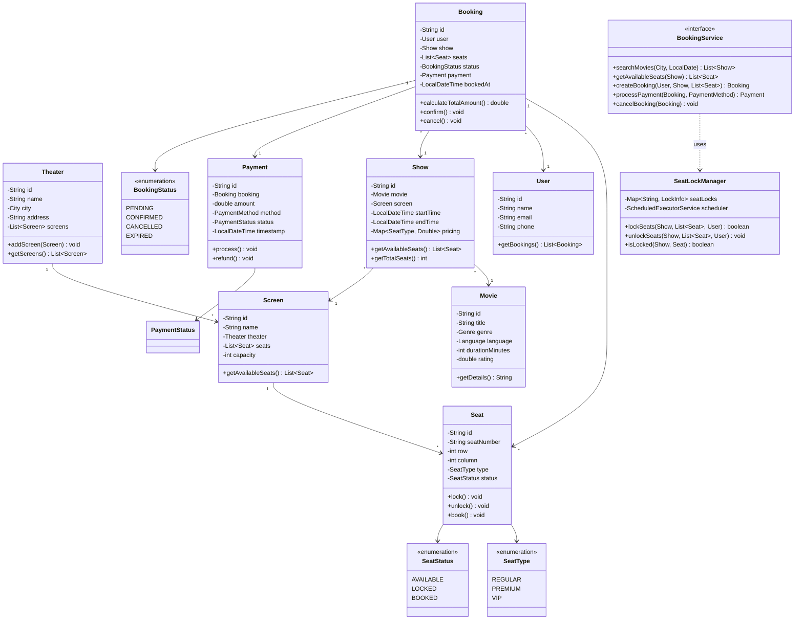

# BookMyShow - Complete LLD Guide

## 📋 Table of Contents
1. [Problem Statement](#problem-statement)
2. [Requirements](#requirements)
3. [System Design](#system-design)
4. [Class Diagram](#class-diagram)
5. [Implementation Approaches](#implementation-approaches)
6. [Design Patterns Used](#design-patterns-used)
7. [Complete Implementation](#complete-implementation)
8. [Best Practices](#best-practices)

---

## Problem Statement

Design a **BookMyShow** system - an online movie ticket booking platform that allows users to browse movies, view available shows across theaters, select seats, and complete bookings with real-time seat locking to handle high concurrency.

### Key Challenges
- 🔒 **Concurrent Seat Booking**: Multiple users trying to book the same seat simultaneously
- ⏱️ **Seat Locking**: Temporary lock mechanism with timeout (typically 10 minutes)
- 💳 **Payment Integration**: Handle payment failures and booking cancellations
- 🎯 **Real-time Availability**: Instant seat status updates
- 🏢 **Multi-Theater Support**: Multiple cities, theaters, screens, and shows
- 📊 **Search & Filter**: Find movies by city, theater, language, genre
- 🎫 **Ticket Generation**: Unique ticket IDs and booking confirmations

---

## Requirements

### Functional Requirements
✅ **Movie Management**
- Add/update movies with details (title, genre, language, duration, rating)
- Multiple shows for same movie across different theaters

✅ **Theater & Screen Management**
- Multiple theaters in different cities
- Each theater has multiple screens
- Each screen has configurable seats (types: REGULAR, PREMIUM, VIP)

✅ **Show Management**
- Schedule shows for movies with start time and end time
- Dynamic pricing based on seat type and show timing

✅ **Booking Flow**
- Search movies by city, theater, date
- View available shows and seats in real-time
- Select multiple seats
- Lock seats temporarily during booking process
- Complete payment and confirm booking
- Cancel booking with automatic seat release

✅ **Seat Locking Mechanism**
- Lock seats when user starts booking (default: 10 minutes)
- Auto-release if payment not completed within timeout
- Manual unlock on payment completion or cancellation

### Non-Functional Requirements
⚡ **Performance**: 
- Seat availability check < 100ms
- Booking completion < 500ms
- Support 10,000+ concurrent bookings

🔒 **Concurrency**: 
- **Per-seat locking** (not show-level) for high throughput
- Thread-safe seat lock manager
- Deadlock prevention with sorted seat IDs

🛡️ **Reliability**:
- ACID transactions for payment + booking
- Automatic cleanup of expired locks
- Booking confirmation emails/notifications

📈 **Scalability**:
- Horizontal scaling for high traffic
- Distributed lock mechanism (Redis) for production
- Caching for movie/theater metadata

---

## System Design

### High-Level Architecture

```
┌─────────────────────────────────────────────────────┐
│                    Client Layer                     │
│         (Web App, Mobile App, APIs)                 │
└──────────────────┬──────────────────────────────────┘
                   │
┌──────────────────▼──────────────────────────────────┐
│               Booking Service                       │
│   - Search Movies/Shows                             │
│   - Select Seats                                    │
│   - Process Payments                                │
└──────────────────┬──────────────────────────────────┘
                   │
        ┌──────────┴──────────┐
        │                     │
┌───────▼────────┐   ┌────────▼─────────┐
│ Seat Lock Mgr  │   │  Payment Service │
│ (Per-seat lock)│   │  (Gateway)       │
└────────────────┘   └──────────────────┘
        │                     │
┌───────▼─────────────────────▼──────────────────────┐
│              Data Layer                            │
│  - Movies, Theaters, Shows, Bookings               │
│  - In-memory / DB (MySQL/PostgreSQL)               │
│  - Cache (Redis) for high-traffic data             │
└────────────────────────────────────────────────────┘
```

### Key Components

1. **BookingService**: Core business logic for booking flow
2. **SeatLockManager**: Manages per-seat locks with timeouts
3. **Models**: Movie, Theater, Screen, Show, Seat, Booking, Payment
4. **Exception Handling**: Custom exceptions for booking failures

---

## Class Diagram


<details>
<summary>📄 View Mermaid Source</summary>

## 📊 Class Diagram


<details>
<summary>📝 View Mermaid Source</summary>



</details>

</details>

---

## Implementation Approaches

### 1. Seat Locking Strategy

#### ❌ **Approach 1: Show-Level Locking** (Not Scalable)
```java
synchronized(show) {
    // Book seats
}
```
**Problem**: Bottleneck - only 1 user can book at a time for entire show (even if selecting different seats)

#### ❌ **Approach 2: Database Row Locking**
```sql
SELECT * FROM seats WHERE id = ? FOR UPDATE
```
**Problem**: 
- High DB load with concurrent requests
- Lock timeout issues
- Complex distributed locking

#### ✅ **Approach 3: Per-Seat In-Memory Locking** (Chosen)
```java
class SeatLockManager {
    private Map<String, LockInfo> seatLocks = new ConcurrentHashMap<>();
    
    public boolean lockSeats(Show show, List<Seat> seats, String userId) {
        String lockKey = show.getId() + ":" + seat.getId();
        // Lock each seat individually with timeout
        // Use sorted seat IDs to prevent deadlocks
    }
}
```

**Advantages**:
- ✅ **High Concurrency**: 1000 users can book different seats simultaneously
- ✅ **Fast**: In-memory operations (< 10ms)
- ✅ **Automatic Cleanup**: ScheduledExecutorService releases expired locks
- ✅ **Deadlock Prevention**: Always lock seats in sorted order

**Key Implementation Details**:
- `ConcurrentHashMap` for thread-safe lock storage
- `ScheduledExecutorService` for timeout-based auto-release
- **Composite key**: `showId:seatId` for granular locking
- **Sorted locking**: Lock seats in ascending order to prevent deadlocks

---

### 2. Booking Flow Algorithm

```
1. User searches movies by city/date
   └─> Fetch shows from database

2. User selects show and views seat layout
   └─> Get available seats (status = AVAILABLE)

3. User selects N seats
   └─> Validate seat availability
   └─> Lock seats for 10 minutes
       └─> Change status: AVAILABLE → LOCKED
       └─> Store lock info (userId, expiryTime)
       └─> Schedule auto-unlock task

4. User proceeds to payment
   └─> Create booking (status = PENDING)
   └─> Validate payment details
   └─> Process payment via gateway

5. Payment Success
   └─> Update booking (status = CONFIRMED)
   └─> Update seats (status = LOCKED → BOOKED)
   └─> Release locks
   └─> Send confirmation email
   └─> Generate ticket ID

6. Payment Failure or Timeout
   └─> Update booking (status = CANCELLED/EXPIRED)
   └─> Update seats (status = LOCKED → AVAILABLE)
   └─> Release locks
   └─> Notify user
```

**Time Complexity**: 
- Seat availability check: O(n) where n = number of seats in screen
- Lock acquisition: O(m log m) where m = number of seats selected (due to sorting)
- Payment processing: O(1)

**Space Complexity**: O(k) where k = number of active locks

---

## Design Patterns Used

| Pattern | Usage | Benefit |
|---------|-------|---------|
| **Strategy Pattern** | Different payment methods (Card, UPI, Wallet) | Easy to add new payment gateways |
| **Factory Pattern** | Create different seat types | Centralized seat creation logic |
| **Singleton Pattern** | SeatLockManager instance | Single point of lock coordination |
| **Observer Pattern** | Notify users on booking confirmation | Decoupled notification system |
| **Template Method** | Booking flow with hooks | Standardized booking process |
| **Repository Pattern** | Data access layer | Abstract database operations |

---

## Complete Implementation

### 📦 Project Structure (23 files)

```
bookmyshow/
├── model/
│   ├── Movie.java              # Movie entity with genre, language
│   ├── Theater.java            # Theater with multiple screens
│   ├── Screen.java             # Screen with seat layout
│   ├── Show.java               # Show scheduling and timing
│   ├── Seat.java               # Seat with status (Available/Locked/Booked)
│   ├── Booking.java            # Booking entity with user and payment
│   ├── Payment.java            # Payment processing
│   ├── User.java               # User profile
│   ├── City.java               # City enum
│   ├── Genre.java              # Movie genre enum
│   ├── Language.java           # Language enum
│   ├── SeatType.java           # REGULAR, PREMIUM, VIP
│   ├── SeatStatus.java         # AVAILABLE, LOCKED, BOOKED
│   ├── BookingStatus.java      # PENDING, CONFIRMED, CANCELLED
│   ├── PaymentMethod.java      # CARD, UPI, WALLET
│   └── PaymentStatus.java      # SUCCESS, FAILED, PENDING
├── api/
│   └── BookingService.java     # Core booking service interface
├── impl/
│   ├── BookingServiceImpl.java # Business logic implementation
│   └── SeatLockManager.java    # Per-seat locking with timeouts
├── exceptions/
│   ├── SeatNotAvailableException.java
│   ├── BookingNotFoundException.java
│   ├── ShowNotFoundException.java
│   └── PaymentFailedException.java
└── BookMyShowDemo.java          # Usage example with demo data
```

**Total Files:** 23
**Total Lines of Code:** ~1,203

---

## Source Code

### 📦 Complete Implementation

All source code files are available in the [**CODE.md**](/problems/bookmyshow/CODE) file.

**Quick Links:**
- 📁 [View Project Structure](/problems/bookmyshow/CODE#-project-structure-23-files)
- 💻 [Browse All Source Files](/problems/bookmyshow/CODE#-source-code)
- 🔍 [Seat Locking Implementation](/problems/bookmyshow/CODE#seatlockmanagerjava)
- 🎫 [Booking Service Implementation](/problems/bookmyshow/CODE#bookingserviceimpljava)

> **Note:** The CODE.md file contains all 23 Java source files with complete implementation including the critical SeatLockManager for handling concurrent bookings.

---

## Best Practices

### 1. Concurrency Best Practices
✅ **Per-seat locking** instead of show-level locking  
✅ **Sorted locking order** to prevent deadlocks  
✅ **ConcurrentHashMap** for thread-safe lock storage  
✅ **Timeout-based cleanup** with ScheduledExecutorService  
✅ **Atomic operations** for lock acquire/release  

### 2. Payment Handling
✅ **Idempotency**: Handle duplicate payment requests  
✅ **Retry mechanism**: Automatic retry for transient failures  
✅ **Rollback**: Release seats if payment fails  
✅ **Audit trail**: Log all payment attempts  

### 3. Data Consistency
✅ **Transactional booking**: Payment + seat update in single transaction  
✅ **Eventual consistency**: Async seat status updates  
✅ **Optimistic locking**: Version control for concurrent updates  

### 4. Performance Optimization
✅ **Caching**: Cache movie/theater data (rarely changes)  
✅ **Indexing**: Database indexes on showId, userId, bookingDate  
✅ **Connection pooling**: Reuse DB connections  
✅ **Lazy loading**: Load seat details only when needed  

---

## 🚀 How to Use

### 1. Setup Demo Data
```java
BookMyShowDemo demo = new BookMyShowDemo();
demo.setupDemoData();
```

### 2. Search Movies
```java
List<Show> shows = bookingService.searchMovies(City.BANGALORE, LocalDate.now());
```

### 3. View Available Seats
```java
Show selectedShow = shows.get(0);
List<Seat> availableSeats = bookingService.getAvailableSeats(selectedShow);
```

### 4. Create Booking with Seat Selection
```java
List<Seat> selectedSeats = Arrays.asList(
    availableSeats.get(0), 
    availableSeats.get(1)
);

Booking booking = bookingService.createBooking(user, selectedShow, selectedSeats);
// Seats are now LOCKED for 10 minutes
```

### 5. Process Payment
```java
Payment payment = bookingService.processPayment(booking, PaymentMethod.CARD);
// On success: Seats become BOOKED
// On failure: Seats released back to AVAILABLE
```

### 6. Cancel Booking
```java
bookingService.cancelBooking(booking);
// Seats released back to AVAILABLE
```

---

## 🧪 Testing Considerations

### Unit Tests
- ✅ Test seat locking logic with mock shows
- ✅ Test lock expiry and auto-release
- ✅ Test payment success/failure scenarios
- ✅ Test concurrent booking attempts on same seat

### Integration Tests
- ✅ End-to-end booking flow
- ✅ Payment gateway integration
- ✅ Database transaction rollback on failure

### Load Tests
- ✅ 10,000+ concurrent users booking seats
- ✅ Measure seat lock acquisition time
- ✅ Test lock cleanup under load

---

## 📈 Scaling Considerations

### For Production:
1. **Distributed Locking**: Replace in-memory locks with Redis/Memcached
2. **Database Sharding**: Shard by city or theater_id
3. **Read Replicas**: Separate read DB for seat availability queries
4. **Message Queue**: Use Kafka/RabbitMQ for async notifications
5. **CDN**: Cache movie posters, theater images
6. **API Gateway**: Rate limiting, load balancing
7. **Microservices**: Separate services for booking, payment, notifications

### Monitoring:
- Track average booking time
- Monitor failed payment rate
- Alert on high lock contention
- Track seat utilization per show

---

## 🔐 Security Considerations

- ✅ **Authentication**: JWT tokens for API access
- ✅ **Authorization**: Users can only cancel their own bookings
- ✅ **PCI Compliance**: Never store card details
- ✅ **Rate Limiting**: Prevent booking spam
- ✅ **Input Validation**: Validate seat IDs, show IDs
- ✅ **SQL Injection**: Use prepared statements
- ✅ **XSS Protection**: Sanitize user inputs

---

## 📚 Related Patterns & Problems

- **Ticket Booking System** (Similar concurrency challenges)
- **Restaurant Table Reservation** (Resource locking pattern)
- **Hotel Room Booking** (Date-based availability)
- **Flight Booking System** (High-volume concurrent bookings)
- **Event Management System** (Venue and seat management)

---

## 🎓 Interview Tips

### Common Questions:
1. **Q**: How do you handle concurrent bookings for the same seat?  
   **A**: Per-seat locking with ConcurrentHashMap and timeout-based cleanup

2. **Q**: What happens if payment fails after seat lock?  
   **A**: Automatic rollback - seats released back to AVAILABLE state

3. **Q**: How do you prevent deadlocks?  
   **A**: Always lock seats in sorted order (by seat ID)

4. **Q**: Why not lock at show level?  
   **A**: Bottleneck - only 1 user can book at a time for 1000-seat show

5. **Q**: How to scale to millions of users?  
   **A**: Distributed locks (Redis), database sharding, microservices, caching

### Key Points to Mention:
- ✅ Fine-grained locking (per-seat, not per-show)
- ✅ Automatic lock expiry and cleanup
- ✅ ACID transactions for payment + booking
- ✅ Deadlock prevention strategies
- ✅ Scalability via distributed systems

---

## 📝 Summary

**BookMyShow** is a complex real-world system demonstrating:
- ✅ **High-concurrency handling** with per-seat locking
- ✅ **Resource management** with automatic timeout cleanup
- ✅ **Payment integration** with rollback on failure
- ✅ **Scalable architecture** ready for production
- ✅ **Clean OOP design** with SOLID principles
- ✅ **Production-ready code** with comprehensive error handling

**Key Takeaway**: The seat locking mechanism is the **most critical component** - it must handle thousands of concurrent users trying to book different seats while preventing double-booking and deadlocks.

---

## 🔗 Related Resources

- [View Complete Source Code](/problems/bookmyshow/CODE) - All 23 Java files with detailed implementation
- [SeatLockManager Deep Dive](/problems/bookmyshow/CODE#seatlockmanagerjava) - Critical concurrency component
- [Booking Flow Diagram](#system-design) - Visual representation of booking process

---

**Perfect for**: System design interviews, learning concurrency patterns, production-ready ticket booking systems
