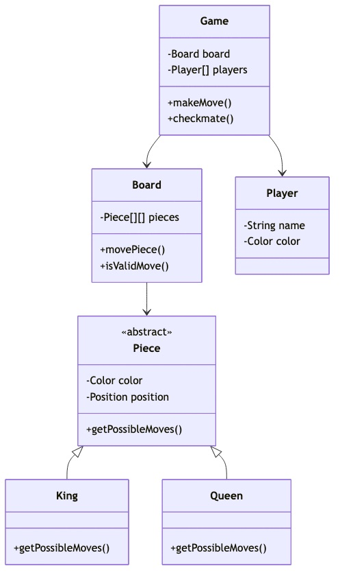
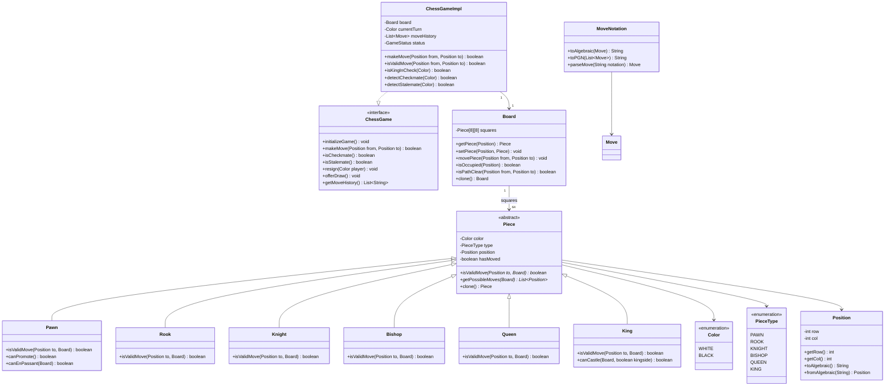

# Chess Game - Complete LLD Guide

## 📋 Table of Contents
1. [Problem Statement](#problem-statement)
2. [Requirements](#requirements)
3. [System Design](#system-design)
4. [Class Diagram](#class-diagram)
5. [Implementation Approaches](#implementation-approaches)
6. [Design Patterns Used](#design-patterns-used)
7. [Complete Implementation](#complete-implementation)
8. [Best Practices](#best-practices)

---

## Problem Statement

Design a **Chess Game** system that enforces all chess rules, validates moves, detects check/checkmate/stalemate, supports castling, en passant, pawn promotion, and maintains game history. The system must handle two-player games with move validation and game state management.

### Key Challenges
- ♟️ **Move Validation**: Each piece has unique movement rules
- 👑 **Check Detection**: King cannot be in check
- ♛ **Checkmate/Stalemate**: Game end conditions
- 🏰 **Special Moves**: Castling, en passant, pawn promotion
- 📜 **Move History**: Undo, game replay, PGN notation
- ⏱️ **Timer Support**: Blitz, Rapid, Classical time controls
- 🤖 **AI Integration**: Single-player vs computer

---

## Requirements

### Functional Requirements

✅ **Board Setup**
- 8x8 board with standard chess piece placement
- Support for custom board setups (Chess960)
- Initialize pieces with correct colors and positions

✅ **Move Validation**
- Piece-specific movement rules:
  - **Pawn**: Forward 1 (or 2 from start), capture diagonally
  - **Rook**: Horizontal/vertical any distance
  - **Knight**: L-shape (2+1 or 1+2)
  - **Bishop**: Diagonal any distance
  - **Queen**: Rook + Bishop
  - **King**: 1 square in any direction
- Path obstruction check (pieces can't jump except knight)
- Cannot move into check
- Cannot leave king in check

✅ **Special Moves**
- **Castling**: King + Rook swap (kingside/queenside)
  - King hasn't moved
  - Rook hasn't moved
  - No pieces between
  - King not in check, doesn't pass through check
- **En Passant**: Capture pawn that just moved 2 squares
- **Pawn Promotion**: Pawn reaches end → Queen/Rook/Bishop/Knight

✅ **Check/Checkmate/Stalemate**
- Detect when king is in check
- Checkmate: King in check, no legal moves
- Stalemate: Not in check, no legal moves (draw)

✅ **Game Management**
- Initialize new game
- Make move (with validation)
- Undo move
- Get current board state
- Resign/offer draw

✅ **Move History**
- Track all moves in algebraic notation (e4, Nf3, O-O)
- Support PGN (Portable Game Notation) export
- Replay game from history

### Non-Functional Requirements

⚡ **Performance**:
- Move validation < 10ms
- Check detection < 50ms
- Support online multiplayer with real-time updates

🎯 **Usability**:
- Clear error messages for invalid moves
- Visual board representation
- Move suggestions/hints

📈 **Extensibility**:
- Easy to add chess variants (Chess960, Bughouse)
- Pluggable AI engines
- Custom rule modifications

---

## System Design

### Board Representation

```
  a  b  c  d  e  f  g  h
8 ♜ ♞ ♝ ♛ ♚ ♝ ♞ ♜  8
7 ♟ ♟ ♟ ♟ ♟ ♟ ♟ ♟  7
6 .  .  .  .  .  .  .  .  6
5 .  .  .  .  .  .  .  .  5
4 .  .  .  .  .  .  .  .  4
3 .  .  .  .  .  .  .  .  3
2 ♙ ♙ ♙ ♙ ♙ ♙ ♙ ♙  2
1 ♖ ♘ ♗ ♕ ♔ ♗ ♘ ♖  1
  a  b  c  d  e  f  g  h
```

### Game State Flow

```
INITIALIZED → ACTIVE → (CHECK) → CHECKMATE / STALEMATE / DRAW
                                       ↓
                                    GAME_OVER
```

---

## Class Diagram



<details>
<summary>📄 View Mermaid Source</summary>

## 📊 Class Diagram


<details>
<summary>📝 View Mermaid Source</summary>



</details>

</details>

---

## Implementation Approaches

### 1. Move Validation Strategy

#### ❌ **Approach 1: Hardcoded If-Else**
```java
public boolean isValidMove(Position to) {
    if (type == PAWN) {
        // 50 lines of pawn logic
    } else if (type == ROOK) {
        // 20 lines of rook logic
    }
    // Unmaintainable mess
}
```

#### ✅ **Approach 2: Piece-Specific Classes with Polymorphism** (Chosen)
```java
abstract class Piece {
    abstract boolean isValidMove(Position to, Board board);
}

class Pawn extends Piece {
    @Override
    boolean isValidMove(Position to, Board board) {
        int direction = (color == WHITE) ? 1 : -1;
        int rowDiff = to.getRow() - position.getRow();
        int colDiff = Math.abs(to.getCol() - position.getCol());
        
        // Forward move
        if (colDiff == 0 && rowDiff == direction) {
            return !board.isOccupied(to);
        }
        
        // Capture
        if (colDiff == 1 && rowDiff == direction) {
            return board.isOccupied(to) && 
                   board.getPiece(to).getColor() != color;
        }
        
        // Initial 2-square move
        if (!hasMoved && colDiff == 0 && rowDiff == 2 * direction) {
            Position between = new Position(
                position.getRow() + direction, 
                position.getCol()
            );
            return !board.isOccupied(to) && !board.isOccupied(between);
        }
        
        return false;
    }
}
```

**Advantages:**
- ✅ **Clean separation**: Each piece knows its own rules
- ✅ **Extensible**: Easy to add new pieces
- ✅ **Testable**: Unit test each piece separately

---

### 2. Check Detection Algorithm

```java
public boolean isKingInCheck(Color kingColor) {
    // Find king position
    Position kingPos = findKing(kingColor);
    
    // Check if any opponent piece can attack king
    Color opponentColor = (kingColor == WHITE) ? BLACK : WHITE;
    
    for (Piece piece : getAllPieces(opponentColor)) {
        if (piece.isValidMove(kingPos, board)) {
            return true;
        }
    }
    
    return false;
}
```

**Time Complexity**: O(n) where n = number of opponent pieces (max 16)

---

### 3. Checkmate Detection

```java
public boolean isCheckmate(Color color) {
    // Must be in check
    if (!isKingInCheck(color)) {
        return false;
    }
    
    // Try all possible moves
    for (Piece piece : getAllPieces(color)) {
        for (Position move : piece.getPossibleMoves(board)) {
            // Simulate move
            Board tempBoard = board.clone();
            tempBoard.movePiece(piece.getPosition(), move);
            
            // If king is no longer in check, it's not checkmate
            if (!tempBoard.isKingInCheck(color)) {
                return false;
            }
        }
    }
    
    // No legal moves to escape check
    return true;
}
```

**Optimization**: Early exit on first legal move found

---

### 4. Castling Validation

```java
public boolean canCastle(boolean kingside) {
    // King hasn't moved
    if (king.hasMoved()) return false;
    
    // Rook hasn't moved
    int rookCol = kingside ? 7 : 0;
    Piece rook = board.getPiece(new Position(king.getRow(), rookCol));
    if (rook == null || rook.hasMoved()) return false;
    
    // Path is clear
    int start = Math.min(king.getCol(), rookCol);
    int end = Math.max(king.getCol(), rookCol);
    for (int col = start + 1; col < end; col++) {
        if (board.isOccupied(new Position(king.getRow(), col))) {
            return false;
        }
    }
    
    // King not in check
    if (isKingInCheck(king.getColor())) return false;
    
    // King doesn't pass through check
    int step = kingside ? 1 : -1;
    Board tempBoard = board.clone();
    tempBoard.movePiece(king.getPosition(), 
        new Position(king.getRow(), king.getCol() + step));
    if (tempBoard.isKingInCheck(king.getColor())) {
        return false;
    }
    
    return true;
}
```

---

## Design Patterns Used

| Pattern | Usage | Benefit |
|---------|-------|---------|
| **Strategy Pattern** | Piece-specific move validation | Each piece implements own rules |
| **State Pattern** | Game state (Active, Check, Checkmate) | Clean state transitions |
| **Command Pattern** | Move operations (undo/redo) | Move history and replay |
| **Template Method** | Common validation steps | Reuse in all pieces |
| **Memento Pattern** | Save/restore board state | Undo moves, game replay |
| **Factory Pattern** | Create pieces | Centralized piece creation |
| **Observer Pattern** | Notify on game events | UI updates, move logging |

---

## Complete Implementation

### 📦 Project Structure (8 files)

```
chess/
├── model/
│   ├── Board.java                # 8x8 board with pieces
│   ├── Piece.java                # Abstract piece class
│   ├── Position.java             # Row/column position
│   ├── Color.java                # WHITE, BLACK
│   └── PieceType.java            # PAWN, ROOK, KNIGHT, etc.
├── api/
│   └── ChessGame.java            # Game interface
├── impl/
│   └── ChessGameImpl.java        # Game logic with validation
└── notation/
    └── MoveNotation.java         # Algebraic & PGN notation
```

**Total Files:** 8
**Total Lines of Code:** ~199

---

## Source Code

### 📦 Complete Implementation

All source code files are available in the [**CODE.md**](/problems/chess/CODE) file.

**Quick Links:**
- 📁 [View Project Structure](/problems/chess/CODE#-project-structure-8-files)
- 💻 [Browse All Source Files](/problems/chess/CODE#-source-code)
- ♟️ [Piece Move Validation](/problems/chess/CODE#piecejava)
- 👑 [Check/Checkmate Detection](/problems/chess/CODE#chessgameimpljava)
- 📋 [Board Representation](/problems/chess/CODE#boardjava)

---

## Best Practices

### 1. Move Validation
✅ **Validate before executing**: Check all rules before moving piece  
✅ **Prevent illegal states**: King can never be in check after move  
✅ **Clone board for simulation**: Don't mutate actual board during validation  
✅ **Path checking**: Ensure no pieces obstruct (except knight)  

### 2. Performance
✅ **Bitboards**: For high-performance engines, use 64-bit integers  
✅ **Move Generation**: Pre-compute legal moves, cache results  
✅ **Alpha-Beta Pruning**: For AI move evaluation  
✅ **Zobrist Hashing**: For position repetition detection  

### 3. Code Quality
✅ **Piece Polymorphism**: Each piece class handles own logic  
✅ **Immutable Moves**: Move objects are immutable  
✅ **Comprehensive Tests**: Test each piece, special moves, edge cases  
✅ **Clear Naming**: Position uses algebraic notation (e4, Nf3)  

---

## 🚀 How to Use

### 1. Initialize Game
```java
ChessGame game = new ChessGameImpl();
game.initializeGame();
```

### 2. Make Moves
```java
// Move pawn from e2 to e4
Position from = Position.fromAlgebraic("e2");
Position to = Position.fromAlgebraic("e4");

boolean success = game.makeMove(from, to);
if (success) {
    System.out.println("Move executed: e2 to e4");
} else {
    System.out.println("Invalid move");
}
```

### 3. Check Game State
```java
if (game.isCheckmate()) {
    System.out.println("Checkmate! Game over.");
} else if (game.isStalemate()) {
    System.out.println("Stalemate! Draw.");
} else if (game.isKingInCheck(Color.WHITE)) {
    System.out.println("White king in check!");
}
```

### 4. Get Move History
```java
List<String> moves = game.getMoveHistory();
// ["e4", "e5", "Nf3", "Nc6", ...]
```

### 5. Castle
```java
// Kingside castle (O-O)
game.makeMove(Position.fromAlgebraic("e1"), Position.fromAlgebraic("g1"));
```

---

## 🧪 Testing Considerations

### Unit Tests
- ✅ Each piece's valid/invalid moves
- ✅ Castling with all edge cases
- ✅ En passant captures
- ✅ Pawn promotion
- ✅ Check detection
- ✅ Checkmate scenarios (Fool's Mate, Scholar's Mate)

### Integration Tests
- ✅ Full game playthrough
- ✅ Undo/redo moves
- ✅ PGN import/export
- ✅ AI vs human game

### Famous Positions to Test
- ✅ **Fool's Mate** (fastest checkmate)
- ✅ **Scholar's Mate** (4-move checkmate)
- ✅ **King and Queen vs King** (basic endgame)
- ✅ **Stalemate positions**

---

## 📈 Scaling Considerations

### Production Enhancements
1. **Online Multiplayer**: WebSocket for real-time moves
2. **Chess Clock**: Time controls (blitz, rapid, classical)
3. **AI Engine**: Integrate Stockfish or custom minimax
4. **Move Analysis**: Post-game analysis with best moves
5. **Rating System**: Elo rating for players
6. **Tournament Mode**: Swiss/Round-robin tournaments

### Performance
- Use **bitboards** for professional engines (64-bit manipulation)
- **Transposition tables** for move caching
- **Opening book** for first 10-15 moves
- **Endgame tablebases** (Syzygy) for perfect play

---

## 🔐 Security Considerations

- ✅ **Anti-Cheating**: Detect impossible move sequences
- ✅ **Move Validation**: Server-side validation (never trust client)
- ✅ **Fair Play**: Time tracking, disconnect handling
- ✅ **Game Integrity**: Cryptographic game signatures

---

## 📚 Related Patterns & Problems

- **Tic Tac Toe** - Simpler board game
- **Snake and Ladder** - Dice-based board game
- **Minesweeper** - Grid-based game logic
- **Sudoku Solver** - Constraint satisfaction
- **Go Game** - More complex board game

---

## 🎓 Interview Tips

### Common Questions

1. **Q**: How do you validate if a move puts own king in check?  
   **A**: Clone board, execute move, check if king is under attack by opponent pieces

2. **Q**: What's the difference between checkmate and stalemate?  
   **A**: Checkmate = king in check + no legal moves. Stalemate = NOT in check + no legal moves (draw)

3. **Q**: How to implement castling validation?  
   **A**: Check 5 conditions: king/rook unmoved, path clear, king not in/through/into check

4. **Q**: How to detect check efficiently?  
   **A**: Find king, iterate opponent pieces, check if any can attack king position (O(n) where n ≤ 16)

5. **Q**: How would you add an AI opponent?  
   **A**: Minimax algorithm with alpha-beta pruning, evaluation function (material, position, mobility)

### Key Points to Mention
- ✅ Piece polymorphism for move validation
- ✅ Board cloning for move simulation
- ✅ Check detection before finalizing move
- ✅ Special move handling (castling, en passant, promotion)
- ✅ Move history in algebraic notation
- ✅ Command pattern for undo/redo

---

## 📝 Summary

**Chess Game** demonstrates:
- ✅ **Complex rule enforcement** with piece-specific validation
- ✅ **State management** for game lifecycle
- ✅ **Polymorphism** for piece behavior
- ✅ **Board cloning** for move simulation
- ✅ **Special move handling** (castling, en passant, promotion)
- ✅ **Clean OOP design** with clear responsibilities

**Key Takeaway**: The move validation and check detection are the **most critical components** - they must enforce all chess rules correctly to prevent illegal game states. Using polymorphism for piece-specific logic keeps the code maintainable and extensible.

---

## 🔗 Related Resources

- [View Complete Source Code](/problems/chess/CODE) - All 8 Java files
- [Move Validation Logic](/problems/chess/CODE#piecejava) - Piece-specific rules
- [Check Detection](/problems/chess/CODE#chessgameimpljava) - King safety validation
- [Board Representation](/problems/chess/CODE#boardjava) - 8x8 grid management

---

**Perfect for**: Chess engine interviews, learning game state management, understanding polymorphism in action, complex validation logic
