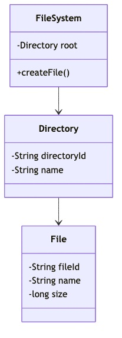
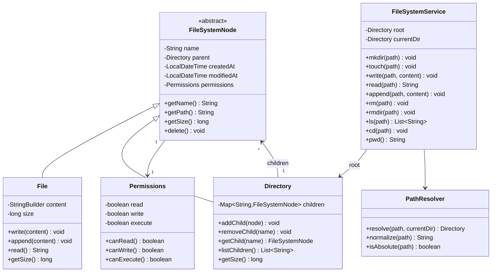

# In-Memory File System - Low Level Design

## Problem Statement

Design an in-memory file system that supports standard file operations like creating files/directories, reading/writing content, and navigating the directory hierarchy. The system should behave like Unix filesystem but operate entirely in memory for fast access.

## Table of Contents
- [Requirements](#requirements)
- [Class Diagram](#class-diagram)
- [Key Design Decisions](#key-design-decisions)
- [Implementation Guide](#implementation-guide)
- [Source Code](#source-code)

## Requirements

### Functional Requirements
1. **Directory Operations**
   - Create directory (`mkdir`)
   - List directory contents (`ls`)
   - Remove directory (`rmdir`) - only if empty
   - Change directory (`cd`)
   - Get current working directory (`pwd`)

2. **File Operations**
   - Create file (`touch`)
   - Write content to file (`write`)
   - Read content from file (`read`)
   - Append content to file (`append`)
   - Delete file (`rm`)

3. **Path Operations**
   - Support absolute paths (`/home/user/file.txt`)
   - Support relative paths (`../file.txt`, `./docs/`)
   - Path normalization (resolve `.` and `..`)
   - Case-sensitive names

4. **Metadata**
   - File/directory size
   - Creation timestamp
   - Last modified timestamp
   - Permissions (basic read/write/execute)

### Non-Functional Requirements
- **Performance**: O(1) operations for direct access, O(n) for path traversal
- **Memory Efficient**: Share common paths, no duplicate content
- **Thread-Safe**: Support concurrent operations
- **Scalability**: Handle 100K+ files/directories

## Class Diagram



<details>
<summary>View Mermaid Source</summary>



</details>

## Key Design Decisions

### 1. Composite Pattern for Files and Directories
**Decision**: Use Composite pattern with abstract `FileSystemNode` base class.

**Rationale**:
- Uniform treatment of files and directories
- Easy tree traversal
- Polymorphic operations (size, delete)
- Natural hierarchy representation

**Tradeoffs**:
- Some operations only make sense for one type (e.g., `listChildren` for directories)
- Need type checking in some cases

### 2. Map-Based Directory Structure
**Decision**: Store directory children in `HashMap<String, FileSystemNode>`.

**Rationale**:
- O(1) lookup by name
- Fast insertion/deletion
- Natural key-value mapping
- No duplicate names enforced automatically

**Tradeoffs**:
- No ordering (unless using LinkedHashMap)
- Memory overhead per directory
- Case-sensitive by default

### 3. Path Resolution Strategy
**Decision**: Separate `PathResolver` class for path parsing and navigation.

**Rationale**:
- Clean separation of concerns
- Reusable path logic
- Handles complex cases (`.`, `..`, `/`, `./`)
- Easy to test independently

**Tradeoffs**:
- Extra class complexity
- String parsing overhead

### 4. Parent Pointers in Nodes
**Decision**: Each node stores reference to parent directory.

**Rationale**:
- Enables `getPath()` to reconstruct full path
- Supports `..` navigation efficiently
- Allows orphan detection
- Facilitates `pwd` implementation

**Tradeoffs**:
- Bidirectional references (memory)
- Must maintain consistency on moves
- Potential for circular references (prevented by design)

## Implementation Guide

### 1. Path Resolution Algorithm

```
Algorithm: ResolvePath(path, currentDir)
Input: path string, current directory
Output: target Directory

1. if path is absolute (starts with '/'):
      current = root
      path = path.substring(1)
   else:
      current = currentDir

2. if path is empty:
      return current

3. segments = path.split('/')

4. for each segment in segments:
      if segment == '' or segment == '.':
         continue
      if segment == '..':
         current = current.parent
         if current == null:
            current = root
      else:
         child = current.getChild(segment)
         if child == null:
            throw FileNotFoundException
         if child is not Directory:
            throw NotADirectoryException
         current = child

5. return current
```

**Time Complexity**: O(d) where d is path depth  
**Space Complexity**: O(1)

### 2. Directory Size Calculation (Recursive)

```
Algorithm: GetDirectorySize(directory)
Input: directory node
Output: total size in bytes

1. if directory.children is empty:
      return 0

2. totalSize = 0

3. for each child in directory.children:
      if child is File:
         totalSize += child.size
      elif child is Directory:
         totalSize += GetDirectorySize(child)  // Recursive

4. return totalSize
```

**Time Complexity**: O(n) where n is total files in subtree  
**Space Complexity**: O(h) where h is tree height (recursion stack)

### 3. File Write Operation

```
Algorithm: WriteFile(path, content)
Input: file path, content string
Output: void

1. directory = resolvePath(parentPath(path), currentDir)

2. fileName = basename(path)

3. file = directory.getChild(fileName)

4. if file == null:
      file = new File(fileName)
      directory.addChild(file)

5. if file is not File:
      throw InvalidOperationException

6. if !file.permissions.canWrite():
      throw PermissionDeniedException

7. file.content.clear()
8. file.content.append(content)
9. file.size = content.length()
10. file.modifiedAt = now()
```

**Time Complexity**: O(d) for path resolution  
**Space Complexity**: O(1)

### 4. Directory Listing with Metadata

```
Algorithm: ListDirectory(path)
Input: directory path
Output: list of file/directory info

1. directory = resolvePath(path, currentDir)

2. result = []

3. for each child in directory.children:
      info = {
         name: child.name,
         type: child.type,
         size: child.size,
         modified: child.modifiedAt
      }
      result.add(info)

4. return result sorted by name
```

**Time Complexity**: O(n log n) where n is children count (for sorting)  
**Space Complexity**: O(n)

## Source Code

**Total Files**: 10  
**Total Lines of Code**: ~743

### Quick Links
- [📁 View Complete Implementation](/problems/filesystem/CODE)

### Project Structure
```
filesystem/
├── model/
│   ├── FileSystemNode.java       // Abstract base class
│   ├── File.java                 // File implementation
│   ├── Directory.java            // Directory implementation
│   └── Permissions.java          // Access control
├── api/
│   └── FileSystemService.java    // Service interface
├── impl/
│   ├── InMemoryFileSystem.java   // Main implementation
│   └── PathResolver.java         // Path parsing/resolution
└── exceptions/
    ├── FileNotFoundException.java
    ├── DirectoryNotEmptyException.java
    ├── InvalidPathException.java
    └── PermissionDeniedException.java
```

### Core Components

1. **FileSystemNode** (`model/FileSystemNode.java`)
   - Abstract base for files and directories
   - Common properties: name, parent, timestamps, permissions
   - Common operations: getName(), getPath(), delete()

2. **File** (`model/File.java`)
   - Stores content in StringBuilder for efficiency
   - Supports write, read, append operations
   - Tracks file size

3. **Directory** (`model/Directory.java`)
   - Contains map of child nodes
   - Implements add/remove/list operations
   - Recursive size calculation

4. **PathResolver** (`impl/PathResolver.java`)
   - Parses absolute and relative paths
   - Handles `.` and `..` navigation
   - Normalizes paths

5. **InMemoryFileSystem** (`impl/InMemoryFileSystem.java`)
   - Main service implementation
   - Manages root directory and current directory
   - Implements all filesystem operations

### Design Patterns Used

| Pattern | Usage | Benefit |
|---------|-------|---------|
| **Composite** | FileSystemNode hierarchy | Uniform treatment of files/dirs |
| **Strategy** | Permission checking | Flexible access control |
| **Singleton** | Root directory | Single source of truth |
| **Template Method** | Node operations | Consistent behavior |
| **Builder** | File/Directory creation | Clean construction |

### Usage Example

```java
FileSystemService fs = new InMemoryFileSystem();

// Create directories
fs.mkdir("/home");
fs.mkdir("/home/user");
fs.mkdir("/home/user/docs");

// Create and write to file
fs.touch("/home/user/docs/readme.txt");
fs.write("/home/user/docs/readme.txt", "Hello World!");

// Read file
String content = fs.read("/home/user/docs/readme.txt");
System.out.println(content);  // "Hello World!"

// Append to file
fs.append("/home/user/docs/readme.txt", "\nLine 2");

// Navigate directories
fs.cd("/home/user");
System.out.println(fs.pwd());  // "/home/user"

// List directory
List<String> files = fs.ls("docs");  // ["readme.txt"]

// Relative path
fs.cd("../");
System.out.println(fs.pwd());  // "/home"

// Delete file
fs.rm("/home/user/docs/readme.txt");

// Delete empty directory
fs.rmdir("/home/user/docs");
```

## Interview Discussion Points

### System Design Considerations

1. **How would you handle file permissions?**
   - Implement Unix-style rwx permissions
   - Add user/group ownership
   - Check permissions before operations
   - Support setuid/setgid for executables

2. **How to support file moving/renaming?**
   - Implement `mv(source, dest)` operation
   - Update parent pointers
   - Handle cross-directory moves
   - Check for name conflicts

3. **How would you add file search functionality?**
   - Maintain inverted index of filenames
   - Support glob patterns (`*.txt`)
   - Implement `find` with predicates
   - Use BFS/DFS for tree traversal

4. **How to handle very large files?**
   - Chunk files into blocks (like real filesystems)
   - Lazy loading of content
   - Stream-based read/write
   - Memory-mapped files

### Scalability

- **Memory**: O(n) where n is total nodes (files + directories)
- **Operations**: O(d) where d is path depth
- **Concurrent Access**: Use ReadWriteLock per node
- **Large Directories**: Consider B-tree instead of HashMap

### Real-World Extensions

1. **Symbolic Links**
   - Add `SymLink` class extending `FileSystemNode`
   - Store target path
   - Follow links during resolution
   - Detect circular links

2. **File Metadata**
   - MIME types
   - File attributes (hidden, system, readonly)
   - Extended attributes (xattr)
   - Access control lists (ACLs)

3. **Journaling**
   - Log all operations before executing
   - Support rollback on errors
   - Implement undo/redo
   - Crash recovery

4. **File System Persistence**
   - Serialize to disk periodically
   - Implement write-ahead log (WAL)
   - Support snapshots
   - Load from saved state on startup

---

This File System implementation provides a clean, extensible foundation for understanding filesystem concepts and can be extended to support advanced features like permissions, symbolic links, and persistence.
