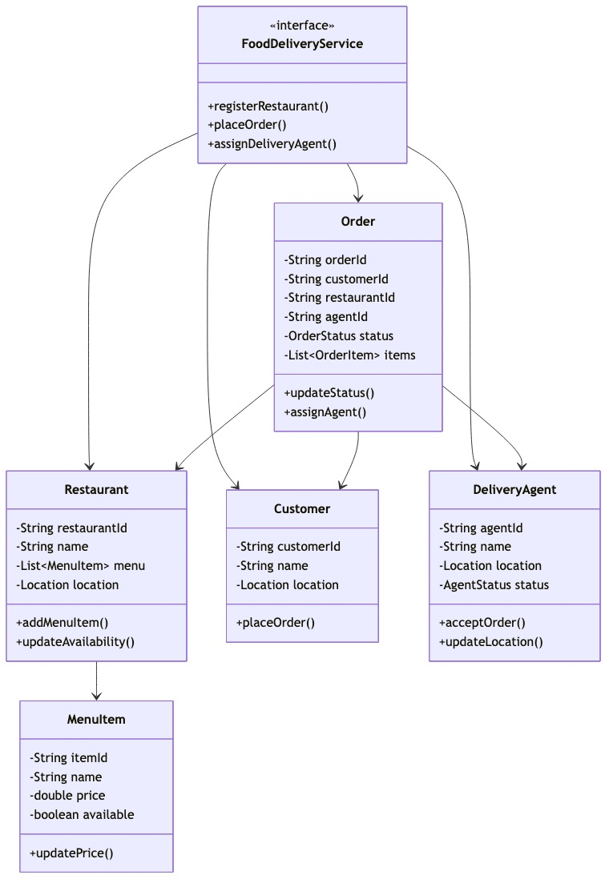
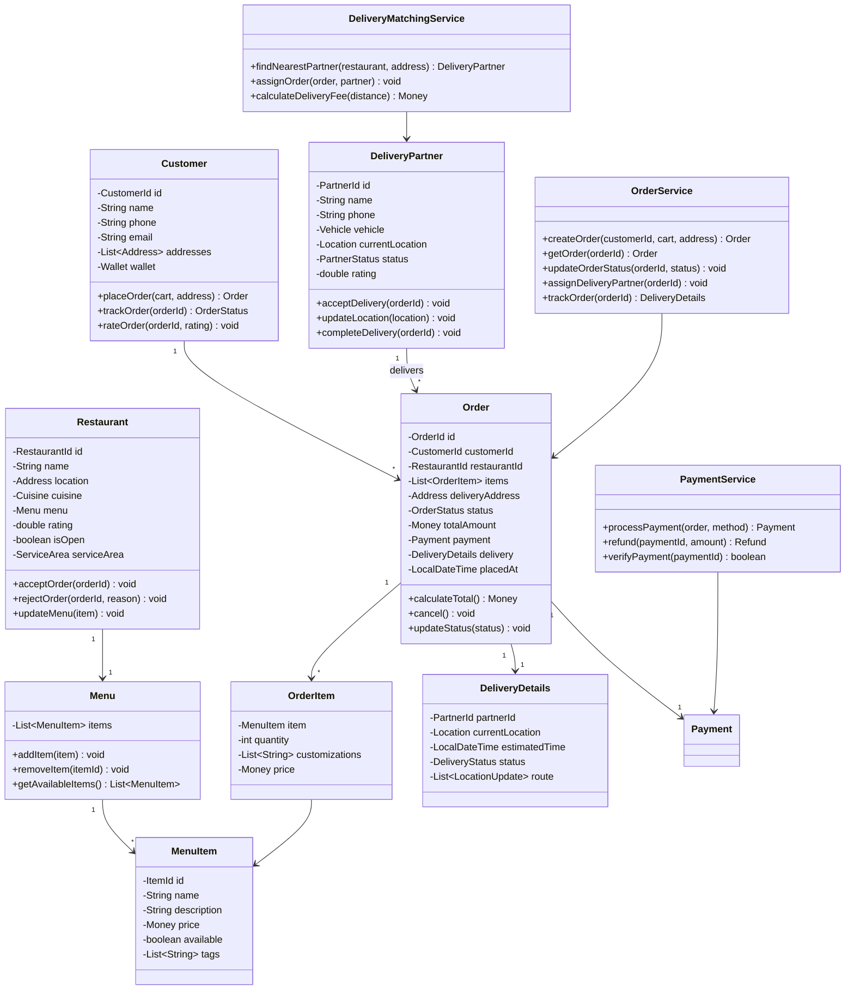

# Food Delivery Service - Low Level Design

## Problem Statement

Design a food delivery platform like Swiggy, Uber Eats, or DoorDash that connects customers with restaurants and delivery partners. The system should handle restaurant management, order processing, real-time delivery tracking, and payment processing.

## Table of Contents
- [Requirements](#requirements)
- [Class Diagram](#class-diagram)
- [Key Design Decisions](#key-design-decisions)
- [Implementation Guide](#implementation-guide)
- [Source Code](#source-code)

## Requirements

### Functional Requirements
1. **Customer Management**
   - Register/login customers
   - Manage delivery addresses
   - View order history
   - Rate restaurants and delivery partners

2. **Restaurant Management**
   - Restaurant registration and profile
   - Menu management (add/update/delete items)
   - Operating hours and service areas
   - Order acceptance/rejection

3. **Order Management**
   - Browse restaurants by location/cuisine
   - Add items to cart
   - Apply promo codes/discounts
   - Place order
   - Real-time order tracking
   - Order cancellation (within time window)

4. **Delivery Management**
   - Delivery partner registration
   - Real-time location tracking
   - Order assignment algorithms
   - Delivery status updates
   - Delivery partner availability

5. **Payment Processing**
   - Multiple payment methods (Card, Wallet, Cash)
   - Split payment
   - Refunds for cancellations
   - Payment status tracking

### Non-Functional Requirements
- **Performance**: Search < 500ms, Order placement < 2s
- **Availability**: 99.9% uptime
- **Scalability**: Handle 100K+ concurrent orders
- **Consistency**: Strong consistency for payments, eventual for tracking
- **Real-time**: Location updates every 5-10 seconds

## Class Diagram



<details>
<summary>View Mermaid Source</summary>



</details>

## Key Design Decisions

### 1. Real-Time Delivery Tracking
**Decision**: Use location updates with WebSocket/Server-Sent Events for real-time tracking.

**Rationale**:
- Low latency updates (5-10 second intervals)
- Efficient for mobile clients
- Reduces server polling load
- Better user experience

**Tradeoffs**:
- WebSocket connection management complexity
- Higher server resource usage
- Need fallback for connection drops

### 2. Delivery Partner Matching Algorithm
**Decision**: Haversine formula for distance + ETA calculation + partner availability.

**Rationale**:
- Finds truly nearest partner (not Euclidean distance)
- Considers traffic patterns
- Balances load across partners
- Optimizes delivery time

**Tradeoffs**:
- More complex than random assignment
- Requires partner location tracking
- Need to handle partner rejections

### 3. Order State Machine
**Decision**: Explicit state transitions with validation.

**Rationale**:
- Prevents invalid state changes
- Clear business logic
- Easy to audit state history
- Supports cancellation policies

**States**: PLACED → ACCEPTED → PREPARING → READY → PICKED_UP → IN_TRANSIT → DELIVERED

**Tradeoffs**:
- More states to manage
- Need state persistence
- Rollback complexity

### 4. Payment Idempotency
**Decision**: Use idempotency keys for payment operations.

**Rationale**:
- Prevents double charging
- Safe retries on network failures
- Consistent payment state
- Better error recovery

**Tradeoffs**:
- Extra storage for idempotency keys
- Expiration policy needed
- Client must generate keys

## Implementation Guide

### 1. Restaurant Search Algorithm

```
Algorithm: SearchRestaurants(location, filters)
Input: customer location, filters (cuisine, rating, price)
Output: list of restaurants

1. candidateRestaurants = []

2. for each restaurant in allRestaurants:
      if !restaurant.isOpen:
         continue
      
      distance = haversineDistance(location, restaurant.location)
      
      if distance > MAX_DELIVERY_RADIUS:
         continue
      
      if filters.cuisine != null and restaurant.cuisine != filters.cuisine:
         continue
      
      if filters.minRating != null and restaurant.rating < filters.minRating:
         continue
      
      candidateRestaurants.add({
         restaurant: restaurant,
         distance: distance,
         eta: calculateETA(distance)
      })

3. sort candidateRestaurants by (distance, rating DESC)

4. return candidateRestaurants.take(20)  // Top 20 results
```

**Time Complexity**: O(n log n) where n is restaurants count  
**Space Complexity**: O(n)

**Optimization**: Use geo-spatial index (R-tree or Quad-tree) to reduce candidates to O(log n).

### 2. Delivery Partner Matching (Nearest Available)

```
Algorithm: FindNearestPartner(restaurant, deliveryAddress)
Input: restaurant location, delivery address
Output: best delivery partner

1. availablePartners = getPartnersWithStatus(AVAILABLE)

2. if availablePartners is empty:
      return null

3. bestPartner = null
4. minCost = infinity

5. for each partner in availablePartners:
      // Calculate total distance: Partner → Restaurant → Customer
      distToRestaurant = haversineDistance(partner.location, restaurant.location)
      distToCustomer = haversineDistance(restaurant.location, deliveryAddress)
      totalDist = distToRestaurant + distToCustomer
      
      // Calculate time cost (distance + partner rating factor)
      timeCost = (totalDist / AVERAGE_SPEED) * (2.0 - partner.rating/5.0)
      
      if timeCost < minCost:
         minCost = timeCost
         bestPartner = partner

6. return bestPartner
```

**Time Complexity**: O(p) where p is available partners  
**Space Complexity**: O(1)

### 3. Order Total Calculation

```
Algorithm: CalculateOrderTotal(orderItems, restaurant, address)
Input: order items, restaurant, delivery address
Output: total amount breakdown

1. itemsTotal = 0
2. for each item in orderItems:
      itemsTotal += item.price * item.quantity

3. taxes = itemsTotal * TAX_RATE  // e.g., 5%

4. distance = haversineDistance(restaurant.location, address)
5. deliveryFee = calculateDeliveryFee(distance)  // Base + per km

6. platformFee = itemsTotal * PLATFORM_FEE_RATE  // e.g., 2%

7. discount = 0
8. if promoCode is applied:
      discount = applyPromoCode(promoCode, itemsTotal)

9. total = itemsTotal + taxes + deliveryFee + platformFee - discount

10. return {
      itemsTotal: itemsTotal,
      taxes: taxes,
      deliveryFee: deliveryFee,
      platformFee: platformFee,
      discount: discount,
      total: total
   }
```

**Time Complexity**: O(n) where n is items count  
**Space Complexity**: O(1)

### 4. Haversine Distance Formula

```
Algorithm: HaversineDistance(loc1, loc2)
Input: two locations (lat, lon)
Output: distance in kilometers

1. R = 6371  // Earth radius in km

2. lat1Rad = toRadians(loc1.latitude)
3. lat2Rad = toRadians(loc2.latitude)
4. deltaLat = toRadians(loc2.latitude - loc1.latitude)
5. deltaLon = toRadians(loc2.longitude - loc1.longitude)

6. a = sin²(deltaLat/2) + cos(lat1Rad) * cos(lat2Rad) * sin²(deltaLon/2)

7. c = 2 * atan2(√a, √(1-a))

8. distance = R * c

9. return distance
```

**Time Complexity**: O(1)  
**Space Complexity**: O(1)

## Source Code

**Total Files**: 18  
**Total Lines of Code**: ~1,208

### Quick Links
- [📁 View Complete Implementation](/problems/fooddelivery/CODE)

### Project Structure
```
fooddelivery/
├── model/
│   ├── Customer.java
│   ├── Restaurant.java
│   ├── Menu.java
│   ├── MenuItem.java
│   ├── Order.java
│   ├── OrderItem.java
│   ├── DeliveryPartner.java
│   ├── DeliveryDetails.java
│   ├── Location.java
│   ├── Address.java
│   └── OrderStatus.java
├── api/
│   ├── OrderService.java
│   ├── DeliveryMatchingService.java
│   └── PaymentService.java
├── impl/
│   ├── InMemoryOrderService.java
│   ├── NearestPartnerMatcher.java
│   └── GeoUtils.java
└── exceptions/
    ├── RestaurantClosedException.java
    ├── OutOfDeliveryAreaException.java
    └── NoPartnerAvailableException.java
```

### Core Components

1. **Order Management** (`model/Order.java`, `impl/InMemoryOrderService.java`)
   - Order creation and validation
   - State machine for order status
   - Total calculation with taxes and fees

2. **Delivery Matching** (`impl/NearestPartnerMatcher.java`)
   - Finds nearest available delivery partner
   - Uses Haversine formula for accurate distance
   - Considers partner ratings

3. **Restaurant Search** (`impl/InMemoryOrderService.java`)
   - Filters by location, cuisine, rating
   - Calculates ETA
   - Sorts by distance and rating

4. **Real-Time Tracking** (`model/DeliveryDetails.java`)
   - Stores delivery partner location
   - Updates ETA dynamically
   - Maintains route history

### Design Patterns Used

| Pattern | Usage | Benefit |
|---------|-------|---------|
| **State** | Order status management | Clear state transitions |
| **Strategy** | Partner matching algorithms | Flexible matching logic |
| **Observer** | Order status notifications | Real-time updates |
| **Factory** | Order creation | Centralized validation |
| **Repository** | Data access | Clean separation |

### Usage Example

```java
OrderService orderService = new InMemoryOrderService();
DeliveryMatchingService matcher = new NearestPartnerMatcher();

// Customer places order
Cart cart = new Cart();
cart.addItem(menuItem1, 2);
cart.addItem(menuItem2, 1);

Order order = orderService.createOrder(
    customerId,
    cart,
    deliveryAddress
);

// System assigns delivery partner
DeliveryPartner partner = matcher.findNearestPartner(
    restaurant.getLocation(),
    order.getDeliveryAddress()
);
orderService.assignDeliveryPartner(order.getId(), partner.getId());

// Track order
DeliveryDetails tracking = orderService.trackOrder(order.getId());
System.out.println("ETA: " + tracking.getEstimatedTime());
System.out.println("Current location: " + tracking.getCurrentLocation());

// Partner updates location
partner.updateLocation(newLocation);
tracking = orderService.trackOrder(order.getId());  // Updated ETA
```

## Interview Discussion Points

### System Design Considerations

1. **How to handle peak hours (lunch/dinner rush)?**
   - Pre-assign partners to hotspot areas
   - Dynamic pricing (surge fees)
   - Partner incentives for busy times
   - Queue management for restaurants

2. **How to optimize delivery routes?**
   - Batch orders going to same area
   - Use route optimization algorithms (TSP variants)
   - Consider traffic data (Google Maps API)
   - Multi-stop deliveries for same partner

3. **How to prevent fraud (fake orders)?**
   - OTP verification at pickup/delivery
   - Payment pre-authorization
   - Delivery partner photo proof
   - Customer verification (phone, address history)

4. **How to handle order cancellations?**
   - Time-based cancellation policy (free within 2 min)
   - Partial refunds after preparation starts
   - Compensate partners for wasted trips
   - Blacklist frequent cancellers

### Scalability

- **Orders**: Shard by restaurant ID or geographic region
- **Search**: Use Elasticsearch with geo-queries
- **Tracking**: Use Redis for real-time location data
- **Payments**: Use payment gateway with retry logic

### Real-World Extensions

1. **Surge Pricing**
   - Monitor demand vs. supply
   - Dynamic delivery fees
   - Notify customers of surge
   - Partner incentives

2. **Live Order Tracking**
   - WebSocket connections
   - Partner location updates (5-10s)
   - Map visualization
   - ETA recalculation

3. **Restaurant Recommendation**
   - ML-based personalization
   - Order history analysis
   - Collaborative filtering
   - Cuisine preferences

4. **Fleet Management**
   - Partner shift scheduling
   - Earnings dashboard
   - Delivery heatmaps
   - Performance analytics

---

This Food Delivery implementation provides a comprehensive foundation for building a scalable delivery platform with real-time tracking, intelligent matching, and robust order management.
