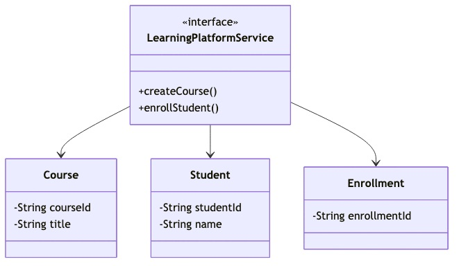
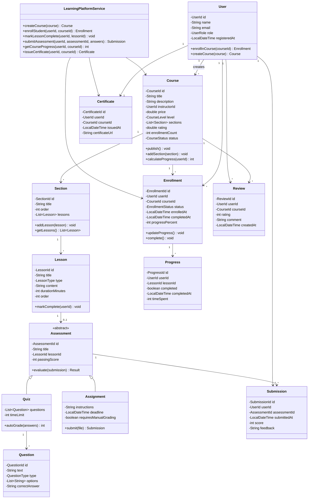

# Online Learning Platform - Low Level Design

## Problem Statement

Design an online learning platform like Coursera, Udemy, or Khan Academy that allows instructors to create courses, students to enroll and learn, and tracks progress through quizzes, assessments, and certifications.

## Table of Contents
- [Requirements](#requirements)
- [Class Diagram](#class-diagram)
- [Key Design Decisions](#key-design-decisions)
- [Implementation Guide](#implementation-guide)
- [Source Code](#source-code)

## Requirements

### Functional Requirements
1. **User Management**
   - User registration (Student/Instructor roles)
   - Profile management
   - Authentication and authorization

2. **Course Management**
   - Create/update/delete courses
   - Add curriculum (sections, lessons)
   - Upload content (video, text, files)
   - Set prerequisites
   - Publish/unpublish courses

3. **Enrollment**
   - Browse and search courses
   - Enroll in courses (free/paid)
   - Track enrollment status
   - Unenroll from courses

4. **Learning Experience**
   - Watch videos/read content sequentially
   - Mark lessons as complete
   - Take notes on lessons
   - Track overall progress (% complete)
   - Resume from last position

5. **Assessments**
   - Quizzes (multiple choice, true/false)
   - Assignments (file submissions)
   - Auto-grading for quizzes
   - Manual grading for assignments
   - Generate certificates on completion

6. **Reviews and Ratings**
   - Rate courses (1-5 stars)
   - Write reviews
   - Instructor responses to reviews

### Non-Functional Requirements
- **Performance**: Video streaming, <100ms search
- **Scalability**: Handle 1M+ students, 100K+ courses
- **Availability**: 99.9% uptime
- **Security**: Secure video streaming, payment processing
- **Usability**: Mobile-friendly, accessible

## Class Diagram



<details>
<summary>View Mermaid Source</summary>



</details>

## Key Design Decisions

### 1. Hierarchical Course Structure
**Decision**: Course → Section → Lesson hierarchy with ordering.

**Rationale**:
- Clear content organization
- Sequential learning flow
- Easy navigation
- Supports prerequisites

**Tradeoffs**:
- More complex to manage
- Need ordering maintenance
- Deeper object graph

### 2. Separate Progress Tracking
**Decision**: Track completion per lesson in separate `Progress` entity.

**Rationale**:
- Granular progress tracking
- Resume capability
- Detailed analytics
- Independent of enrollment

**Tradeoffs**:
- More storage (one row per lesson per user)
- Need aggregation for overall progress
- Potential performance impact

### 3. Abstract Assessment with Quiz/Assignment Subtypes
**Decision**: Use inheritance for different assessment types.

**Rationale**:
- Different evaluation logic (auto vs. manual grading)
- Type-specific properties
- Polymorphic assessment handling
- Extensible for new types

**Tradeoffs**:
- ORM mapping complexity
- Instanceof checks needed
- Less flexible than composition

### 4. Certificate Generation on Completion
**Decision**: Auto-generate certificates when progress reaches 100% and all assessments passed.

**Rationale**:
- Immediate gratification
- Motivates completion
- Verifiable credentials
- Shareable on social media

**Tradeoffs**:
- Need certificate generation service
- Storage for certificate files
- Fraud prevention needed

## Implementation Guide

### 1. Course Progress Calculation

```
Algorithm: CalculateCourseProgress(userId, courseId)
Input: user ID, course ID
Output: progress percentage (0-100)

1. course = getCourse(courseId)

2. allLessons = []
3. for each section in course.sections:
      allLessons.addAll(section.lessons)

4. totalLessons = allLessons.size()
5. if totalLessons == 0:
      return 0

6. completedLessons = 0
7. for each lesson in allLessons:
      progress = getProgress(userId, lesson.id)
      if progress != null and progress.completed:
         completedLessons++

8. progressPercent = (completedLessons * 100) / totalLessons

9. return progressPercent
```

**Time Complexity**: O(n) where n is total lessons  
**Space Complexity**: O(n)

### 2. Quiz Auto-Grading

```
Algorithm: AutoGradeQuiz(quiz, userAnswers)
Input: quiz object, user's answers map
Output: score (0-100)

1. totalQuestions = quiz.questions.size()
2. correctAnswers = 0

3. for each question in quiz.questions:
      userAnswer = userAnswers.get(question.id)
      
      if userAnswer == null:
         continue  // Unanswered question
      
      if question.type == MULTIPLE_CHOICE:
         if userAnswer.equals(question.correctAnswer):
            correctAnswers++
      
      elif question.type == TRUE_FALSE:
         if userAnswer.equalsIgnoreCase(question.correctAnswer):
            correctAnswers++
      
      elif question.type == MULTIPLE_SELECT:
         // For multiple select, all correct answers must match
         if userAnswer.equals(question.correctAnswer):  // Assuming sorted order
            correctAnswers++

4. score = (correctAnswers * 100) / totalQuestions

5. return score
```

**Time Complexity**: O(q) where q is questions count  
**Space Complexity**: O(1)

### 3. Course Search and Ranking

```
Algorithm: SearchCourses(query, filters)
Input: search query, filters (level, price, rating)
Output: ranked list of courses

1. candidates = []

2. for each course in allCourses:
      if course.status != PUBLISHED:
         continue
      
      // Title/description match
      if !course.title.contains(query) and !course.description.contains(query):
         continue
      
      // Apply filters
      if filters.level != null and course.level != filters.level:
         continue
      if filters.maxPrice != null and course.price > filters.maxPrice:
         continue
      if filters.minRating != null and course.rating < filters.minRating:
         continue
      
      candidates.add(course)

3. // Rank by relevance score
   for each course in candidates:
      score = 0
      if course.title.containsExact(query):
         score += 10
      if course.description.contains(query):
         score += 5
      score += course.rating  // Boost by rating
      score += log(course.enrollmentCount)  // Boost by popularity
      course.relevanceScore = score

4. sort candidates by relevanceScore DESC

5. return candidates.take(20)  // Top 20 results
```

**Time Complexity**: O(n log n) where n is candidate courses  
**Space Complexity**: O(n)

### 4. Certificate Eligibility Check

```
Algorithm: IsCertificateEligible(userId, courseId)
Input: user ID, course ID
Output: boolean eligible

1. enrollment = getEnrollment(userId, courseId)

2. if enrollment == null or enrollment.status != ACTIVE:
      return false

3. // Check if all lessons completed
   progressPercent = calculateCourseProgress(userId, courseId)
   if progressPercent < 100:
      return false

4. // Check if all assessments passed
   assessments = getAllAssessments(courseId)
   for each assessment in assessments:
      submission = getSubmission(userId, assessment.id)
      
      if submission == null:
         return false  // Not attempted
      
      if submission.score < assessment.passingScore:
         return false  // Failed assessment

5. return true  // All criteria met
```

**Time Complexity**: O(n + m) where n is lessons, m is assessments  
**Space Complexity**: O(1)

## Source Code

**Total Files**: 16  
**Total Lines of Code**: ~962

### Quick Links
- [📁 View Complete Implementation](/problems/learningplatform/CODE)

### Project Structure
```
learningplatform/
├── model/
│   ├── User.java
│   ├── Course.java
│   ├── Section.java
│   ├── Lesson.java
│   ├── Enrollment.java
│   ├── Progress.java
│   ├── Assessment.java
│   ├── Quiz.java
│   ├── Assignment.java
│   ├── Question.java
│   ├── Submission.java
│   ├── Certificate.java
│   ├── Review.java
│   └── EnrollmentStatus.java
├── api/
│   └── LearningPlatformService.java
└── impl/
    └── InMemoryLearningPlatformService.java
```

### Core Components

1. **Course Management** (`model/Course.java`, `model/Section.java`, `model/Lesson.java`)
   - Hierarchical content organization
   - Sequential lesson ordering
   - Section-based grouping

2. **Enrollment & Progress** (`model/Enrollment.java`, `model/Progress.java`)
   - Per-user enrollment tracking
   - Granular lesson completion
   - Overall progress calculation

3. **Assessment System** (`model/Assessment.java`, `model/Quiz.java`, `model/Assignment.java`)
   - Quiz auto-grading
   - Assignment manual grading
   - Passing score enforcement

4. **Certificate Generation** (`model/Certificate.java`)
   - Eligibility checking
   - Unique certificate ID
   - Verifiable credentials

### Design Patterns Used

| Pattern | Usage | Benefit |
|---------|-------|---------|
| **Composite** | Course structure (Section → Lesson) | Hierarchical content |
| **Strategy** | Grading strategies (auto/manual) | Flexible grading |
| **Observer** | Progress updates → notifications | Real-time updates |
| **Factory** | Assessment creation | Type-specific instantiation |
| **Template Method** | Assessment evaluation | Consistent grading flow |

### Usage Example

```java
LearningPlatformService platform = new InMemoryLearningPlatformService();

// Instructor creates course
Course course = Course.builder()
    .title("Introduction to Java")
    .description("Learn Java from scratch")
    .instructorId(instructorId)
    .price(49.99)
    .level(CourseLevel.BEGINNER)
    .build();

Section section1 = new Section("Getting Started");
section1.addLesson(new Lesson("Introduction", LessonType.VIDEO, 10));
section1.addLesson(new Lesson("Setup IDE", LessonType.VIDEO, 15));
course.addSection(section1);

course.publish();

// Student enrolls
Enrollment enrollment = platform.enrollStudent(studentId, course.getId());

// Student learns
platform.markLessonComplete(studentId, lesson1.getId());
platform.markLessonComplete(studentId, lesson2.getId());

// Check progress
int progress = platform.getCourseProgress(studentId, course.getId());
System.out.println("Progress: " + progress + "%");  // 100%

// Take quiz
Quiz quiz = new Quiz();
quiz.addQuestion(new Question("What is Java?", QuestionType.MULTIPLE_CHOICE, 
    Arrays.asList("Language", "Framework"), "Language"));

Map<String, String> answers = new HashMap<>();
answers.put(question1.getId(), "Language");
Submission submission = platform.submitAssessment(studentId, quiz.getId(), answers);
System.out.println("Score: " + submission.getScore());  // 100

// Generate certificate
if (platform.isCertificateEligible(studentId, course.getId())) {
    Certificate cert = platform.issueCertificate(studentId, course.getId());
    System.out.println("Certificate ID: " + cert.getId());
}
```

## Interview Discussion Points

### System Design Considerations

1. **How to handle video streaming?**
   - Use CDN for video delivery
   - Adaptive bitrate streaming (HLS/DASH)
   - Resume playback from last position
   - Offline download for mobile

2. **How to prevent course content piracy?**
   - DRM (Digital Rights Management)
   - Watermarking videos with user ID
   - Limit concurrent sessions
   - Disable screen recording

3. **How to scale assessment grading?**
   - Auto-grade quizzes immediately
   - Queue assignments for manual review
   - Use ML for plagiarism detection
   - Peer grading for large classes

4. **How to implement course recommendations?**
   - Collaborative filtering (users like you enrolled in...)
   - Content-based (similar topics/instructors)
   - Trending courses (enrollment spikes)
   - Personalized based on completed courses

### Scalability

- **Users**: Shard by user ID
- **Courses**: Cache popular courses
- **Videos**: CDN + object storage (S3)
- **Database**: Read replicas for course catalog

### Real-World Extensions

1. **Discussion Forums**
   - Per-course forums
   - Q&A threads
   - Instructor participation
   - Upvoting answers

2. **Live Sessions**
   - Webinar integration
   - Live Q&A
   - Screen sharing
   - Recording for later viewing

3. **Gamification**
   - Points for completion
   - Badges for achievements
   - Leaderboards
   - Streaks for daily learning

4. **Analytics Dashboard**
   - Student performance metrics
   - Course completion rates
   - Popular lessons
   - Drop-off points

---

This Learning Platform implementation provides a comprehensive foundation for building an online education system with course management, progress tracking, assessments, and certifications.
