# Parking Lot System - Mermaid Diagrams

## 1. Class Diagram - Complete System

## 2. Sequence Diagram - Vehicle Entry Flow

## 3. Sequence Diagram - Vehicle Exit & Payment Flow

## 4. Component Diagram - System Architecture

## 5. State Diagram - Parking Ticket Lifecycle

## 6. State Diagram - Payment Lifecycle

## 7. Activity Diagram - Complete Parking Flow

## 8. Deployment Diagram - Deployment View

## 9. Package Diagram - Code Organization

## 10. Use Case Diagram - System Actors & Operations

```mermaid
graph LR
    subgraph Actors
        Customer[👤 Customer]
        Attendant[👤 Parking Attendant]
        Admin[👤 Administrator]
        System[⚙️ System]
    end
    
    subgraph UseCases["Use Cases"]
        UC1[Enter Parking Lot]
        UC2[Exit Parking Lot]
        UC3[Calculate Fee]
        UC4[Process Payment]
        UC5[Check Availability]
        UC6[View Occupancy]
        UC7[Add Parking Space]
        UC8[Remove Parking Space]
        UC9[Configure Pricing]
        UC10[Process Refund]
        UC11[Generate Reports]
    end
    
    Customer --> UC1
    Customer --> UC2
    Customer --> UC3
    Customer --> UC5
    
    Attendant --> UC1
    Attendant --> UC2
    Attendant --> UC4
    Attendant --> UC6
    Attendant --> UC10
    
    Admin --> UC7
    Admin --> UC8
    Admin --> UC9
    Admin --> UC11
    Admin --> UC6
    
    System -.-> UC3
    System -.-> UC6
    
    UC2 -.includes.-> UC3
    UC2 -.includes.-> UC4
    
    style Customer fill:#4caf50
    style Attendant fill:#2196f3
    style Admin fill:#ff9800
    style System fill:#9e9e9e
```

## Usage Notes

### Viewing Diagrams
These Mermaid diagrams can be viewed in:
- GitHub (native support)
- GitLab (native support)
- VS Code with Mermaid extension
- Online editors: https://mermaid.live/

### Diagram Types Included
1. **Class Diagram** - Complete system structure with all classes and relationships
2. **Sequence Diagrams** - Vehicle entry and exit flows
3. **Component Diagram** - High-level architecture
4. **State Diagrams** - Ticket and payment lifecycles
5. **Activity Diagram** - Complete parking flow
6. **Deployment Diagram** - Production deployment architecture
7. **Package Diagram** - Code organization
8. **Use Case Diagram** - User interactions

### Key Insights from Diagrams

**From Class Diagram:**
- Strategy pattern clearly visible with 3 strategy interfaces
- Clean separation between interfaces (api) and implementations (impl)
- Rich domain model with value objects (Money)
- Proper exception hierarchy

**From Sequence Diagrams:**
- Clear validation at each step
- Proper error handling with exceptions
- Strategy pattern in action (delegation to strategies)
- Thread-safe space occupation

**From State Diagrams:**
- Ticket lifecycle: Created → Active → Exiting → Completed
- Payment lifecycle: Pending → Processing → Completed/Failed/Refunded
- Clear terminal states

**From Activity Diagram:**
- Grace period logic clearly shown
- Minimum charge application
- Multiple error paths properly handled
- End-to-end flow visibility

### Customization
To modify diagrams:
1. Copy the Mermaid code
2. Paste into https://mermaid.live/
3. Edit and preview in real-time
4. Copy back updated code

### Export Options
From mermaid.live you can export as:
- PNG
- SVG
- PDF
- Markdown
