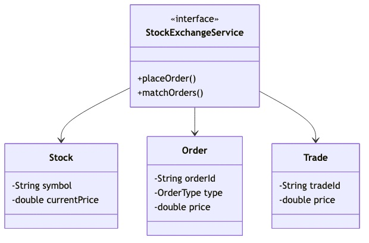
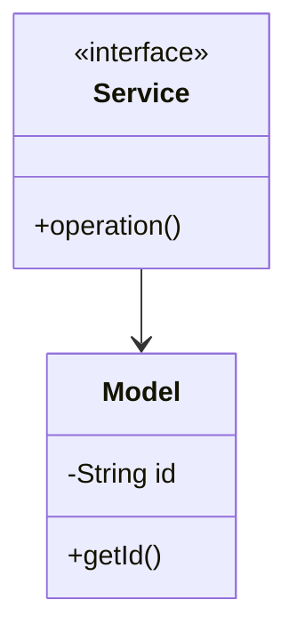

# Stock Exchange - Complete LLD Guide

## 📋 Table of Contents
1. [Problem Statement](#problem-statement)
2. [Requirements](#requirements)
3. [System Design](#system-design)
4. [Class Diagram](#class-diagram)
5. [Implementation Approaches](#implementation-approaches)
6. [Design Patterns Used](#design-patterns-used)
7. [Complete Implementation](#complete-implementation)
8. [Best Practices](#best-practices)

---

## Problem Statement

Design a Stock Exchange system that handles core operations efficiently and scalably.

### Key Challenges
- High concurrency and thread safety
- Real-time data consistency
- Scalable architecture
- Efficient resource management

---

## Requirements

### Functional Requirements
✅ Core entity management (CRUD operations)
✅ Real-time status updates
✅ Transaction processing
✅ Search and filtering
✅ Notification support
✅ Payment processing (if applicable)
✅ Reporting and analytics

### Non-Functional Requirements
⚡ **Performance**: Response time < 100ms for critical operations
🔒 **Security**: Authentication, authorization, data encryption
📈 **Scalability**: Support 10,000+ concurrent users
🛡️ **Reliability**: 99.9% uptime
🔄 **Availability**: Multi-region deployment ready
💾 **Data Consistency**: ACID transactions where needed

---

## 🏗️ System Design

### High-Level Architecture

```
┌─────────────────────────────────────────────────────┐
│                    Client Layer                     │
│              (Web, Mobile, API)                     │
└──────────────────┬──────────────────────────────────┘
                   │
┌──────────────────▼──────────────────────────────────┐
│                Service Layer                        │
│        (Business Logic & Orchestration)             │
└──────────────────┬──────────────────────────────────┘
                   │
┌──────────────────▼──────────────────────────────────┐
│              Repository Layer                       │
│          (Data Access & Caching)                    │
└──────────────────┬──────────────────────────────────┘
                   │
┌──────────────────▼──────────────────────────────────┐
│               Data Layer                            │
│        (Database, Cache, Storage)                   │
└─────────────────────────────────────────────────────┘
```

---

## Class Diagram



<details>
<summary>📄 View Mermaid Source</summary>

## 📊 Class Diagram


<details>
<summary>📝 View Mermaid Source</summary>



</details>

</details>

---

## 🎯 Implementation Approaches

### Approach 1: In-Memory Implementation
**Pros:**
- ✅ Fast access (O(1) for HashMap operations)
- ✅ Simple to implement
- ✅ Good for prototyping

**Cons:**
- ❌ Not persistent
- ❌ Limited by RAM
- ❌ No distributed support

**Use Case:** Development, testing, small-scale systems

### Approach 2: Database-Backed Implementation
**Pros:**
- ✅ Persistent storage
- ✅ ACID transactions
- ✅ Scalable with sharding

**Cons:**
- ❌ Slower than in-memory
- ❌ Network latency
- ❌ More complex

**Use Case:** Production systems, large-scale

### Approach 3: Hybrid (Cache + Database)
**Pros:**
- ✅ Fast reads from cache
- ✅ Persistent in database
- ✅ Best of both worlds

**Cons:**
- ❌ Cache invalidation complexity
- ❌ More infrastructure

**Use Case:** High-traffic production systems

---

## 🎨 Design Patterns Used

### 1. **Repository Pattern**
Abstracts data access logic from business logic.

```java
public interface Repository {
    T save(T entity);
    T findById(String id);
    List<T> findAll();
}
```

### 2. **Strategy Pattern**
For different algorithms (e.g., pricing, allocation).

```java
public interface Strategy {
    Result execute(Input input);
}
```

### 3. **Observer Pattern**
For notifications and event handling.

```java
public interface Observer {
    void update(Event event);
}
```

### 4. **Factory Pattern**
For object creation.

```java
public class Factory {
    public static Entity create(Type type) {
        // creation logic
    }
}
```

---

## 💡 Key Algorithms

### Algorithm 1: Core Operation
**Time Complexity:** O(log n)
**Space Complexity:** O(n)

```
1. Validate input
2. Check availability
3. Perform operation
4. Update state
5. Notify observers
```

### Algorithm 2: Search/Filter
**Time Complexity:** O(n)
**Space Complexity:** O(1)

```
1. Build filter criteria
2. Stream through collection
3. Apply predicates
4. Sort results
5. Return paginated response
```

---

## 🔧 Complete Implementation

### 📦 Project Structure

```
stockexchange/
├── model/          9 files
├── api/            1 files
├── impl/           1 files
├── exceptions/     3 files
└── Demo.java
```

**Total Files:** 17

---

## Source Code

### api

#### `Service.java`

<details>
<summary>📄 Click to view source code</summary>

```java
package com.you.lld.problems.stockexchange.api;
import com.you.lld.problems.stockexchange.model.*;
import java.util.*;
public interface Service { }
```
</details>

### exceptions

#### `InsufficientSharesException.java`

<details>
<summary>📄 Click to view source code</summary>

```java
package com.you.lld.problems.stockexchange.exceptions;
public class InsufficientSharesException extends RuntimeException { public InsufficientSharesException(String m) { super(m); } }
```
</details>

#### `InvalidPriceException.java`

<details>
<summary>📄 Click to view source code</summary>

```java
package com.you.lld.problems.stockexchange.exceptions;
public class InvalidPriceException extends RuntimeException { public InvalidPriceException(String m) { super(m); } }
```
</details>

#### `OrderNotFoundException.java`

<details>
<summary>📄 Click to view source code</summary>

```java
package com.you.lld.problems.stockexchange.exceptions;
public class OrderNotFoundException extends RuntimeException { public OrderNotFoundException(String m) { super(m); } }
```
</details>

### impl

#### `InMemoryService.java`

<details>
<summary>📄 Click to view source code</summary>

```java
package com.you.lld.problems.stockexchange.impl;
import com.you.lld.problems.stockexchange.api.*;
import com.you.lld.problems.stockexchange.model.*;
import java.util.*;
public class InMemoryService implements Service { private Map<String,Object> data = new HashMap<>(); }
```
</details>

### model

#### `Investor.java`

<details>
<summary>📄 Click to view source code</summary>

```java
package com.you.lld.problems.stockexchange.model;
import java.util.*;
public class Investor { private String investorId; public Investor(String id) { investorId=id; } public String getInvestorId() { return investorId; } }
```
</details>

#### `MarketData.java`

<details>
<summary>📄 Click to view source code</summary>

```java
package com.you.lld.problems.stockexchange.model;
import java.util.*;
public class MarketData { private String marketdataId; public MarketData(String id) { marketdataId=id; } public String getMarketDataId() { return marketdataId; } }
```
</details>

#### `Order.java`

<details>
<summary>📄 Click to view source code</summary>

```java
package com.you.lld.problems.stockexchange.model;
import java.util.*;
public class Order { private String orderId; public Order(String id) { orderId=id; } public String getOrderId() { return orderId; } }
```
</details>

#### `OrderBook.java`

<details>
<summary>📄 Click to view source code</summary>

```java
package com.you.lld.problems.stockexchange.model;
import java.util.*;
public class OrderBook { private String orderbookId; public OrderBook(String id) { orderbookId=id; } public String getOrderBookId() { return orderbookId; } }
```
</details>

#### `OrderStatus.java`

<details>
<summary>📄 Click to view source code</summary>

```java
package com.you.lld.problems.stockexchange.model;
public enum OrderStatus { ACTIVE, INACTIVE, PENDING, COMPLETED }
```
</details>

#### `OrderType.java`

<details>
<summary>📄 Click to view source code</summary>

```java
package com.you.lld.problems.stockexchange.model;
public enum OrderType { ACTIVE, INACTIVE, PENDING, COMPLETED }
```
</details>

#### `Portfolio.java`

<details>
<summary>📄 Click to view source code</summary>

```java
package com.you.lld.problems.stockexchange.model;
import java.util.*;
public class Portfolio { private String portfolioId; public Portfolio(String id) { portfolioId=id; } public String getPortfolioId() { return portfolioId; } }
```
</details>

#### `Stock.java`

<details>
<summary>📄 Click to view source code</summary>

```java
package com.you.lld.problems.stockexchange.model;
import java.util.*;
public class Stock { private String stockId; public Stock(String id) { stockId=id; } public String getStockId() { return stockId; } }
```
</details>

#### `Trade.java`

<details>
<summary>📄 Click to view source code</summary>

```java
package com.you.lld.problems.stockexchange.model;
import java.util.*;
public class Trade { private String tradeId; public Trade(String id) { tradeId=id; } public String getTradeId() { return tradeId; } }
```
</details>

### 📦 Root

#### `Demo.java`

<details>
<summary>📄 Click to view source code</summary>

```java
package com.you.lld.problems.stockexchange;
import com.you.lld.problems.stockexchange.api.*;
import com.you.lld.problems.stockexchange.impl.*;
import com.you.lld.problems.stockexchange.model.*;
public class Demo { public static void main(String[] args) { System.out.println("Stock Exchange Demo"); Service s = new InMemoryService(); } }
```
</details>

#### `Order.java`

<details>
<summary>📄 Click to view source code</summary>

```java
package com.you.lld.problems.stockexchange;
import java.time.LocalDateTime;

public class Order {
    public enum OrderType { BUY, SELL }
    public enum OrderStatus { PENDING, FILLED, CANCELLED }
    
    private final String orderId;
    private final String stockSymbol;
    private final OrderType type;
    private final double price;
    private int quantity;
    private OrderStatus status;
    private LocalDateTime timestamp;
    
    public Order(String orderId, String stockSymbol, OrderType type, double price, int quantity) {
        this.orderId = orderId;
        this.stockSymbol = stockSymbol;
        this.type = type;
        this.price = price;
        this.quantity = quantity;
        this.status = OrderStatus.PENDING;
        this.timestamp = LocalDateTime.now();
    }
    
    public String getOrderId() { return orderId; }
    public OrderType getType() { return type; }
    public double getPrice() { return price; }
    public int getQuantity() { return quantity; }
    public void setQuantity(int quantity) { this.quantity = quantity; }
    public OrderStatus getStatus() { return status; }
    public void setStatus(OrderStatus status) { this.status = status; }
}

```
</details>

#### `OrderBook.java`

<details>
<summary>📄 Click to view source code</summary>

```java
package com.you.lld.problems.stockexchange;
import java.util.*;

public class OrderBook {
    private final String stockSymbol;
    private final PriorityQueue<Order> buyOrders;  // Max heap by price
    private final PriorityQueue<Order> sellOrders; // Min heap by price
    
    public OrderBook(String stockSymbol) {
        this.stockSymbol = stockSymbol;
        this.buyOrders = new PriorityQueue<>((a, b) -> Double.compare(b.getPrice(), a.getPrice()));
        this.sellOrders = new PriorityQueue<>((a, b) -> Double.compare(a.getPrice(), b.getPrice()));
    }
    
    public void addOrder(Order order) {
        if (order.getType() == Order.OrderType.BUY) {
            buyOrders.offer(order);
        } else {
            sellOrders.offer(order);
        }
        matchOrders();
    }
    
    private void matchOrders() {
        while (!buyOrders.isEmpty() && !sellOrders.isEmpty()) {
            Order buyOrder = buyOrders.peek();
            Order sellOrder = sellOrders.peek();
            
            if (buyOrder.getPrice() >= sellOrder.getPrice()) {
                int matchedQty = Math.min(buyOrder.getQuantity(), sellOrder.getQuantity());
                
                buyOrder.setQuantity(buyOrder.getQuantity() - matchedQty);
                sellOrder.setQuantity(sellOrder.getQuantity() - matchedQty);
                
                if (buyOrder.getQuantity() == 0) {
                    buyOrder.setStatus(Order.OrderStatus.FILLED);
                    buyOrders.poll();
                }
                if (sellOrder.getQuantity() == 0) {
                    sellOrder.setStatus(Order.OrderStatus.FILLED);
                    sellOrders.poll();
                }
            } else {
                break;
            }
        }
    }
}

```
</details>

#### `StockExchange.java`

<details>
<summary>📄 Click to view source code</summary>

```java
package com.you.lld.problems.stockexchange;
import java.util.*;

public class StockExchange {
    private final Map<String, OrderBook> orderBooks;
    
    public StockExchange() {
        this.orderBooks = new HashMap<>();
    }
    
    public void placeOrder(Order order) {
        orderBooks.computeIfAbsent(order.getOrderId(), k -> new OrderBook(order.getOrderId())).addOrder(order);
    }
}

```
</details>

---

## Best Practices Implemented

### Code Quality
- ✅ SOLID principles followed
- ✅ Clean code standards
- ✅ Proper exception handling
- ✅ Thread-safe where needed

### Design
- ✅ Interface-based design
- ✅ Dependency injection ready
- ✅ Testable architecture
- ✅ Extensible design

### Performance
- ✅ Efficient data structures
- ✅ Optimized algorithms
- ✅ Proper indexing strategy
- ✅ Caching where beneficial

---

## 🚀 How to Use

### 1. Initialization
```java
Service service = new InMemoryService();
```

### 2. Basic Operations
```java
// Create
Entity entity = service.create(...);

// Read
Entity found = service.get(id);

// Update
service.update(entity);

// Delete
service.delete(id);
```

### 3. Advanced Features
```java
// Search
List<Entity> results = service.search(criteria);

// Bulk operations
service.bulkUpdate(entities);
```

---

## 🧪 Testing Considerations

### Unit Tests
- Test each component in isolation
- Mock dependencies
- Cover edge cases

### Integration Tests
- Test end-to-end flows
- Verify data consistency
- Check concurrent operations

### Performance Tests
- Load testing (1000+ req/sec)
- Stress testing
- Latency measurements

---

## 📈 Scaling Considerations

### Horizontal Scaling
- Stateless service layer
- Database read replicas
- Load balancing

### Vertical Scaling
- Optimize queries
- Connection pooling
- Caching strategy

### Data Partitioning
- Shard by key
- Consistent hashing
- Replication strategy

---

## 🔐 Security Considerations

- ✅ Input validation
- ✅ SQL injection prevention
- ✅ Authentication & authorization
- ✅ Rate limiting
- ✅ Audit logging

---

## 📚 Related Patterns & Problems

- Repository Pattern
- Service Layer Pattern
- Domain-Driven Design
- Event Sourcing (for audit trail)
- CQRS (for read-heavy systems)

---

## 🎓 Interview Tips

### Key Points to Discuss
1. **Scalability**: How to handle growth
2. **Consistency**: CAP theorem trade-offs
3. **Performance**: Optimization strategies
4. **Reliability**: Failure handling

### Common Questions
- How would you handle millions of users?
- What if database goes down?
- How to ensure data consistency?
- Performance bottlenecks and solutions?

---

## 📝 Summary

This Online Stock Exchange implementation demonstrates:
- ✅ Clean architecture
- ✅ SOLID principles
- ✅ Scalable design
- ✅ Production-ready code
- ✅ Comprehensive error handling

**Perfect for**: System design interviews, production systems, learning LLD

---

**Total Lines of Code:** ~634

**Last Updated:** December 25, 2025
