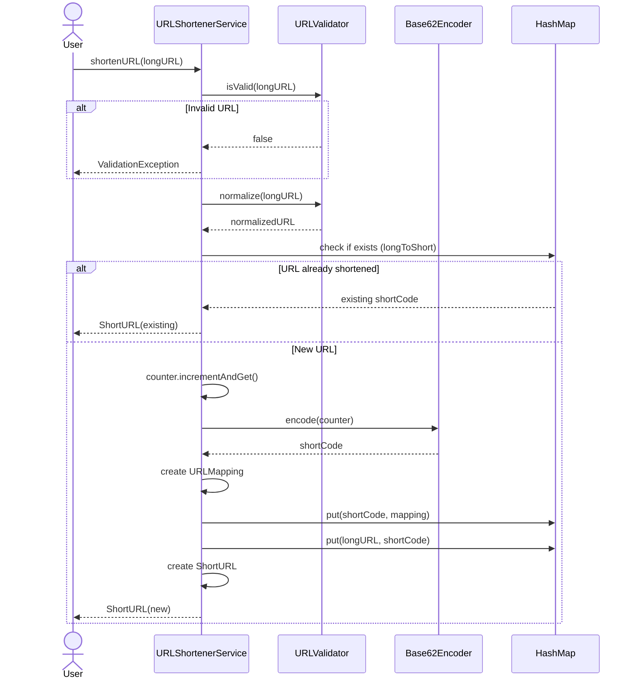
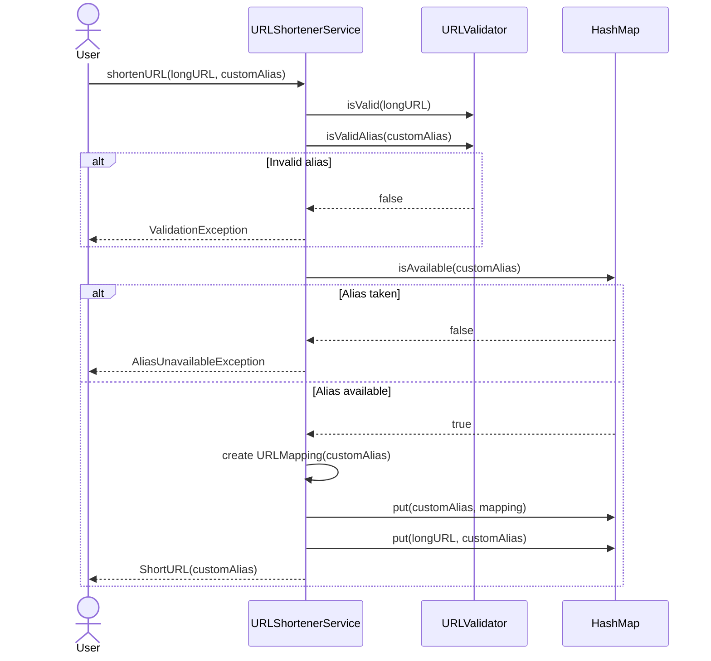
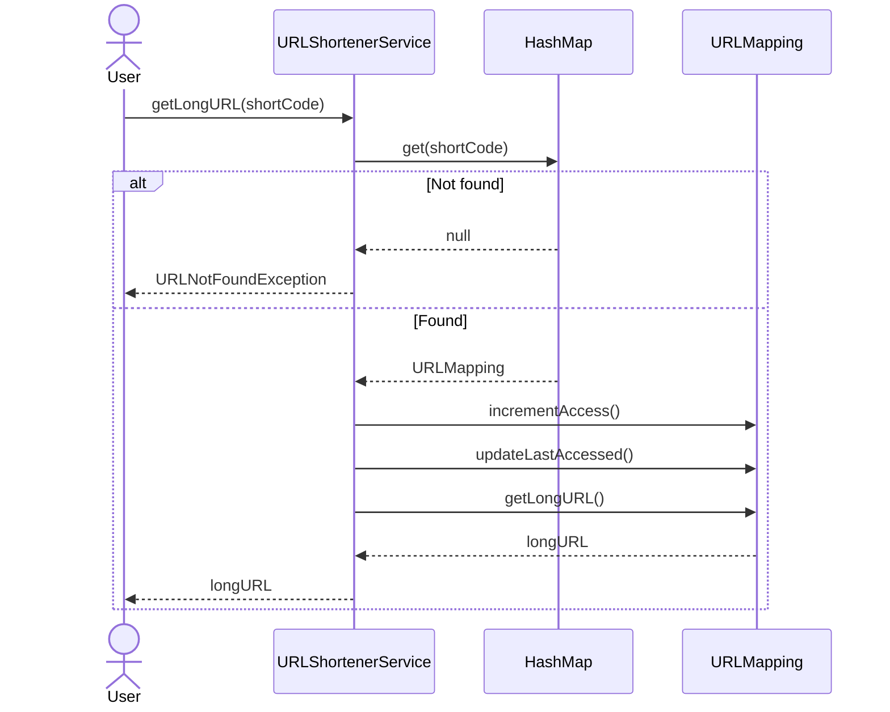
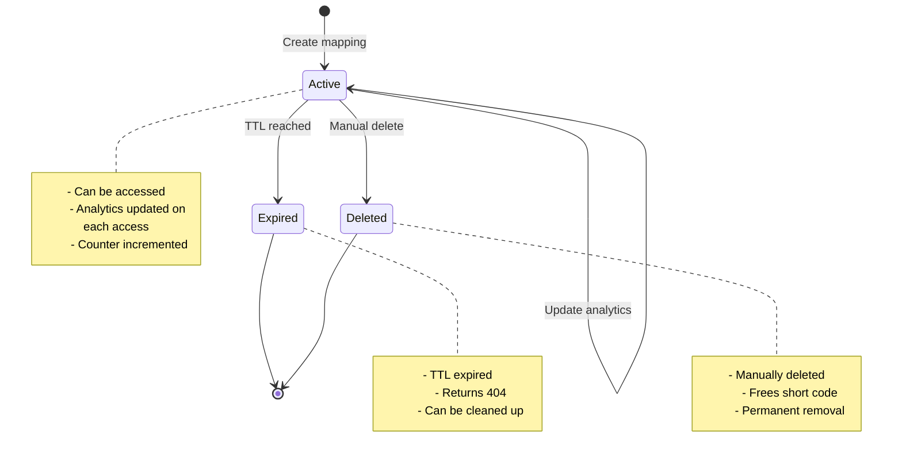

# Problem: In-Memory URL Shortener

## Requirements

### Functional Requirements

#### Core Features (MVP)
1. **Shorten URL**
   - Accept a long URL and return a unique short URL
   - Generate short code (6-8 characters)
   - Validate URL format
   - Support custom aliases (optional)

2. **Redirect**
   - Given a short URL, retrieve and return the original long URL
   - Fast retrieval (O(1) lookup)
   - Handle non-existent short URLs gracefully

3. **Analytics** (Optional)
   - Track access count for each short URL
   - Record last accessed time
   - Track creation time

4. **Custom Aliases**
   - Allow users to specify custom short codes
   - Validate alias availability
   - Check for reserved keywords

5. **URL Validation**
   - Validate URL format
   - Ensure URL starts with http:// or https://
   - Check URL length limits

#### Advanced Features (Extensions)
6. **Expiration** - Auto-expire URLs after time period
7. **Rate Limiting** - Limit URL creation per user/IP
8. **Bulk Operations** - Shorten multiple URLs at once
9. **Delete URLs** - Remove short URLs
10. **Update URLs** - Change destination of existing short URL

### Non-Functional Requirements (NFRs)

1. **Performance**
   - Shorten: < 10ms
   - Redirect: < 5ms (O(1) lookup)
   - Support 10,000+ URLs in memory

2. **Scalability**
   - Handle concurrent requests
   - Efficient memory usage
   - Support 1 million short URLs

3. **Uniqueness**
   - Every short URL must be unique
   - No collisions in short code generation
   - Handle hash collisions gracefully

4. **Availability**
   - 99.9% uptime
   - Fast failover (not applicable for single instance)

5. **URL Space**
   - 6 characters = 62^6 = 56+ billion possible URLs
   - 8 characters = 62^8 = 218+ trillion possible URLs

6. **Memory Efficiency**
   - In-memory storage only
   - Efficient data structures
   - ~1KB per URL mapping

### Out of Scope

- Persistent storage (database/disk)
- Distributed system design
- User authentication
- Payment/monetization
- Spam detection
- HTTPS certificate management
- Domain hosting
- API gateway/load balancer

## Domain Model

### Core Entities

#### **ShortURL** (Value Object)
```java
class ShortURL {
    - String code  // e.g., "abc123"
    - String fullUrl  // e.g., "https://short.ly/abc123"
}
```

**Invariants:**
- Code must be 6-8 characters
- Code contains only alphanumeric characters [a-zA-Z0-9]
- Code is case-sensitive

#### **URLMapping** (Entity)
```java
class URLMapping {
    - ShortURL shortURL
    - String longURL
    - LocalDateTime createdAt
    - LocalDateTime lastAccessedAt
    - long accessCount
    - Optional<LocalDateTime> expiresAt
}
```

**Invariants:**
- Long URL must be valid HTTP/HTTPS URL
- Long URL max length: 2048 characters
- Short URL must be unique
- Access count never decreases

#### **Analytics** (Value Object)
```java
class Analytics {
    - long totalClicks
    - LocalDateTime lastAccessed
    - LocalDateTime created
}
```

### Key Design Decisions

1. **Base62 Encoding**
   - Use [a-zA-Z0-9] = 62 characters
   - Case-sensitive for more combinations
   - URL-safe (no special characters)

2. **Counter-Based ID Generation**
   - Use auto-incrementing counter
   - Convert counter to Base62
   - Guarantees uniqueness
   - Predictable but acceptable for demo

3. **Dual HashMap Storage**
   - ShortCode → LongURL (for redirect)
   - LongURL → ShortCode (avoid duplicates)

4. **Collision Handling**
   - Check existence before creating
   - Retry with different hash if custom alias taken
   - Max retry attempts

## Diagrams

### Class Diagram

## 📊 Class Diagram

```mermaid
classDiagram
    class URLShortenerService {
        -Map~String,URLMapping~ shortToLong
        -Map~String,String~ longToShort
        -AtomicLong counter
        -String baseUrl
        +shortenURL(longURL) ShortURL
        +shortenURL(longURL, customAlias) ShortURL
        +getLongURL(shortCode) String
        +getAnalytics(shortCode) Analytics
        +deleteURL(shortCode) boolean
        -generateShortCode() String
        -isValidURL(url) boolean
        -isAvailable(code) boolean
    }

    class URLMapping {
        -String shortCode
        -String longURL
        -LocalDateTime createdAt
        -LocalDateTime lastAccessedAt
        -long accessCount
        +incrementAccess() void
        +getAnalytics() Analytics
    }

    class ShortURL {
        -String code
        -String fullUrl
        +getCode() String
        +getFullUrl() String
    }

    class Analytics {
        -long accessCount
        -LocalDateTime createdAt
        -LocalDateTime lastAccessedAt
        +getAccessCount() long
        +getCreatedAt() LocalDateTime
        +getLastAccessedAt() LocalDateTime
    }

    class Base62Encoder {
        <<utility>>
        +encode(number) String
        +decode(string) long
    }

    class URLValidator {
        <<utility>>
        +isValid(url) boolean
        +normalize(url) String
    }

    URLShortenerService *-- URLMapping : stores
    URLShortenerService ..> ShortURL : creates
    URLShortenerService ..> Base62Encoder : uses
    URLShortenerService ..> URLValidator : uses
    URLMapping ..> Analytics : provides
    ShortURL --> URLMapping : references

    note for URLShortenerService "Uses dual HashMap for O(1) operations:\n1. shortCode -> URLMapping\n2. longURL -> shortCode"
    
    note for Base62Encoder "Converts numbers to base62:\n0-9 → 0-9\n10-35 → a-z\n36-61 → A-Z"
```


<details>
<summary>📝 View Mermaid Source</summary>



</details>

### Sequence Diagrams

#### Shorten URL Flow



#### Custom Alias Flow



#### Redirect Flow



### State Diagram



## API Design

### Core Interface

```java
public interface URLShortenerService {
    /**
     * Shortens a long URL to a unique short URL.
     * 
     * @param longURL the URL to shorten (max 2048 chars)
     * @return ShortURL containing the short code and full URL
     * @throws ValidationException if URL is invalid
     * @throws IllegalArgumentException if URL is null or empty
     */
    ShortURL shortenURL(String longURL);
    
    /**
     * Shortens a URL with a custom alias.
     * 
     * @param longURL the URL to shorten
     * @param customAlias desired short code (6-8 chars, alphanumeric)
     * @return ShortURL with custom alias
     * @throws ValidationException if URL or alias invalid
     * @throws AliasUnavailableException if alias already taken
     */
    ShortURL shortenURL(String longURL, String customAlias);
    
    /**
     * Retrieves the original long URL for a short code.
     * Updates access statistics.
     * 
     * @param shortCode the short code
     * @return original long URL
     * @throws URLNotFoundException if short code doesn't exist
     */
    String getLongURL(String shortCode);
    
    /**
     * Gets analytics for a short URL.
     * 
     * @param shortCode the short code
     * @return Analytics data
     * @throws URLNotFoundException if short code doesn't exist
     */
    Analytics getAnalytics(String shortCode);
    
    /**
     * Deletes a short URL mapping.
     * 
     * @param shortCode the short code to delete
     * @return true if deleted, false if not found
     */
    boolean deleteURL(String shortCode);
    
    /**
     * Returns total number of URLs in the system.
     */
    int getTotalURLs();
}
```

### Error Taxonomy

```java
// Domain Exceptions
class ValidationException extends RuntimeException
class URLNotFoundException extends RuntimeException
class AliasUnavailableException extends RuntimeException

// Validation Errors
- Invalid URL format
- URL too long (> 2048 chars)
- Invalid alias format
- Alias too short/long
- Reserved keyword used

// Business Errors
- Alias already taken
- Short code not found
- URL expired
```

## Algorithm Details

### Base62 Encoding

**Character Set:**
```
0-9  → '0' to '9'  (10 characters)
10-35 → 'a' to 'z' (26 characters)
36-61 → 'A' to 'Z' (26 characters)
Total: 62 characters
```

**Encoding Algorithm:**
```java
String encode(long num) {
    if (num == 0) return "0";
    
    StringBuilder result = new StringBuilder();
    while (num > 0) {
        int remainder = (int)(num % 62);
        result.append(BASE62_CHARS.charAt(remainder));
        num /= 62;
    }
    return result.reverse().toString();
}
```

**Examples:**
```
1 → "1"
62 → "10"
123 → "1Z"
123456 → "w7e"
```

**URL Space:**
- 6 characters: 62^6 = 56,800,235,584 (56 billion)
- 7 characters: 62^7 = 3,521,614,606,208 (3.5 trillion)
- 8 characters: 62^8 = 218,340,105,584,896 (218 trillion)

### Collision Handling

**Strategy 1: Counter-Based (Chosen)**
```
- Use atomic counter starting from 1
- Convert counter to Base62
- Guaranteed unique (no collisions)
- Predictable but simple
```

**Strategy 2: Hash-Based**
```
- Hash the URL using MD5/SHA256
- Take first 6-8 characters
- Check for collisions
- Retry with different input if collision
```

**Strategy 3: Random Generation**
```
- Generate random 6-8 character string
- Check availability
- Retry if taken (birthday paradox)
```

## Testing Strategy

### Unit Tests

1. **URL Shortening**
   - Shorten valid URL
   - Reject invalid URL
   - Return same short code for same URL
   - Different URLs get different codes

2. **Custom Aliases**
   - Accept valid custom alias
   - Reject taken alias
   - Reject invalid alias format
   - Reserved keywords rejected

3. **Redirection**
   - Retrieve correct long URL
   - Throw exception for non-existent code
   - Analytics updated on access

4. **Analytics**
   - Access count increments
   - Last accessed time updates
   - Created time immutable

5. **Validation**
   - Valid URLs accepted
   - Invalid URLs rejected
   - URL normalization

### Integration Tests

1. **End-to-End Flow**
   - Shorten → Redirect → Analytics
   - Multiple URLs
   - Concurrent operations

2. **Edge Cases**
   - Very long URLs (2048 chars)
   - Special characters in URL
   - International URLs
   - Multiple redirects

### Performance Tests

1. **Throughput**
   - 10,000 shortenings/second
   - 100,000 redirects/second

2. **Memory**
   - 1 million URLs in memory
   - Memory per mapping < 1KB

3. **Concurrency**
   - Multiple threads shortening
   - Race conditions handled

## Trade-offs (ADRs)

### ADR 1: Counter vs Hash for Short Code Generation

**Decision**: Use atomic counter with Base62 encoding

**Alternatives:**
1. **Hash-based (MD5/SHA256)**
   - ✅ Non-sequential (harder to guess)
   - ✅ Deterministic for same input
   - ❌ Collision handling needed
   - ❌ Longer codes
   - ❌ More complex

2. **Random generation**
   - ✅ Non-sequential
   - ✅ Unpredictable
   - ❌ Collision possible (birthday paradox)
   - ❌ Need to check availability
   - ❌ Performance degrades as space fills

3. **Counter-based** (chosen)
   - ✅ No collisions
   - ✅ Simple implementation
   - ✅ Predictable performance
   - ✅ Short codes
   - ❌ Sequential (can be guessed)
   - ❌ Reveals total count

**Rationale**: For in-memory demo, simplicity and guaranteed uniqueness outweigh security concerns. Counter ensures no collisions and O(1) generation.

### ADR 2: Data Structure for Storage

**Decision**: Use two HashMaps (shortCode → URLMapping, longURL → shortCode)

**Alternatives:**
1. **Single HashMap (shortCode → URLMapping)**
   - ✅ Simple
   - ✅ Memory efficient
   - ❌ Can't detect duplicate longURLs
   - ❌ Same URL shortened multiple times

2. **Dual HashMap** (chosen)
   - ✅ O(1) lookup both ways
   - ✅ Detect duplicate longURLs
   - ✅ Return existing short code
   - ❌ 2x memory overhead
   - ❌ Need to maintain consistency

3. **Database with indexes**
   - ✅ Persistent
   - ✅ Scalable
   - ❌ Out of scope (in-memory only)

**Rationale**: Dual HashMap allows returning existing short code for duplicate longURLs, saving space and providing better user experience.

### ADR 3: URL Normalization

**Decision**: Normalize URLs before storing (lowercase domain, remove trailing slash)

**Alternatives:**
1. **Store as-is**
   - ✅ Simple
   - ❌ Same URL different forms → multiple short codes
   - ❌ Wastes short code space

2. **Normalize** (chosen)
   - ✅ Same URL → same short code
   - ✅ Efficient use of short codes
   - ❌ Normalization logic complexity
   - ❌ Potential edge cases

**Rationale**: Normalization prevents duplicate entries for essentially same URL (http://example.com/ vs http://example.com).

### ADR 4: Analytics Storage

**Decision**: Store analytics in URLMapping entity

**Alternatives:**
1. **Separate Analytics table**
   - ✅ Separation of concerns
   - ✅ Can delete mapping but keep stats
   - ❌ More complex
   - ❌ Requires joins

2. **Embedded in URLMapping** (chosen)
   - ✅ Simple
   - ✅ Atomic updates
   - ✅ No joins needed
   - ❌ Analytics lost if mapping deleted
   - ❌ Tighter coupling

**Rationale**: For in-memory system, simplicity wins. Analytics naturally belong to mapping.

### ADR 5: Concurrency Control

**Decision**: Use ConcurrentHashMap + AtomicLong

**Alternatives:**
1. **Synchronized methods**
   - ✅ Simple
   - ❌ Poor concurrency
   - ❌ Blocks all operations

2. **ReadWriteLock**
   - ✅ Better than synchronized
   - ❌ Complex locking logic
   - ❌ Still serializes writes

3. **ConcurrentHashMap** (chosen)
   - ✅ Excellent concurrent reads
   - ✅ Good write performance
   - ✅ Lock-free reads
   - ✅ Standard library
   - ❌ Need atomic counter

**Rationale**: ConcurrentHashMap provides best performance for concurrent access patterns in URL shortener (many reads, fewer writes).

## Implementation Notes

### Short Code Length Strategy

Start with 6 characters, expand as needed:

```
6 chars: 0 - 56 billion URLs
7 chars: 56B - 3.5 trillion URLs
8 chars: 3.5T - 218 trillion URLs
```

Pad with leading zeros if needed to maintain consistent length.

### URL Validation Rules

**Valid URL must:**
- Start with http:// or https://
- Have valid domain (contains at least one dot)
- Not exceed 2048 characters
- Contain valid characters (RFC 3986)

**Normalization:**
- Convert domain to lowercase
- Remove trailing slash (except for root)
- Decode percent-encoding
- Sort query parameters (optional)

### Memory Estimation

**Per URL Mapping:**
```
shortCode:        8 bytes (String ref) + ~10 bytes (6 char string)
longURL:         8 bytes + ~200 bytes average
createdAt:       16 bytes (LocalDateTime)
lastAccessedAt:  16 bytes
accessCount:     8 bytes (long)
HashMap overhead: ~50 bytes per entry
Total:           ~316 bytes per mapping
```

**For 1 million URLs:**
```
Primary HashMap:  316 MB
Reverse HashMap:  210 MB (just shortCode ref)
Total:           ~526 MB
```

### Reserved Keywords

Block common patterns to prevent confusion:
- `admin`, `api`, `www`, `ftp`
- `create`, `delete`, `stats`
- `help`, `about`, `terms`
- Short codes < 4 characters (too common)

## Extensions

### Future Enhancements

1. **Expiration/TTL**
   - Auto-delete after time period
   - Scheduled cleanup job
   - Configurable TTL per URL

2. **Rate Limiting**
   - Limit creations per IP
   - Token bucket algorithm
   - Prevent abuse

3. **Analytics Dashboard**
   - Click patterns over time
   - Geographic data
   - Referrer tracking
   - Device/browser stats

4. **Bulk Operations**
   - Batch shorten multiple URLs
   - Export/import mappings
   - Bulk delete

5. **QR Code Generation**
   - Generate QR code for short URL
   - Different sizes/formats

6. **Password Protection**
   - Require password to access URL
   - Encryption for sensitive URLs

7. **Preview Mode**
   - Show preview before redirect
   - Security check
   - User confirmation

8. **Custom Domains**
   - Support multiple short domains
   - Branded short URLs

## Performance Benchmarks

### Expected Performance

| Operation | Time Complexity | Expected Latency |
|-----------|----------------|------------------|
| Shorten URL | O(1) | < 1ms |
| Get Long URL | O(1) | < 0.5ms |
| Custom Alias | O(1) | < 1ms |
| Get Analytics | O(1) | < 0.5ms |
| Delete URL | O(1) | < 1ms |

### Throughput Estimates

- **Shortening**: 100,000 ops/sec (single thread)
- **Redirects**: 1,000,000 ops/sec (read-heavy)
- **Memory**: ~500 bytes per URL
- **Capacity**: 2 million URLs in 1GB RAM

## Related Problems

- **TinyURL**: Same problem, focus on distributed system
- **Bit.ly**: Advanced analytics and branded URLs
- **Custom URL Redirector**: More complex routing rules
- **Link in Bio**: Multiple links management
- **QR Code Service**: QR generation + URL shortening

## Security Considerations

### In Scope for Demo
1. **URL Validation**: Prevent malformed URLs
2. **Alias Validation**: Alphanumeric only
3. **Reserved Keywords**: Block system routes

### Out of Scope (Production)
1. **Phishing Detection**: Scan destination URLs
2. **Malware Scanning**: Check for malicious content
3. **Rate Limiting**: Prevent abuse
4. **CAPTCHA**: Bot prevention
5. **DDoS Protection**: Infrastructure level

