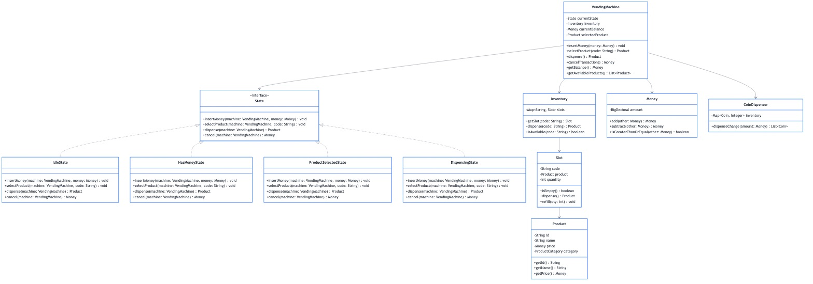
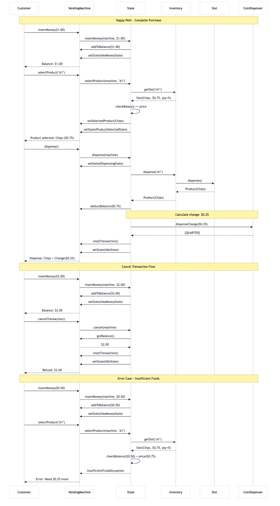

# Day 3: UML Diagrams — Class, Sequence, and State 📊

**Focus**: Master UML diagramming techniques essential for LLD interviews and system design documentation.

---

## 🎯 **Learning Objectives**

By the end of Day 3, you will:
- **Create** professional class diagrams with proper relationships
- **Design** sequence diagrams showing object interactions
- **Model** state machines for stateful components
- **Apply** UML to a complete Vending Machine system
- **Communicate** designs effectively in interviews

---

## 📚 **UML Diagram Types for LLD**

### **1. Class Diagrams** 📦
Shows the static structure of a system: classes, attributes, methods, and relationships.

**Key Elements:**
- **Classes**: Boxes with name, attributes, and methods
- **Visibility**: `+` public, `-` private, `#` protected, `~` package
- **Relationships**: Association, Aggregation, Composition, Inheritance, Dependency

**Relationship Types:**
| Relationship | Symbol | Meaning | Example |
|--------------|--------|---------|---------|
| Association | `──>` | "uses" or "knows about" | Order uses Customer |
| Aggregation | `◇──>` | "has" (weak ownership) | Department has Employees |
| Composition | `◆──>` | "owns" (strong ownership) | House owns Rooms |
| Inheritance | `──▷` | "is-a" | Dog extends Animal |
| Dependency | `- - ->` | "depends on" | Service depends on Repository |
| Implementation | `- - -▷` | "implements" | Class implements Interface |

### **2. Sequence Diagrams** 🔄
Shows how objects interact over time through message passing.

**Key Elements:**
- **Lifelines**: Vertical lines representing object lifetime
- **Messages**: Horizontal arrows showing method calls
- **Activation Bars**: Rectangles showing when object is active
- **Return Messages**: Dashed arrows for responses
- **Alt/Loop/Opt**: Control flow fragments

### **3. State Diagrams** 🔄
Shows the different states an object can be in and transitions between them.

**Key Elements:**
- **States**: Rounded rectangles
- **Initial State**: Filled circle
- **Final State**: Bullseye (circle within circle)
- **Transitions**: Arrows with event/condition/action labels
- **Guard Conditions**: Boolean conditions in brackets

---

## 🏪 **Complete Example: Vending Machine**

### **Requirements**

**Functional Requirements:**
1. Display available products with prices
2. Accept coins (1¢, 5¢, 10¢, 25¢) and bills ($1, $5)
3. Allow product selection
4. Dispense product when sufficient payment received
5. Return change if overpaid
6. Cancel transaction and refund money
7. Handle out-of-stock products

**Non-Functional Requirements:**
- Thread-safe for concurrent users
- Response time < 100ms for product selection
- Accurate money handling (no floating-point errors)
- Support for 50+ product types

---

## 📊 **Class Diagram: Vending Machine**

**Key Design Decisions:**
- **State Pattern**: `VendingMachine` delegates behavior to `State` implementations
- **Composition**: `VendingMachine` owns `Inventory`, `CoinDispenser`
- **Value Object**: `Money` for safe currency calculations
- **Enum**: `Coin` for type-safe coin values

---

## 🔄 **Sequence Diagram: Purchase Flow**

**Flow Highlights:**
1. Customer inserts money → State updates balance
2. Customer selects product → Validates availability & balance
3. Customer confirms → Dispenses product and returns change
4. System returns to Idle state

---

## 🔄 **State Diagram: Vending Machine States**

| State | Description | Valid Actions |
|-------|-------------|---------------|
| **Idle** | No money, no selection | Insert money |
| **HasMoney** | Money inserted, no selection | Select product, cancel, add more money |
| **ProductSelected** | Product chosen, sufficient funds | Dispense, change selection, cancel |
| **Dispensing** | Dispensing product | (None - automatic transition) |

**State Transitions:**
- `Idle` → `HasMoney`: On `insertMoney()`
- `HasMoney` → `ProductSelected`: On `selectProduct()` with sufficient balance
- `HasMoney` → `Idle`: On `cancel()` (refunds money)
- `ProductSelected` → `Dispensing`: On `dispense()`
- `Dispensing` → `Idle`: On completion (returns change)

---

## 💻 **Implementation**

See the complete implementation:
- **API**: `[View in Code Repository](/problems/)problems/vendingmachine/api/`
- **Model**: `[View in Code Repository](/problems/)problems/vendingmachine/model/`
- **State**: `[View in Code Repository](/problems/)problems/vendingmachine/state/`
- **Tests**: `src/test/java/com/you/lld/problems/vendingmachine/`

---

## 🎯 **UML Best Practices**

### **Class Diagrams:**
1. **Show only relevant details** - Don't include every getter/setter
2. **Use proper visibility markers** - Public (+), Private (-), Protected (#)
3. **Label relationships** - Add multiplicity (1, 0..*, 1..*)
4. **Group related classes** - Use packages or visual grouping
5. **Keep it readable** - 10-15 classes max per diagram

### **Sequence Diagrams:**
1. **Start with the trigger** - Who initiates the interaction?
2. **Show key interactions** - Focus on important message flows
3. **Use alt/opt/loop** - Show conditional and repeated behavior
4. **Include return values** - Show what methods return
5. **Keep it linear** - Time flows top to bottom

### **State Diagrams:**
1. **Identify all states** - What states can the object be in?
2. **Define transitions** - What events cause state changes?
3. **Add guard conditions** - When are transitions allowed?
4. **Include actions** - What happens during transitions?
5. **Mark initial/final states** - Show lifecycle boundaries

---

## 📝 **Interview Tips**

### **When Drawing UML:**
1. **Start with the domain** - Identify key entities first
2. **Show relationships** - How do entities relate?
3. **Add key methods** - Focus on behavior, not data
4. **Explain as you draw** - Communicate your thinking
5. **Iterate** - Refine based on requirements

### **Common Interview Scenarios:**
- "Design a vending machine" → State pattern + class diagram
- "Design an elevator system" → State diagram + sequence diagram
- "Design a parking lot" → Class diagram + key interactions

---

## 🏋️ **Exercises**

Complete the exercises: [EXERCISES.md](week1/day3/EXERCISES.md)

### Quick Preview:
1. **ATM Machine** - Class, sequence, and state diagrams
2. **Traffic Light System** - State diagram with emergency handling
3. **Online Order System** - Sequence diagram for checkout flow

---

## 📖 **Additional Resources**

- **All Diagrams (PNG)**: [diagrams/](diagrams/)
- **Exercises**: [EXERCISES.md](week1/day3/EXERCISES.md)
- **Solutions**: [EXERCISE_SOLUTIONS.md](week1/day3/EXERCISE_SOLUTIONS.md)

---

**Next**: [Day 4 - Value Objects & Domain Types](week1/day4/README.md) →