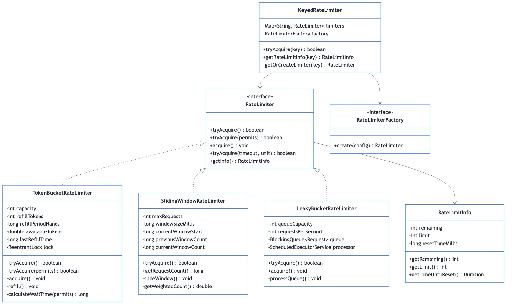

# Day 11: Rate Limiter 🚦

**Focus**: Implement Token Bucket, Leaky Bucket, and Sliding Window rate limiting algorithms.

---

## 📊 **Class Diagram**



---

## 🎯 **Learning Objectives**

By the end of Day 11, you will:
- **Implement** Token Bucket, Leaky Bucket, and Sliding Window algorithms
- **Design** distributed rate limiting strategies
- **Handle** edge cases and burst traffic
- **Apply** rate limiting to real APIs

---

## 📚 **Rate Limiting Algorithms**

### **1. Token Bucket**

**Concept**: Tokens added at fixed rate. Requests consume tokens. Allows bursts.

```java
public class TokenBucketRateLimiter implements RateLimiter {
    
    private final int maxTokens;          // Bucket capacity
    private final double refillRate;      // Tokens per second
    private double tokens;
    private long lastRefillTime;
    
    public TokenBucketRateLimiter(int maxTokens, double refillRate) {
        this.maxTokens = maxTokens;
        this.refillRate = refillRate;
        this.tokens = maxTokens;
        this.lastRefillTime = System.nanoTime();
    }
    
    @Override
    public synchronized boolean tryAcquire() {
        return tryAcquire(1);
    }
    
    @Override
    public synchronized boolean tryAcquire(int permits) {
        refill();
        
        if (tokens >= permits) {
            tokens -= permits;
            return true;
        }
        
        return false;
    }
    
    private void refill() {
        long now = System.nanoTime();
        double elapsed = (now - lastRefillTime) / 1_000_000_000.0;
        double tokensToAdd = elapsed * refillRate;
        
        tokens = Math.min(maxTokens, tokens + tokensToAdd);
        lastRefillTime = now;
    }
    
    @Override
    public double getAvailableTokens() {
        refill();
        return tokens;
    }
}
```

**Use Cases:**
- API rate limiting (allows bursts)
- Network traffic shaping
- Throttling background jobs

---

### **2. Leaky Bucket**

**Concept**: Requests enter bucket, processed at fixed rate. Smooths traffic.

```java
public class LeakyBucketRateLimiter implements RateLimiter {
    
    private final int bucketSize;
    private final double leakRate;        // Requests per second
    private int currentWater;
    private long lastLeakTime;
    
    public LeakyBucketRateLimiter(int bucketSize, double leakRate) {
        this.bucketSize = bucketSize;
        this.leakRate = leakRate;
        this.currentWater = 0;
        this.lastLeakTime = System.nanoTime();
    }
    
    @Override
    public synchronized boolean tryAcquire() {
        leak();
        
        if (currentWater < bucketSize) {
            currentWater++;
            return true;
        }
        
        return false;
    }
    
    private void leak() {
        long now = System.nanoTime();
        double elapsed = (now - lastLeakTime) / 1_000_000_000.0;
        int leaked = (int) (elapsed * leakRate);
        
        if (leaked > 0) {
            currentWater = Math.max(0, currentWater - leaked);
            lastLeakTime = now;
        }
    }
    
    // Process at fixed rate (blocking)
    public void acquire() throws InterruptedException {
        while (!tryAcquire()) {
            Thread.sleep((long) (1000 / leakRate));
        }
    }
}
```

**Use Cases:**
- Smoothing bursty traffic
- Queue processing
- Network congestion control

---

### **3. Fixed Window Counter**

```java
public class FixedWindowRateLimiter implements RateLimiter {
    
    private final int maxRequests;
    private final long windowSizeMillis;
    private int requestCount;
    private long windowStart;
    
    public FixedWindowRateLimiter(int maxRequests, long windowSizeMillis) {
        this.maxRequests = maxRequests;
        this.windowSizeMillis = windowSizeMillis;
        this.requestCount = 0;
        this.windowStart = System.currentTimeMillis();
    }
    
    @Override
    public synchronized boolean tryAcquire() {
        long now = System.currentTimeMillis();
        
        // Reset window if expired
        if (now - windowStart >= windowSizeMillis) {
            windowStart = now;
            requestCount = 0;
        }
        
        if (requestCount < maxRequests) {
            requestCount++;
            return true;
        }
        
        return false;
    }
    
    @Override
    public int getRemainingRequests() {
        return Math.max(0, maxRequests - requestCount);
    }
    
    @Override
    public long getResetTime() {
        return windowStart + windowSizeMillis;
    }
}
```

**Problem**: Boundary issue - 2x requests possible at window boundaries.

---

### **4. Sliding Window Log**

```java
public class SlidingWindowLogRateLimiter implements RateLimiter {
    
    private final int maxRequests;
    private final long windowSizeMillis;
    private final Deque<Long> requestTimestamps;
    
    public SlidingWindowLogRateLimiter(int maxRequests, long windowSizeMillis) {
        this.maxRequests = maxRequests;
        this.windowSizeMillis = windowSizeMillis;
        this.requestTimestamps = new LinkedList<>();
    }
    
    @Override
    public synchronized boolean tryAcquire() {
        long now = System.currentTimeMillis();
        long windowStart = now - windowSizeMillis;
        
        // Remove expired timestamps
        while (!requestTimestamps.isEmpty() && 
               requestTimestamps.peekFirst() < windowStart) {
            requestTimestamps.pollFirst();
        }
        
        if (requestTimestamps.size() < maxRequests) {
            requestTimestamps.addLast(now);
            return true;
        }
        
        return false;
    }
}
```

**Trade-off**: Accurate but memory-intensive for high traffic.

---

### **5. Sliding Window Counter**

```java
public class SlidingWindowCounterRateLimiter implements RateLimiter {
    
    private final int maxRequests;
    private final long windowSizeMillis;
    private int currentWindowCount;
    private int previousWindowCount;
    private long currentWindowStart;
    
    public SlidingWindowCounterRateLimiter(int maxRequests, long windowSizeMillis) {
        this.maxRequests = maxRequests;
        this.windowSizeMillis = windowSizeMillis;
        this.currentWindowCount = 0;
        this.previousWindowCount = 0;
        this.currentWindowStart = System.currentTimeMillis();
    }
    
    @Override
    public synchronized boolean tryAcquire() {
        long now = System.currentTimeMillis();
        
        // Check if we need to slide to new window
        if (now - currentWindowStart >= windowSizeMillis) {
            previousWindowCount = currentWindowCount;
            currentWindowCount = 0;
            currentWindowStart = now;
        }
        
        // Calculate weighted count
        double windowProgress = (now - currentWindowStart) / (double) windowSizeMillis;
        double weightedCount = previousWindowCount * (1 - windowProgress) + currentWindowCount;
        
        if (weightedCount < maxRequests) {
            currentWindowCount++;
            return true;
        }
        
        return false;
    }
}
```

**Best of both worlds**: Accurate and memory-efficient.

---

## 🌐 **Distributed Rate Limiting**

### **Redis-Based Rate Limiter**

```java
public class RedisRateLimiter implements RateLimiter {
    
    private final RedisClient redis;
    private final String keyPrefix;
    private final int maxRequests;
    private final long windowSizeSeconds;
    
    public RedisRateLimiter(RedisClient redis, String keyPrefix, 
                           int maxRequests, long windowSizeSeconds) {
        this.redis = redis;
        this.keyPrefix = keyPrefix;
        this.maxRequests = maxRequests;
        this.windowSizeSeconds = windowSizeSeconds;
    }
    
    @Override
    public boolean tryAcquire(String clientId) {
        String key = keyPrefix + ":" + clientId;
        long now = System.currentTimeMillis();
        long windowStart = now - (windowSizeSeconds * 1000);
        
        // Lua script for atomic operation
        String script = 
            "redis.call('ZREMRANGEBYSCORE', KEYS[1], '-inf', ARGV[1])\n" +
            "local count = redis.call('ZCARD', KEYS[1])\n" +
            "if count < tonumber(ARGV[2]) then\n" +
            "    redis.call('ZADD', KEYS[1], ARGV[3], ARGV[3])\n" +
            "    redis.call('EXPIRE', KEYS[1], ARGV[4])\n" +
            "    return 1\n" +
            "end\n" +
            "return 0";
        
        Long result = redis.eval(script, 
            Collections.singletonList(key),
            Arrays.asList(
                String.valueOf(windowStart),
                String.valueOf(maxRequests),
                String.valueOf(now),
                String.valueOf(windowSizeSeconds)
            ));
        
        return result == 1;
    }
}
```

---

## 🎯 **Rate Limiter API Design**

```java
public interface RateLimiter {
    boolean tryAcquire();
    boolean tryAcquire(int permits);
    
    default void acquire() throws InterruptedException {
        while (!tryAcquire()) {
            Thread.sleep(10);
        }
    }
    
    // For client response headers
    default RateLimitInfo getInfo() {
        return new RateLimitInfo(
            getLimit(),
            getRemainingRequests(),
            getResetTime()
        );
    }
    
    int getLimit();
    int getRemainingRequests();
    long getResetTime();
}

public class RateLimitInfo {
    private final int limit;
    private final int remaining;
    private final long resetTime;
    
    // X-RateLimit-Limit: 100
    // X-RateLimit-Remaining: 45
    // X-RateLimit-Reset: 1640995200
}
```

---

## 🏗️ **HTTP Integration**

```java
@Component
public class RateLimitingFilter implements Filter {
    
    private final RateLimiterRegistry registry;
    
    @Override
    public void doFilter(ServletRequest request, ServletResponse response, 
                        FilterChain chain) throws IOException, ServletException {
        
        HttpServletRequest httpRequest = (HttpServletRequest) request;
        HttpServletResponse httpResponse = (HttpServletResponse) response;
        
        String clientId = extractClientId(httpRequest);
        RateLimiter limiter = registry.getLimiter(clientId);
        
        if (!limiter.tryAcquire()) {
            RateLimitInfo info = limiter.getInfo();
            
            httpResponse.setStatus(429);
            httpResponse.setHeader("X-RateLimit-Limit", String.valueOf(info.getLimit()));
            httpResponse.setHeader("X-RateLimit-Remaining", "0");
            httpResponse.setHeader("X-RateLimit-Reset", String.valueOf(info.getResetTime()));
            httpResponse.setHeader("Retry-After", String.valueOf(
                (info.getResetTime() - System.currentTimeMillis()) / 1000));
            
            httpResponse.getWriter().write("Rate limit exceeded");
            return;
        }
        
        chain.doFilter(request, response);
    }
    
    private String extractClientId(HttpServletRequest request) {
        // Could use API key, user ID, or IP address
        String apiKey = request.getHeader("X-API-Key");
        if (apiKey != null) return apiKey;
        
        String userId = request.getHeader("X-User-Id");
        if (userId != null) return userId;
        
        return request.getRemoteAddr();
    }
}
```

---

## 📊 **Algorithm Comparison**

| Algorithm | Burst Handling | Memory | Accuracy | Distributed |
|-----------|---------------|--------|----------|-------------|
| Token Bucket | ✅ Allows bursts | O(1) | Good | Moderate |
| Leaky Bucket | ❌ Smooths | O(1) | Good | Easy |
| Fixed Window | ⚠️ Boundary issue | O(1) | Poor | Easy |
| Sliding Log | ✅ Accurate | O(n) | Excellent | Hard |
| Sliding Counter | ✅ Good | O(1) | Good | Moderate |

---

**Next**: [Day 12 - Notification Service](week3/day12/README.md) →
